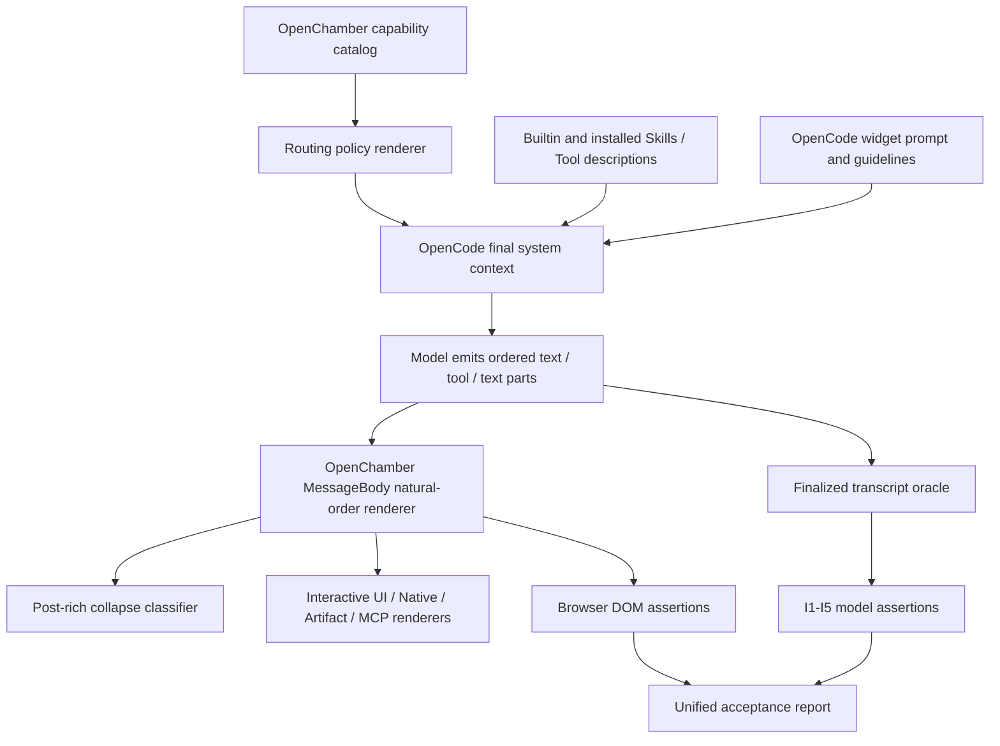
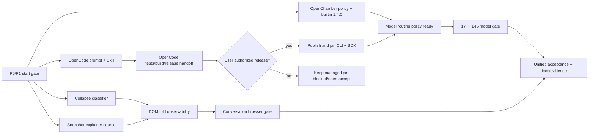

# P2 对话讲解优先与流式交织：详细实施计划

> **文档性质**：可直接交给多个开发 Agent 的实施蓝图；不是开工授权，也不是完成声明。  
> **状态**：`design / implementation-ready`（代码尚未按本文实施）  
> **优先级来源**：工作区根目录 [`roadmap.md`](../../roadmap.md) 的 P2.1–P2.4；若本文与 roadmap 冲突，以 roadmap 为准。  
> **开始门**：P0 UI 壳层稳定、P1 验收窗口已按 roadmap 安排，并由用户明确安排 P2 开发后再进入产品代码实现。  
> **涉及仓库**：`openchamber/`（主实现与验收）+ `opencode/`（Generative Widget 系统提示/内置 Skill 对齐）。  
> **基线日期**：2026-08-09；实施 Agent 开工时必须重新读取当前代码，不得把本文行号或旧断言当作不可变事实。  
> **主设计**：[`CONVERSATIONAL_INTERACTIVE_UI_FOUR_TRACKS_DESIGN.md`](./CONVERSATIONAL_INTERACTIVE_UI_FOUR_TRACKS_DESIGN.md)。

---

## 目录

- [0. 执行摘要](#0-执行摘要)
- [1. 优先级、授权与范围](#1-优先级授权与范围)
- [2. 目标、非目标与完成结果](#2-目标非目标与完成结果)
- [3. 当前实现基线](#3-当前实现基线)
- [4. 统一术语、产品不变量与决策](#4-统一术语产品不变量与决策)
- [5. 模块边界与改动架构](#5-模块边界与改动架构)
- [6. P2.1：四轨选型政策落地](#6-p21四轨选型政策落地)
- [7. P2.2：Post-rich 文本折叠服务图后讲解](#7-p22post-rich-文本折叠服务图后讲解)
- [8. P2.3：Trusted Snapshot Explainer 合同与示例扩展](#8-p23trusted-snapshot-explainer-合同与示例扩展)
- [9. P2.4：交织验收语料 I1–I5](#9-p24交织验收语料-i1i5)
- [10. 逐文件改动清单](#10-逐文件改动清单)
- [11. 测试矩阵与验收命令](#11-测试矩阵与验收命令)
- [12. 跨仓实施、构建与发布顺序](#12-跨仓实施构建与发布顺序)
- [13. 多 Agent 工作包与文件所有权](#13-多-agent-工作包与文件所有权)
- [14. 风险、失败模式与回退](#14-风险失败模式与回退)
- [15. Definition of Done](#15-definition-of-done)
- [16. 文档与证据回写](#16-文档与证据回写)
- [附录 A：目标政策规范文本](#附录-a目标政策规范文本)
- [附录 B：终态 transcript oracle 建议合同](#附录-b终态-transcript-oracle-建议合同)
- [附录 C：I1–I5 语料草案](#附录-ci1i5-语料草案)
- [附录 D：Agent 开工/交接模板](#附录-dagent-开工交接模板)

---

## 0. 执行摘要

P2 不需要另造消息协议，也不需要重写整个对话 renderer。当前 OpenCode parts 已能按产生顺序保存 `text → tool → text`，OpenChamber `MessageBody` 也会按自然顺序渲染；show-widget 已能在单个 text part 中解析多个 fence，并支持流式预览。当前阻碍体验的主要因素是：

1. OpenChamber 注入的路由系统提示、内置 Skill 和 Tool description 强制“每 turn 最多一个 primary View”“第一个 View 成功后停止”“View 后只补一句”；
2. `shouldCollapsePostRichResultText` 会把富结果后的长解释或列表收进 `Agent notes`，无法识别“这段文字后面还有下一张图”；
3. Trusted Native 虽然已经具备 `mode=snapshot`、内联 `data`、无 `dataRef` 的运行时能力，但缺少一份可复制、不会冒充 live 数据的 explainer 合同与端到端示例；
4. 现有模型路由验收只擅长判定“选了哪个 Tool、有没有重复 primary View”，不能证明文字和视觉的相对顺序，也看不见 show-widget fence。

因此 P2 应围绕四个稳定接口实施：

| 工作项 | 稳定接口（验收面） | 主要实现位置 | 结果 |
|--------|--------------------|--------------|------|
| P2.1 | Agent 最终收到的政策文本 | OpenChamber routing/builtin runtime + OpenCode widget prompt/skill | 允许 1–N 个不同焦点视觉，仍禁止同一业务数据多轨复述 |
| P2.2 | `shouldCollapsePostRichResultText` 的显式上下文合同 | `toolRenderUtils.ts` + `MessageBody.tsx` | 中间讲解默认展开，只折叠最终且明显冗长的 recap |
| P2.3 | 现有 `interactive-result/v1` snapshot envelope | 新的示例扩展 + Developer Guide | 已安装 Trusted explainer 能安全展示内联示例数据，不要求 Gateway |
| P2.4 | 隐私安全的 finalized transcript token 流 | 新 oracle、I1–I5 corpus、模型与浏览器门禁 | 自动证明 text↔visual 顺序、多图、业务去重和短答克制 |

建议投入为 **7–13 人日**：P2.1 约 2–3 人日、P2.2 约 1–2 人日、P2.3 约 2–4 人日、P2.4 约 2–4 人日。模型 E2E 的外部延迟和重跑次数不计入确定性工时。

---

## 1. 优先级、授权与范围

### 1.1 优先级规则

- 本文只细化 roadmap 已存在的 P2.1–P2.4，不调整 P0/P1/P2/P3 顺序。
- 本文完成后，P2 仍是 `design`；不得因“计划足够详细”就把 roadmap 状态改为进行中或完成。
- P0 未稳定前，不安排会修改 `MessageBody.tsx`、路由宿主或统一验收聚合器的 P2 Agent。
- 纯测试 oracle、语料 schema 或示例合同可以预先评审，但是否合入仍由用户安排。
- 专题设计中旧的 P0/P1/P2 标签只代表 2026-08-07 当时的局部顺序；实施 ID 统一映射到根 roadmap 的 P2.1–P2.4。

### 1.2 本文覆盖的工作

| Roadmap ID | 覆盖范围 |
|------------|----------|
| P2.1 | 四轨选择顺序；多图/交织政策；OpenChamber 路由提示、内置和示例 Skill/Tool 文案；OpenCode show-widget prompt/Skill 对齐；断言与文档同步 |
| P2.2 | 富结果后文本的判定上下文、折叠规则、DOM 呈现与单元/组件回归 |
| P2.3 | Snapshot Explainer 规范、一个无 Gateway 的 Trusted Native 示例、manifest/tool/skill/UI、打包与重放验收 |
| P2.4 | I1–I5 独立语料、终态 transcript 规范化、show-widget 识别、模型 gate、浏览器 DOM gate、统一报告聚合 |

### 1.3 明确不在 P2 范围

- 不新增第五种对话 UI 轨；MCP Apps 是协议/host 层，不是第五种“画法”。
- 不做 Declarative partial tool-args 渲染；该项属于 roadmap P3.6，且必须等待 OpenCode 可持久化、带server revision、可重放的 **full-replacement ToolPart progress snapshot**。tool args delta/raw/半截JSON永远不是authority，精确合同见P3总蓝图§10。
- 不修改 OpenCode message/part wire protocol，不引入第二套消息排序或视觉占位协议。
- 不让模型现场生成或安装 Trusted Native bundle。
- 不合并 show-widget runtime 与 HTML Artifact runtime。
- 不重写 `MessageBody` 的 activity grouping、sorted mode、工具折叠或 Workbench 行为。
- 不移除 business tool 的同数据去重、权限、确认写、连接状态或权威来源约束。
- 不为短回答强制插图，不把“视觉越多越好”作为质量指标。
- 不在 P2 顺带实现 outline anchor、可配置硬上限、Marketplace、Local Data Runtime 或 Codex Shell。

---

## 2. 目标、非目标与完成结果

### 2.1 用户可观察目标

讲解型回答应能自然形成：

```text
[text] 背景与阅读提示
[visual] 焦点图 A
[text] 解释 A，并过渡到下一点
[visual] 焦点图 B
[text] 结论与下一步
```

具体要求：

1. 四轨 visual 可以是 show-widget fence、Declarative/Trusted/Artifact Tool result；顺序必须保持模型产生顺序。MCP App rich result 也继续按自然顺序渲染和参与 P2.2 折叠边界，但不进入 I1–I5 四轨计数。
2. 一次回答可有多个 visual，每个 visual 只服务一个清晰焦点。
3. 图前后必须有人话锚点；视觉不能成为没有上下文的“末尾 dump”。
4. 对 CRM 等真实业务请求仍优先已安装业务 Tool，且同一业务事实只渲染一次。
5. 简短事实问答、确认、澄清和错误说明可以纯文本。
6. 已安装 explainer 可以使用固定或经 schema 校验的内联 snapshot，但必须永久可见地标注“示例/模拟，不是 live”。

### 2.2 工程目标

- 改政策而不改消息协议；P2.2 不改 Tool 富结果 parser；P2.4 只给既有 widget parser 增加显式终态严格模式；加示例而不加 runtime mode。
- 把含糊的“多图看起来对”转成可复用、可单测的 transcript expectation。
- 把接口做深：调用者只提供必要上下文，折叠模块自行判断 earlier/later rich；验收脚本只消费规范化 token，不重复解析五种 UI 实现细节。
- 保持测试确定性：本地 unit/functional 不依赖模型；只有模型路由 gate 允许外部不确定性。
- 报告不保存完整用户文本、widget HTML/JS、Tool output 或业务行数据。

### 2.3 P2 完成后的交付物

- 两个仓库的政策文本与测试同步；
- 明确且被组件使用的 post-rich collapse interface；
- 一份 Snapshot Explainer 开发规范和一个可打包示例；
- I1–I5 独立 corpus、oracle unit tests、模型报告和浏览器报告；
- 统一验收命令能聚合上述报告；
- roadmap、主设计、Developer Guide、MessageBody 文档和验收文档状态一致；
- `docs/release-evidence/` 中存在一次通过证据，且不提交凭据或原始敏感 transcript。

---

## 3. 当前实现基线

以下是实施前必须保留的事实。Agent 应先跑基线测试，再改代码。

### 3.1 已经具备，不应重做

| 能力 | 当前锚点 | P2 处理 |
|------|----------|---------|
| parts 自然顺序 | OpenCode message parts；OpenChamber `MessageBody` flat render | **验证，不改协议** |
| text→tool→text 渲染 | `packages/ui/src/components/chat/message/MessageBody.tsx` | 只传递新的 collapse context |
| 多 show-widget fence | OpenCode widget prompt/Skill + OpenChamber fence parser/renderer | 回归并纳入 I3，不另造格式 |
| rich result 判定 | `hasRichToolResult` 识别 Interactive UI、两类 Artifact、MCP App | 复用；如无失败证据不扩 schema |
| snapshot envelope | `result.ts` 接受 `mode: snapshot|live`、`data` 可内联、`dataRef` 可选 | 直接复用，不加 `explainer` mode |
| Native view snapshot props | `InteractiveUIView.tsx` 向 Native view 传 `snapshot={envelope.data}` | 回归，不加旁路 |
| manifest 信任门 | Native 需要 `trust.mode=native-code` 和非空签名；连接器可缺省 | 示例必须遵守，不放宽验证器 |
| capability routing 注入 | server 生成 prompt，UI 经 `/api/interactive-ui/capabilities` 读取并随会话发送 | 修改源 prompt 与精确断言，不另加客户端 prompt |

### 3.2 当前反目标政策

`packages/web/server/lib/interactive-ui/routing.js` 当前包含三条相互加强的限制：

- `Use at most one primary OpenChamber surface per assistant turn.`
- `Stop calling tools after the first primary surface tool succeeds.`
- View 后 `finish with exactly one short conclusion...`。

同一限制还存在于内置 `interactive-ui-visualization/SKILL.md`、`interactive_ui.ts` description 及 `examples/interactive-ui/agent-runtime/` 的演示副本。实施时必须原子修改这些来源与精确字符串测试；只改某一份会造成开发环境、内置安装和文档示例行为分叉。

### 3.3 当前折叠行为

`shouldCollapsePostRichResultText(parts, partIndex, isMessageCompleted, hasEarlierRichResultInTurn)` 当前在消息完成后：

- 发现当前 text 前有 rich result（或 turn 中更早 assistant message 有 rich result）后；
- 文本超过 240 字符即折叠；或
- 命中列表/标题等 structured line 规则即折叠。

它不知道当前 assistant message 是否是 turn 的最后一条，也不知道当前 text 后是否还有 rich result。因此 `rich → long explanation → rich` 的中间解释可能被错误折叠。

### 3.4 当前验收缺口

`scripts/verify-interactive-ui-model-routing.mjs` 当前主要扁平化 ToolPart、识别 Interactive UI/Artifact result，并以“期望 0 或 1 个 primary route”“重复率必须为 0”为核心。它：

- 看不见 show-widget fence；
- 不能断言 text 在 visual 前、后或中间；
- 会把合法的多焦点视觉误判成 duplicate primary view；
- 现有 frozen unified corpus 的 17 个历史场景承担旧路由回归，不适合直接改写成 P2 语义。

因此 P2.4 应保留旧 corpus，并新增一份 I1–I5 corpus 和独立 oracle，再把新结果接入同一总报告。

---

## 4. 统一术语、产品不变量与决策

### 4.1 术语

| 术语 | 本文含义 |
|------|----------|
| visual | P2 四轨在对话顺序中的可视化单元；包括 show-widget fence、Interactive UI/Trusted result、Generated/Installed HTML Artifact。MCP App 是独立协议层，不纳入 I1–I5 四轨计数 |
| surface | 一次 Tool result 对应的 Host 渲染面；show-widget 是 text 内 visual，不称 Tool surface |
| primary surface | 回答主体使用的一个 Tool-based 可视面；不再等价于“每 turn 只能一个” |
| focus | 一个 visual 要解释的单一问题，例如“一条流程”或“一组对比”，不是整篇回答 |
| same-data duplicate | 用第二条轨复述已渲染 surface 的同一业务行、指标、表或风险结论 |
| explainer | 已安装扩展提供的讲解向 read Tool；返回 snapshot，不声称 live 权威数据 |
| recap | 位于最终 rich result 后、重复视觉已有信息的冗长总结，可折叠 |
| bridge text | 图前阅读提示、图后解释、两图之间过渡；默认必须展开 |
| finalized transcript | 一次模型回答结束后，按 message/part/fence 自然顺序规范化得到的 token 流 |

### 4.2 四轨选择不变量

1. 用户显式指定安全且可用的形态/Tool 时优先满足。
2. 真实企业事实、写操作、连接状态优先已安装业务 Tool；未配置时让该 Tool 报设置要求，不能生成假指标替代。
3. 零安装的结构化讲解默认 Declarative Generated（`interactive_ui`, snapshot）。
4. 小型、free-form、强调流式或 HTML/SVG 表现力的临场讲解使用 show-widget。
5. 多区同屏、自定义布局、复杂本地状态、拖拽/播放/仿真使用 HTML Artifact。
6. 已安装且更合适的业务/培训 explainer 可优先于通用轨，但 snapshot 必须标注非 live。
7. 不同焦点可使用多个 visual；同一事实不能用多个轨重复。
8. 一句话能说清时不造图；视觉数量不是奖励函数。

### 4.3 多视觉数量决策

- 目标政策采用 **软上限 4 个 visual/turn**，不是 Tool 层状态机硬限制。
- 超过 4 个时，模型应先合并相近焦点或征询是否继续；但 runtime 不应为此拒绝第五次安全调用。
- 原因：硬上限需要跨 Tool、text fence 和多 assistant message 记账，会增加耦合；当前没有足够滥用证据支持这一复杂度。
- I2 只要求 `>=2`，不鼓励为了过测试固定生成 4 个。

### 4.4 “不重复”与“允许多图”的边界

| 情况 | 允许？ | 说明 |
|------|--------|------|
| CRM Tool 已渲染 pipeline，又用 `interactive_ui` 画相同 pipeline | 否 | 同一权威数据的跨轨复述 |
| 图 A 讲训练流程，图 B 对比 PPO/DPO | 是 | 不同焦点，且中间有解释文字 |
| 一个主题拆成两个互补小图 | 是 | 每图焦点清晰，比巨型 dashboard 更易读 |
| View 后文字解释“应该看哪里” | 是 | bridge text，不是逐行重抄 |
| View 后重新列出所有指标/表格 | 否/折叠 | 属于 recap；业务场景还可能造成权威漂移 |
| 业务 View 后增加无关的概念示意图 | 谨慎允许 | 必须明显是不同主题，且不要伪装成业务数据 |

### 4.5 状态与信任不变量

- snapshot 数据必须随消息输出可重放，不依赖未来网络请求。
- `generated` / `user-provided` / `connected-business-system` 的 authority 语义不得混用。
- explainer 不读取 Host Business Gateway、不持 token、不执行写操作。
- 示例/模拟标识必须在可见 UI 内，不只放在 tool description、summary 或隐藏 metadata。
- P2 不放宽 `.ocix` 签名、Native trust、CSP、权限、action confirmation 或 connector 验证。

---

## 5. 模块边界与改动架构

### 5.1 目标调用链



### 5.2 四个 deep module seam

| 模块 | Interface | Implementation 隐藏内容 | 不允许渗漏给调用者的细节 |
|------|-----------|-------------------------|--------------------------|
| Routing policy | 最终注入的一段有界 system text | capability 排序、连接状态、四轨选择措辞 | UI 客户端不重复拼政策；Tool 不维护 per-turn 计数 |
| Collapse classifier | `parts + index + completion/turn context → boolean` | earlier/later rich、文本形状、阈值 | `MessageBody` 不复制 regex/阈值 |
| Snapshot Explainer | 普通 `interactive-result/v1` snapshot envelope | fixture 选择、参数校验、Native 本地交互 | runtime 不理解“explainer”新 mode；view 不访问 Gateway |
| Transcript oracle | finalized messages → 隐私安全 token 流；expectation → diagnostics | Tool schema/fence 解析、排序、计数 | corpus 不依赖 React DOM；model runner 不重复判定逻辑 |

### 5.3 文件所有权原则

- 每个 seam 只有一个 Agent 负责其实现文件与直接 unit test。
- 统一验收 Agent 不改产品 prompt；政策 Agent 不改 transcript oracle。
- `roadmap.md`、本计划、主设计和总验收报告聚合器由整合 Agent 最后统一修改。
- 任何需要同时修改 `openchamber/` 与 `opencode/` 的工作包都按两个独立仓库交接：先完成 OpenCode 本地包验证，再更新 OpenChamber SDK/依赖（若实际有获授权的版本发布）。
- **Git/GitHub authority gate**：安排开发不自动授权 commit、push、tag、release、PR 或 workflow mutation。各 Agent 默认只做到本地实现、测试与 release handoff；只有用户对相应仓库明确授权后，才执行这些外部/版本控制动作。

### 5.4 不新增的抽象

- 不增加 `VisualSequenceManager`、per-turn surface registry 或全局 visual budget store。
- 不把 show-widget fence 转成伪 ToolPart。
- 不为 explainer 新建 envelope schema 或 runtime capability。
- 不把验收 oracle 放进 UI production bundle；它属于 `scripts/lib/`。
- 不新增配置项控制 240/120 阈值；第一片保留现有常量，只调整进入阈值判定的语义位置。

---

## 6. P2.1：四轨选型政策落地

### 6.1 完成定义

P2.1 完成时，最终注入模型的所有权威政策必须同时表达：

1. 选择顺序覆盖 installed business/specialized、Declarative、show-widget、Artifact 和 text；
2. 讲解型回答允许多个不同焦点 visual，并推荐 `短文 → 图 → 短文`；
3. 不再出现“每 turn 最多一个 View”“第一个 View 成功后停止”“View 后 exactly one sentence”等绝对限制；
4. 同业务数据去重、业务权威、确认写、示例标识、安全边界仍保留；
5. 短答克制、软上限和图前后锚点写清楚；
6. builtin runtime、example runtime、OpenCode widget prompt/Skill 与测试不会互相矛盾。

### 6.2 规范选择顺序

最终政策使用以下顺序；“显式请求”是安全边界内的覆盖规则，不意味着绕过业务权威或权限：

```text
0. 用户显式指定的可用 Tool/形态（仍受安全、权威和权限约束）
1. 匹配的已安装 connected-business-system Tool
2. 匹配的已安装 specialized Tool 或 MCP Tool/App
3. 结构化、可治理、零安装讲解 → interactive_ui (Declarative snapshot)
4. 小型/free-form/强调流式 HTML/SVG 讲解 → show-widget fence
5. 大画布、多区同屏、复杂本地交互 → html_artifact
6. 视觉无增益、短答、澄清、错误 → normal text
```

注意：show-widget 是 assistant text wire format，不是 Tool。OpenChamber routing prompt 只能描述何时选择它，不能把它列入 capability catalog 或假设当前 OpenCode 一定支持；OpenCode 自身的系统提示/Skill 负责提供完整 fence 合同。

### 6.3 OpenChamber server 路由政策

#### 修改：`packages/web/server/lib/interactive-ui/routing.js`

在 `renderInteractiveUIRoutingSystemPrompt` 中完成以下原子改写：

- 保留 capability catalog 的来源说明、Tool 存在性门、连接状态和 business authority 规则。
- 用 §6.2 的顺序替换当前 selection order；明确 show-widget 为 free-form/streaming 讲解轨。
- 删除绝对的 single-surface、first-success-stop、exactly-one-sentence 三条。
- 添加 multi-focus 规则：一个回答可调用多个 surface tool，前提是焦点不同、顺序有 bridge text、总量通常不超过 4。
- 添加 same-data dedupe 规则：specialized/business surface 已返回后，不得用 generic surface、widget 或 Markdown 重画相同指标/表格。
- 添加 short-answer restraint：事实短答、澄清、拒绝/错误不强制 visual。
- 保留 explicit visualization mandatory 规则，但从“必须 interactive_ui”改为“选择能满足用户形态和复杂度的合适 visual”；用户明确要求 chart/table 且 standard components 足够时仍首选 `interactive_ui`。
- 保持 `MAX_SYSTEM_PROMPT_LENGTH` 和 catalog truncation 行为不变。

#### 修改测试：`packages/web/server/lib/interactive-ui/routing.test.js`

测试应验证语义片段而不是整段快照：

- 包含新的选择顺序、multi-focus、bridge text、same-data dedupe、short-answer restraint；
- 不包含三个废弃绝对短语；
- business unconfigured/expired、explicit tool、write confirmation、catalog truncation 的旧断言继续通过；
- 同一 extension 多 surface 的聚合/priority/operation 测试不因文案改动而删除。

#### 修改受影响测试：`packages/web/server/lib/interactive-ui/manager.test.js`

- 替换依赖“只补一句/一个 View”的精确断言。
- 仍验证 Manager 把同一份 routing prompt 安装/暴露给 runtime，不在 Manager 再写一份政策副本。

### 6.4 内置 Agent Runtime 资产

#### 修改：`packages/web/server/lib/interactive-ui/builtin/agent-runtime/skills/interactive-ui-visualization/SKILL.md`

- 把目标从“生成一个 primary View 后结束”改成“为讲解选择 1–N 个单焦点 visual”。
- 新增四轨决策表、图前后锚点、软上限、不同焦点示例。
- 保留 incompatible units 拆图、a11y、labels、数据来源、业务权威和同数据去重。
- 明确 `interactive_ui` 是结构化讲解默认，不应因允许多图而把所有段落都做成 dashboard。

#### 修改：`packages/web/server/lib/interactive-ui/builtin/agent-runtime/tools/interactive_ui.ts`

- 只修改 `description` 及必要的 field descriptions；不改 envelope、schema、execute 或渲染数据结构。
- 删除 `one ad-hoc primary View only`、`exactly one short conclusion`。
- 写明一次调用一个焦点；可在同 turn 再调用不同焦点 visual；前后用简短 prose 锚定。
- 继续禁止伪造企业指标、同业务结果重复渲染、单位/数量级不兼容同轴。
- 不在 execute 中增加 turn 计数或硬上限。

#### 修改：`packages/web/server/lib/interactive-ui/builtin/agent-runtime/tools/html_artifact.ts`

- 在 description 增加其四轨定位：大画布/多区/复杂本地状态，而不是“允许多图后所有东西都用 Artifact”。
- 明确可与其他不同焦点 visual 交织，但不得复述已安装业务 surface。
- 保留全部 HTML validator、CSP、scripts、网络/存储/Token/Gateway 禁止项；不改 execute。

#### 保持一致的示例副本

同步修改：

- `examples/interactive-ui/agent-runtime/skills/interactive-ui/SKILL.md`
- `examples/interactive-ui/agent-runtime/tools/interactive_ui.ts`
- `examples/interactive-ui/agent-runtime/tools/html_artifact.ts`

这些不是第二套规范。建议由测试比较关键 invariant，或至少在源码注释中指向 builtin 权威文件，避免今后再次漂移。当前阶段不引入生成器，除非重复资产已经有既存生成流程可复用。

#### 内置资产版本与安全迁移

上述修改会改变三个受管资产的内容，不能继续沿用当前 built-in `1.3.0`。建议统一升级为 `1.4.0`，并修改：

- `packages/web/server/lib/interactive-ui/builtin-runtime.js`
- `packages/web/server/lib/interactive-ui/builtin/openchamber.extension.json`
- `packages/web/server/lib/interactive-ui/builtin-runtime.test.js`
- `packages/web/server/lib/interactive-ui/manager.test.js`
- `packages/web/server/lib/interactive-ui/DOCUMENTATION.md`
- `packages/electron/scripts/verify-packaged-interactive-ui.mjs`

`builtin-runtime.js` 的 `LEGACY_BUILT_IN_ASSETS` 必须 **追加** 当前 1.3.0 三资产 hash，不能替换或删除更旧版本：

```text
tools/interactive_ui.ts
sha256-HFJwueb/YNiaG3r3t7SDxH2VybeEncdGMUVH76eZqVE=

tools/html_artifact.ts
sha256-lJzup0d7/3QS35dl3bCqAGi98njIKPMlooFMR2C8NUw=

skills/interactive-ui-visualization/SKILL.md
sha256-1M6V0sYIEawsTqyOwAmrqZDeLl54BsOArq/GQ248xpg=
```

迁移测试必须证明：

- 精确匹配旧 1.3.0 内容/hash 的内置副本可由 Manager 安全接管并升级；
- 任意用户自定义的同名 Tool/Skill 仍产生 ownership conflict，绝不能因同路径被覆盖；
- 更旧 legacy hash 仍保留，升级不是“只认上一个版本”；
- `agent-runtime.js` 的通用 ownership/reconcile 算法无需改动。

`packages/electron/scripts/verify-packaged-interactive-ui.mjs` 当前存在硬编码旧 built-in 版本的漂移。P2 应优先改为读取 staged manifest 后断言，至少也必须同步到新版本；不要再增加另一个手写版本常量。

#### 业务示例、模板与验收 fixture

以下文案也含“成功后停止所有 visualization”式绝对规则，必须收窄成“不得复述同一业务事实”，而不是直接删除业务去重：

- `examples/interactive-ui/agent-runtime/skills/acme-crm/SKILL.md`
- `examples/interactive-ui/agent-runtime/tools/crm_open_dashboard.ts`
- `examples/interactive-ui/acme-sales/agent-runtime/skills/acme-sales/SKILL.md`
- `templates/interactive-ui-extension/agent-runtime/skills/__SKILL_NAME__/SKILL.md`
- `scripts/lib/interactive-ui-hybrid-crm-fixture.mjs`
- `scripts/lib/interactive-ui-hybrid-crm-fixture.test.js`
- `extension/interop-acceptance-lab/local-crm/agent-runtime/skills/interop-crm-interactive-ui/SKILL.md`
- `extension/interop-acceptance-lab/local-crm/agent-runtime/tools/interop_crm_open_overview.ts`
- `extension/interop-acceptance-lab/local-crm/agent-runtime/tools/interop_crm_open_customer.ts`
- `extension/interop-acceptance-lab/local-crm/agent-runtime/tools/interop_crm_open_funnel.ts`

可保留的约束：

- 某个业务 Tool 自身的 `Call it at most once per assistant turn`，用于防止同一业务调用重复；
- `sales_get_dashboard.ts`、`sales_get_summary.ts` 和模板 Tool 中明确限定 `for the same business data` 的句子；
- MCP/tldraw fixture 专用的“不要调用第二个 drawing tool”，它是单一操作链合同，不是全局四轨政策。

需修改的过宽约束：

- “任何 installed Tool 返回后停止选择所有 visual”；
- “不允许任何第二个 primary visualization Tool”；
- “最终 prose 只能一句”。

目标措辞应允许普通解释文字；极少数情况下也允许明显不同焦点、非业务权威的讲解 visual，同时继续禁止 generic/UI/widget/Markdown 重画当前 CRM/销售数据。

### 6.5 OpenCode Generative Widget 对齐

#### 检查并按差异修改

- `opencode/packages/opencode/src/session/prompt/generative-widget.txt`
- `opencode/packages/opencode/src/skill/generative-widget-guidelines.ts`

当前基线已经允许 prose 在 fence 外、多 widget 使用独立 fence，并在 guidelines 中说明多 widget narrative。Agent 不应机械重写；只补齐以下缺失语义：

- widget 的适用面是小型/free-form/streaming 讲解，不抢真实业务 Tool；
- 多 fence 之间要有 prose，且每个 fence 一个焦点；
- 同数据去重、示例/模拟标识、短答克制；
- 结构化标准图优先 Declarative（当 OpenChamber 提供并且可用），复杂大画布优先 Artifact；
- 不声称或调用并不存在的 `show-widget` Tool。

#### 修改测试

- `opencode/packages/opencode/test/session/system.test.ts`：断言系统提示包含 fence 合同、多 widget/prose 和安全边界，并对所有 session/model **始终且恰好注入一次**。当前注入是 always-on，不得误改成 capability gate。
- `opencode/packages/opencode/test/skill/skill.test.ts`：断言内置 Skill 可发现、内容包含 multi-widget narrative 和 same-data/short-answer 约束。

如当前源码与这些要求已完全一致，对应文件列为 **验证不改**；不要为了产生 diff 改措辞。

### 6.6 OpenChamber Widget 指引镜像

核对并在需要时同步：

- `packages/ui/src/lib/generative-widget/guidelines.ts`
- `packages/ui/src/lib/generative-widget/GENERATIVE_WIDGET_GUIDELINES_SKILL.md`
- `packages/ui/src/lib/generative-widget/guidelines.test.ts`
- `packages/ui/src/components/chat/generative-widget/DOCUMENTATION.md`

这里的 TypeScript/Markdown 指引是 UI 侧 parity/documentation helper，当前不是生产 system prompt 注入源，不应变成第三套选择策略。Skill description 应从“所有非平凡 visualization 前加载”收窄成“已经选择 show-widget 后加载”。建议测试固定共同 invariant，而非要求两个仓库逐字相同。

### 6.7 P2.1 单元测试矩阵

| Case | 输入/上下文 | 期望 |
|------|-------------|------|
| P-01 | 匹配 configured CRM Tool | CRM 优先；禁止 generic/widget 复述 |
| P-02 | CRM Tool unconfigured | 仍选 CRM 并让其报 setup；不造假 dashboard |
| P-03 | 结构化流程讲解 | `interactive_ui` 为默认候选；允许后续不同焦点 visual |
| P-04 | 小型自由 SVG/流式示意 | show-widget 合法；prose 在 fence 外 |
| P-05 | 拖拽仿真/多区共享状态 | `html_artifact` 合法；不降级成巨型 Declarative |
| P-06 | 双主题讲解 | 允许两 visual，中间有 bridge text |
| P-07 | “法国首都是？” | 纯文本，不触发 mandatory visual |
| P-08 | 已有业务 View 后要求解释另一无关概念 | 可加明显非业务 visual；不得搬运业务行 |
| P-09 | 超过 4 个潜在图 | 软引导合并/询问；Tool runtime 不硬报错 |

### 6.8 P2.1 禁止实现

- 不把“same-data”做成字符串/标题相似度拦截器；它仍是 Agent policy + corpus 验收。
- 不在 `interactive_ui.execute` 或 `html_artifact.execute` 加全局/会话级次数状态。
- 不删除 business-specific Skill 中“不要重复同一业务数据”的限制。
- 不强制每次 tool call 前后分别生成独立 assistant message；自然 part 顺序即可。
- 不把 MCP App 纳入四轨选型编号或 I1–I5 visual 计数；它继续使用独立 MCP/tldraw 验收，P2.2 仍把其 rich result 当折叠边界。

---

## 7. P2.2：Post-rich 文本折叠服务图后讲解

### 7.1 完成定义

- streaming 或未完成消息的文字永不折叠；
- 非 turn 最后一条 assistant message 的文字默认展开；
- 当前 text 后面还有 rich result 时默认展开；
- 富结果后的简短解释/设问/过渡默认展开；
- 只有 turn 最终、rich result 之后、明显冗长或结构化复述的 recap 才折叠；
- 原文仍参与复制、导出和审计；折叠只影响视觉呈现；
- natural-order、sorted mode、activity grouping、show-widget text 和普通 ToolPart 行为不回归。

### 7.2 建议接口

把当前位置参数改成显式 context 对象，避免继续追加易错布尔值：

```ts
export interface PostRichResultTextContext {
  isMessageCompleted: boolean;
  /** undefined = 没有 turn grouping，保留历史 message-local 行为。 */
  isLastAssistantInTurn?: boolean;
  hasEarlierRichResultInTurn?: boolean;
}

export const shouldCollapsePostRichResultText = (
  parts: readonly unknown[],
  partIndex: number,
  context: PostRichResultTextContext,
): boolean;
```

`has earlier/later visual in current message` 由 helper 用私有 `isVisualPart` 计算；跨 message 的既有 rich 事实仍由 context 提供。不要把 `hasLaterVisualInMessage` 也交给 `MessageBody` 计算，否则判定实现会泄漏到渲染组件。

### 7.3 确定性判定顺序

按以下顺序 early return；顺序本身是合同：

```text
1. message 未完成、index 非法、part 非 text、text 为空              → 展开
2. grouped turn 中明确不是最后一条 assistant message                 → 展开
3. 当前 text 含 show-widget marker                                  → 展开，绝不能把 widget 藏进 notes
4. 当前 text 前在本 message 中无 visual，且 turn 中无 earlier rich      → 展开
5. 当前 text 后在本 message 中还有 rich Tool 或 widget text            → 展开
6. 仅剩“最后一个 visual 后的最终 text”                                 → 使用现有 240/120 与 structured 规则
```

P2.2 第一片先保留现有 240/120 数值，只修正“何时允许进入阈值判定”的语义，避免在没有真实消息样本时同时引入任意新阈值。若 I1–I5 或人工抽检仍证明正常最终解释被误折叠，再单独校准到 320/360 等新值并补证据。

### 7.4 修改：`packages/ui/src/components/chat/message/parts/toolRenderUtils.ts`

- 新增并导出 `PostRichResultTextContext`（若只被同文件/MessageBody 使用，也可只导出 type）。
- 保留 `hasRichToolResult` 为所有 rich surface 的唯一 predicate。
- 新增私有 `isVisualPart`：`hasRichToolResult(part) || textContainsShowWidget(text)`；复用 `@/lib/generative-widget/parseShowWidget` 的既有 marker predicate，不复制 fence regex。
- earlier/later 的 message-local 扫描都用 `isVisualPart`；当前 text 含 show-widget 时 fail-open；当前 text 后还有 rich Tool 或 widget text 时 fail-open。
- structured/length recap 规则必须只在最终位置执行；不要使用语言特定关键词（如“总结”“结论”）猜语义。
- `show-widget` 位于 text 本身，不应被 `hasRichToolResult` 冒充 Tool result，但折叠判定必须把它当 visual part。
- 不改 `isStandaloneTool`、`isStaticTool`、input preview 等无关行为。

### 7.5 修改：`packages/ui/src/components/chat/message/MessageBody.tsx`

- 复用已有 `hasEarlierRichResultInTurn`，并把原始 `turnGroupingContext?.isLastAssistantInTurn` 传给 helper；不要传已默认成 `false` 的局部值，否则 ungrouped 历史消息会永久失去原有 message-local 折叠能力。
- 保持 flat natural-order loop、`AssistantTextPart`、`data-message-text-export-source`、message actions 不变。
- 保持 collapsed DOM 的 `<details>`、本地化 `Agent notes`、export/copy source 不变；本项不做视觉重设计。
- 确认 hook dependency 数组包含实际使用的 turn context，避免 stale closure。
- 不在 JSX 内重复扫描 later rich 或写长度/regex。

### 7.6 修改文档：`packages/ui/src/components/chat/message/parts/DOCUMENTATION.md`

把“long/list-shaped text after rich result 会折叠”改成：

- 只折叠 turn 最终且明显是 recap 的内容；
- 中间 bridge text、短解释、后续还有 visual 的文字保持可见；
- 原文继续可导出/复制/审计；
- 列出 unit 与 browser acceptance 的入口。

### 7.7 单元测试：`toolRenderUtils.test.ts`

至少覆盖：

| Case | parts/turn context | 期望 |
|------|--------------------|------|
| C-01 | `rich → concise text`，完成且最后 message | 展开 |
| C-02 | `rich → long explanatory prose → rich` | 中间 prose 展开 |
| C-03 | 前一 assistant message rich；当前 message 是中间 message | 展开 |
| C-04 | 前一 assistant message rich；当前为最终短解释 | 展开 |
| C-05 | 前一 assistant message rich；当前为最终 3+ bullet recap | 折叠 |
| C-06 | `rich → >240 prose`，最终且无后续 visual | 保持现有折叠行为 |
| C-07 | `rich → >240 prose → rich/widget` | 中间 prose 展开 |
| C-08 | message streaming/incomplete | 展开 |
| C-09 | 普通 tool → long text | 展开 |
| C-10 | text 在 rich 前 | 展开 |
| C-11 | 含两个 show-widget fence 的长 text | 展开 |
| C-12 | MCP App / Interactive UI / 两类 Artifact rich | 都使用相同规则 |
| C-13 | 空 text、越界 index、非 text | 展开且不抛错 |
| C-14 | 独立 widget text → 最终长 recap | 进入最终 recap 的既有阈值判定 |
| C-15 | malformed show-widget marker | fail-open，避免把错误提示藏起 |

### 7.8 组件/浏览器测试

utility test 不能证明 DOM 中的 bridge text 没有进入 `<details>`。必须至少增加一层真实渲染断言：

- 优先在现有 MessageBody 测试基础设施中新增 `packages/ui/src/components/chat/message/MessageBody.test.tsx`；若该组件依赖过重，则在 conversation browser fixture 中注入确定性 transcript。
- 断言 DOM 顺序为：可见 text → rich surface → 可见 text → rich surface → 可见 text。
- 对最终 recap 断言 `[data-post-rich-result-notes="collapsed"]` 存在，且 bridge text 节点不带该属性、不位于 `<details>`。
- 同时断言 collapsed 原文仍带 `[data-message-text-export-source="true"]`。
- 运行一次 sorted render mode 回归；P2 不要求 sorted mode 模拟交织，但不得丢文本。

### 7.9 P2.2 禁止实现

- 不用中文/英文语义关键词判断“这是讲解还是复述”。
- 不从 DOM 高度、viewport 或渲染后的字符测量决定折叠。
- 不为 P2 删除 `Agent notes` 功能。
- 不把所有 final text 都强制展开；真正刷屏 recap 仍可折叠。
- 不复制 show-widget marker regex；只复用无副作用的 `textContainsShowWidget` predicate，不导入 React renderer。

---

## 8. P2.3：Trusted Snapshot Explainer 合同与示例扩展

### 8.1 完成定义

P2.3 交付一个独立、可签名打包、可在普通对话 ToolPart 中打开的 Trusted Native explainer。它必须：

- 使用现有 `openchamber://interactive-result/v1`、`mode: "snapshot"` 和内联 `data`；
- 不含 `dataRef`、connector、action、network permission 或 Business Gateway 调用；
- extension-wide `agentRouting.dataAuthority` 为 `generated`；
- Tool 参数有界并由 schema 验证，不能把任意代码/HTML/巨型 JSON 传给 Native；
- UI 内永久显示“示例/模拟数据，不是实时业务数据”；
- 首次渲染、历史重放、inline 展示和本地交互都只依赖消息里的 snapshot；
- 继续满足 Native `trust.mode: "native-code"` 和签名 `.ocix` 安装门；
- Developer Guide 给出可复制合同，明确与 live business extension 的边界。

### 8.2 为什么必须是独立扩展

当前 `agentRouting.dataAuthority` 是 extension-wide，而不是每个 view/tool 单独声明。若把 explainer 混入 `acme-crm`/`acme-sales` 这类 `connected-business-system` 扩展，Agent 和用户无法仅从 catalog 判断某个 Tool 的 snapshot 是模拟还是真实业务权威数据。

因此第一例必须是独立的 snapshot-only 扩展：

为避免与 frozen corpus 中“LLM 强化学习流程 → `interactive_ui`”的既有场景竞争，示例主题不使用 RLHF，而使用“OCIX 信任与历史重放流程”。它天然是培训内容，也不会被误解为当前机器/企业的实时状态：

```text
examples/interactive-ui/trusted-snapshot-explainer/
├── README.md
├── openchamber.extension.json
├── agent-runtime/
│   ├── skills/ocix-trusted-snapshot-explainer/SKILL.md
│   └── tools/ocix_explain_trust_pipeline.ts
└── ui/native/ocix-trust-explainer.mjs
```

建议 ID：

- extension：`com.openchamber.demo.snapshot-explainer`
- view：`com.openchamber.demo.snapshot-explainer.ocix-trust`
- tool：`ocix_explain_trust_pipeline`
- Skill：`ocix-trusted-snapshot-explainer`
- intents：`ocix-training.trust.explain`、`ocix-training.replay.explain`

如实现 Agent 发现现有 ID 命名规则要求调整，可改名字，但 manifest、Tool、Skill、测试和文档必须一次性同步。

### 8.3 Manifest 合同

`examples/interactive-ui/trusted-snapshot-explainer/openchamber.extension.json` 建议最小字段：

```json
{
  "$schema": "openchamber://extension/v1",
  "id": "com.openchamber.demo.snapshot-explainer",
  "name": "Trusted Snapshot Explainer",
  "shortName": "Snapshot Explainer",
  "version": "1.0.0",
  "publisher": "OpenChamber",
  "agentRouting": {
    "domain": "ocix-training",
    "intents": ["ocix-training.trust.explain", "ocix-training.replay.explain"],
    "examples": {
      "zh-CN": ["使用已安装的讲解器解释 OCIX 信任链"],
      "en": ["use the installed explainer to walk through OCIX trust"]
    },
    "dataAuthority": "generated"
  },
  "connectors": [],
  "views": [
    {
      "id": "com.openchamber.demo.snapshot-explainer.ocix-trust",
      "title": "OCIX trust and replay explainer",
      "runtime": "native",
      "entry": "ui/native/ocix-trust-explainer.mjs",
      "export": "extension",
      "tools": ["ocix_explain_trust_pipeline"],
      "routing": {
        "intents": ["ocix-training.trust.explain", "ocix-training.replay.explain"],
        "priority": 60,
        "operation": "read"
      },
      "displayModes": ["inline"]
    }
  ],
  "actions": [],
  "permissions": { "network": [] },
  "trust": { "mode": "native-code", "signature": "development" }
}
```

最终字段应以当前 manifest validator 为准；不得为使示例通过而放宽 validator。若空数组允许省略，优先省略无意义字段，但测试仍要确认解析后的 connector/action/network 能力为空。

### 8.4 Explainer Tool 合同

`ocix_explain_trust_pipeline.ts` 是普通 read Tool。输入只允许有限枚举：

```ts
type Input = {
  focus?: 'overview' | 'signature' | 'installation' | 'replay';
  depth?: 'quick' | 'detailed';
};
```

默认 `focus='overview'`、`depth='detailed'`。不要为“通用 explainer framework”提前抽象任意 topic、URL、source kind 或任意 JSON payload。

同一 Tool 文件必须导出一个可直接单测的纯 builder，并让默认 Tool handler 只负责调用它和序列化：

```ts
export const buildSnapshotExplainerResult = (input: unknown): SnapshotExplainerResult => {
  // exact own-key allowlist: focus / depth；校验 enum，应用确定性默认值
  // 返回全新、可序列化的 inline snapshot；无 I/O、时间、随机数或环境依赖
};

export default tool({
  // args 仍使用 tool.schema 的 focus/depth enum
  async execute(args) {
    return JSON.stringify(buildSnapshotExplainerResult(args));
  },
});
```

builder 必须拒绝非法 `focus`、非法 `depth` 和 unknown own field；不能依赖上游 schema “也许会 strip unknown”来建立安全合同。这样测试可执行真实的结果构造逻辑，而不是只扫描源码或相信浏览器 happy path。

输出示意：

```json
{
  "$schema": "openchamber://interactive-result/v1",
  "schemaVersion": 1,
  "view": "com.openchamber.demo.snapshot-explainer.ocix-trust",
  "mode": "snapshot",
  "summary": "已打开 OCIX 信任链讲解；内容为扩展内置训练示例，并非当前环境实时状态。",
  "context": {
    "focus": "overview",
    "depth": "detailed"
  },
  "data": {
    "$schema": "openchamber://snapshot-explainer-data/v1",
    "schemaVersion": 1,
    "source": {
      "kind": "bundled-fixture",
      "authority": "generated",
      "fixtureId": "ocix-trust-pipeline",
      "fixtureVersion": 1,
      "live": false,
      "label": "OpenChamber bundled training fixture — not live runtime state"
    },
    "title": "OCIX trust and replay pipeline",
    "thesis": "A signed package establishes origin and integrity; it does not certify code safety.",
    "stages": [],
    "notes": []
  }
}
```

规范要求：

- `data` 完整包含首屏和交互所需信息；不得返回 `dataRef`。
- fixture 是 Tool 文件中的确定性、自包含数据；Tool 可以按有界参数选择/裁剪，不能读取 `process.env`、本地文件或网络。
- 第一例不输出 `updatedAt`，避免训练 fixture 暗示“当前/最新”；fixture 不调用随机数。
- `summary` 必须说明 bundled/example；不能只靠 summary 代替 UI 内标识。
- 不暴露 query/action ID，不返回 credential、connector URL 或 Host capability。
- nested payload 硬限制：stage 1–8 个；受限 identifier；title ≤80 字符；body ≤800 字符；每 stage points ≤6；不接受 HTML、Markdown、URL 或执行字段。
- 错误输入由 Tool schema/明确错误拒绝，不静默改成 live 或另一个 focus。

### 8.5 Skill 合同

`agent-runtime/skills/ocix-trusted-snapshot-explainer/SKILL.md` 应说明：

- 用户明确要已安装的 OCIX 信任/重放讲解器或该模块独有交互时调用此 Tool；
- 普通零安装流程图仍可走 Declarative Generated/show-widget；不要让 specialized Tool 抢走 generic RLHF/概念可视化；
- Tool 数据是 bundled example/simulation，不是组织内部模型指标；
- 不调用 business Tool，不声称连接 CRM/训练平台；
- Tool 返回后允许简短解释和不同焦点 visual，但不得把同一 stages/comparisons 再画一遍。

### 8.6 Native UI 合同

`ui/native/ocix-trust-explainer.mjs` 应实现一个小而完整的 Native view，不复制 sales/CRM 的业务能力。不要使用普通 `dist/`：仓库 `.gitignore` 会忽略该目录，容易导致示例 bundle 漏提交。

具体要求：

- 通过既存 Host Native extension API 注册唯一的 `com.openchamber.demo.snapshot-explainer.ocix-trust` view；
- 只从 `props.snapshot` 读取数据，以 `props.context` 作为显示偏好；
- 当前 `NativeViewProps` 不传 envelope `mode`；示例不应为此扩 prop。数据来源标识由签名 Tool 的固定 snapshot 输出与 `data.source` 驱动；若未来要求 runtime 硬拒绝 live 冒充，应另立 manifest result policy 任务。
- 可额外导出纯函数 `parseSnapshotExplainerData`，供 Node 测试直接验证合法/非法 payload；decoder 严格检查 nested schema/version/source/live/stage bounds。
- `props.dataRef !== undefined` 时 fail closed，显示错误 Notice；payload 缺失、损坏或未来 schema 不兼容时不补造数据。
- snapshot 缺失/无效时显示受控空状态，不发网络请求补数据；
- 顶部始终显示可见 badge/banner；至少冻结 `zh-CN: 示例/模拟 · 非实时数据` 与 `en: Example/simulation · not live data`，未知 locale 回退英文；
- 提供 1–2 个纯本地交互，例如阶段选择、quick/detailed 解释切换；
- 不使用 `host.business.query/action`，不注册写操作，不读 token/storage；
- 使用 Host UI Kit/token，支持 light/dark、键盘、focus、窄宽度和 reduced motion；
- cleanup 必须移除监听器/定时器；如无必要不要使用定时器；
- 数据量小且可序列化，历史消息重放时显示调用当时的 snapshot。
- 提供稳定验收属性：`data-ocix-snapshot-explainer`、`data-ocix-snapshot-source`、`data-ocix-snapshot-stage`。

示例的意义是证明合同，不是做完整课程。避免添加视频、外部资源、复杂图表依赖或通用课程引擎。

### 8.7 历史重放合同

现有重放链路无需新存储：

```text
completed ToolPart.output
→ Session 持久化
→ 重新打开同一会话
→ ToolPart 再次 parseInteractiveResultEnvelope
→ 以原 Tool 名请求当前 View descriptor
→ 当前已启用的签名 Native bundle 解码原 snapshot
→ 重建确定性初始 UI
```

示例冻结以下规则：

- View ID 和 Tool 名保持稳定；改名会让旧 ToolPart 退回普通 Tool UI。
- `data.schemaVersion=1` 独立于 extension semver；新版 Native 至少继续读取 v1，或显示明确“不兼容”Notice，不能补造数据。
- Envelope 不固定 extension version，历史会加载当前 active bundle，因此 decoder compatibility 是作者责任。
- 卸载、禁用或删除 Tool/View binding 后，历史退回原始 Tool output；这是可接受降级，不加兼容旁路。
- 用户临时选择的 tab/stage 不写回历史；重放从 `context.focus` 的确定性初始状态开始。
- summary 与 `data.source` 在 fallback 中仍可审计。

browser 验收必须刷新或重新导航 **同一 session**，不能再次调用 Tool；前后比较 `fixtureId`、`fixtureVersion`、stage IDs/数量、source Notice、Host `Snapshot` 元数据和初始 focus。

### 8.8 运行时文件：只验证，不新增分支

下列文件当前已经覆盖合同，应增加/扩充测试但原则上不改生产接口：

- `packages/ui/src/lib/interactive-ui/result.ts`
- `packages/ui/src/lib/interactive-ui/types.ts`
- `packages/ui/src/components/interactive-ui/InteractiveUIView.tsx`
- `packages/ui/src/components/chat/message/parts/ToolPart.tsx`
- `packages/web/server/lib/interactive-ui/runtime.js`
- `packages/web/server/lib/interactive-ui/routes.js`
- `packages/web/server/lib/interactive-ui/manager.js`
- `packages/web/server/lib/interactive-ui/package-format.js`

只修改 `packages/ui/src/lib/interactive-ui/result.test.ts` 增加 explainer snapshot 的 parse/serialize 重放用例。若示例暴露 production bug，应在单独修复说明中给出失败证据；不得先加 `mode: "explainer"`、专用 endpoint、专用 parser 或 Native 绕过签名。

### 8.9 示例验收隔离与默认模型 demo 基线

示例放在 `examples/interactive-ui/` 顶层，便于 extension validator、routing static corpus 和 system test 把它当正式 bundled example；但 `scripts/interactive-ui-demo.mjs` 当前显式只加载 CRM/Sales 目录，因此 **不要** 把 explainer 加入默认模型 demo。这样既能做确定性 runtime coverage，又不会让 specialized Tool 改变 frozen generic/model-routing 行为。

必须更新：

- `scripts/interactive-ui-extension.test.mjs`：把示例加入 bundled validation、临时 Ed25519 pack/verify、Native decoder 测试和 sample-specific 静态安全断言；
- `scripts/lib/ocix-snapshot-explainer-tool.test.ts`：直接导入 `buildSnapshotExplainerResult` 和默认 handler，执行合法/非法参数、确定性输出与无 live 字段合同；
- `packages/ui/src/lib/interactive-ui/result.test.ts`：合法 snapshot、nested source 保留、无 dataRef、JSON serialize→parse 重放；
- `packages/web/server/lib/interactive-ui/routing.test.js`：静态 manifest corpus 新增 explainer，断言 `generated/not-required/read`；
- `examples/interactive-ui/routing-cases.json`：增加中英文 **explicit installed explainer** case，同时保留 generic RLHF → `interactive_ui`；
- `scripts/interactive-ui-system-test.mjs`：registry/capability 扩展数 3→4，但 connector 数仍为 2；正确 Tool 成功、错误 Tool `tool_view_mismatch`/403；
- `scripts/verify-interactive-ui-conversation-browser.mjs`：复用现有 Chrome/CDP harness，临时打包安装并在 finally 卸载/撤销测试 publisher/归档 session；
- `examples/interactive-ui/README.md` 和示例自带 README。

默认 **不改**：

- `scripts/interactive-ui-demo.mjs` 的 extension/tool 列表；
- `examples/interactive-ui/unified-acceptance-corpus.json` 的 17 条；
- P2.4 generic I1 的 capability 环境。

若未来产品决定把 explainer 加入默认 demo，应另做一次明确变更，更新 Tool/Skill copy、模型 corpus 和视觉范围；不要在 P2.3 最小片中隐式扩大。

### 8.10 P2.3 测试矩阵

| 层 | Case | 期望 |
|----|------|------|
| manifest | `generated` + no connector/action/network | 校验通过，capability catalog 不声称 connected business |
| manifest | Native trust/signature 缺失 | 校验失败；示例不能放宽门 |
| binding | Tool 名与 view.tools 匹配 | discovery 返回唯一绑定 |
| Tool | 合法有界参数 | 返回 snapshot + inline data，无 dataRef/updatedAt |
| Tool | 相同合法 focus/depth 重复执行 | builder 与 handler 产生字节等价的确定性 snapshot |
| Tool | 非法 focus/depth/unknown field | builder/handler 受控拒绝，不把未知字段带进 snapshot |
| replay | 原 ToolPart 重解析 | 不联网即可重现相同关键内容 |
| Native | snapshot 缺失/畸形 | 受控空状态，无 crash/network |
| Native | local stage selection | 只改本地 state，不改 snapshot/业务系统 |
| trust | 未签名/未信任 `.ocix` | 安装失败或等待确认，不能直接执行 Native |
| package | 签名 `.ocix` | manifest/resources/hash/entry 完整 |
| UI | light/dark + narrow | source Notice 永久可见、无溢出、键盘可达 |
| UI | `zh-CN` / `en` / 未知 locale | 中英文 source Notice 正确，未知 locale 确定性回退英文 |
| Host | metadata footer | 明确显示 `Snapshot`，不显示 live connector |
| security | capture network/business calls | 均为 0 |

Workbench 边界：第一版 manifest **不声明 `dashboard`**，且只声明 `displayModes=["inline"]`；只承诺普通对话 inline 渲染与历史 ToolPart 重放。当前 installed dashboard pin 只持久化 context，重建时会强制 `mode=live`；正确支持 installed snapshot pin 需要核心 Workbench 持久化语义改造，不属于 P2.3。

### 8.11 Developer Guide 修改

在 `docs/INTERACTIVE_UI_EXTENSION_DEVELOPER_GUIDE.md` 增加“Snapshot Explainer vs Live Business View”章节，包含：

- 两种用途/authority/connector/action/dataRef 对比表；
- 最小 manifest、Tool output、Native props 示例；
- UI 内永久标识要求；
- 历史重放与 snapshot 不变性；
- 不得混入 connected-business-system 扩展的当前限制；
- 签名/信任仍然适用；
- 示例扩展与验收命令链接。

同步更新：

- `docs/INTERACTIVE_UI_EXTENSION_ARCHITECTURE.md`：Installed Native 不等于 live Gateway；挂载后 explainer 走本地 state、business view 才走 Gateway；
- `docs/INTERACTIVE_UI_AGENT_ROUTING_PLAN.md`：installed specialized Tool 可以是 `generated` authority；
- `packages/ui/src/components/interactive-ui/DOCUMENTATION.md`：修正“Installed Native 都调用 business action”的过度概括；
- `packages/ui/src/components/chat/message/parts/DOCUMENTATION.md`：Tool output 是 snapshot 历史重放来源；
- `.agents/skills/build-openchamber-interactive-extension/SKILL.md`；
- `.agents/skills/build-openchamber-interactive-extension/references/contracts.md`；
- `.agents/skills/build-openchamber-interactive-extension/references/distribution.md`。

后三项把 connector/Gateway 写成 business extension 才需要，补零 Connector Native 仍需签名、source 标识和历史兼容。P2.1 与 P2.3 都可能碰 Agent 文案/合同，按 §13 文件所有权串行整合。

### 8.12 P2.3 禁止实现

- 不把 `dataAuthority` 改成 per-view，除非另立架构任务；第一例用独立扩展规避。
- 不为 explainer 配置“假的 localhost connector”。
- 不把示例数据称为 authoritative、live、synced、latest 或 organization metrics。
- 不从 CDN 加载图表库、字体、图片或课程内容。
- 不把 Agent 任意文本 `eval`/innerHTML 成 Native UI。
- 不把未签名 `dist/ui.mjs` 作为生产安装捷径。
- 不将现有 generic extension template 改成培训专用模板；示例与通用脚手架职责分开。

---

## 9. P2.4：交织验收语料 I1–I5

### 9.1 完成定义

- 保留现有 frozen 17-case 单焦点路由 corpus 和它的历史阈值；
- 新增一份独立 I1–I5 interleaving corpus；
- 同一模型脚本同时运行 legacy 与 interleaving 两组，并分别汇总；
- finalized assistant transcript 被规范化成可单测的 text/visual token 流；
- 四轨范围内的 Tool visual 和 show-widget 都能被识别，顺序精确到 message/part/segment；MCP App 保持独立验收轨；
- I1–I5 每条都有结构化 expectation 和可读 failure diagnostics；
- semantic mismatch 不重试，只有明确 transient transport/runtime error 可重试；
- 至少一条 deterministic browser test 证明 DOM 顺序和折叠状态；
- conversation browser 报告被统一验收聚合器纳入，而不是成为孤立脚本。

### 9.2 为什么新增 corpus 而不是改 17 条

旧 `unified-acceptance-corpus.json` 的职责是证明 business/generic/artifact 单焦点路由，且多个脚本和文档固定断言 17 条。I2 合法要求多个 visual，若直接放宽旧 `duplicatePrimaryViewRate=0`，会削弱 CRM 等业务去重；若把旧 prompt 改成讲解 prompt，又会丢失历史可比性。

因此新增：

`examples/interactive-ui/conversational-interleaving-corpus.json`

建议 schema：

```json
{
  "$schema": "openchamber://conversational-interleaving-corpus/v1",
  "cases": [
    {
      "id": "I1-rlhf-text-visual-text",
      "locale": "zh-CN",
      "prompt": "……",
      "tools": { "disable": [] },
      "expectation": {
        "kind": "text-visual-text",
        "minVisuals": 1,
        "maxVisuals": 4,
        "allowedVisuals": [
          { "runtime": "show-widget", "source": "assistant-text" },
          { "runtime": "interactive-ui", "source": "agent-generated" }
        ],
        "maxMalformedWidgets": 0
      }
    }
  ]
}
```

corpus loader 必须做严格 schema/类型/唯一 ID/边界验证；不能让 typo 默认为宽松通过。

### 9.3 新增 finalized transcript oracle

新增：

- `scripts/lib/interactive-ui-conversation-transcript.ts`
- `scripts/lib/interactive-ui-conversation-transcript.test.ts`

Interface 建议：

```js
export const normalizeAssistantTranscript = (assistantMessages) => evidence;
export const evaluateInterleavingExpectation = (evidence, expectation) => result;
```

`evidence.events` 至少包含：

```ts
type ConversationEvent =
  | {
      kind: 'text';
      location: EvidenceLocation;
      characterCount: number;
      meaningful: boolean;
      visible?: boolean;
    }
  | {
      kind: 'visual';
      location: EvidenceLocation;
      runtime: 'show-widget' | 'interactive-ui' | 'html-artifact';
      source: 'assistant-text' | 'agent-generated' | 'installed';
      toolName?: string;
      resultSchema?: string;
      /** 仅供进程内 I3 比较；safe report projection 必须删除。 */
      widgetTitle?: string;
    }
  | {
      kind: 'malformed-widget';
      location: EvidenceLocation;
    };
```

`EvidenceLocation` 保存 `messageId/messageIndex/partId/partIndex/segmentIndex/partKey`；同时返回只含 Tool 名/状态/安全 runtime 分类的 `toolCalls`，供 accepted/forbidden Tool 断言。报告不得保存完整 text、widget code、Tool input/output、业务行、prompt system text 或凭据。

`widgetTitle` 只存在于当前验收进程内，用于比较 I3 的 `expectedWidgetTitlesInOrder`。evaluator 在生成 safe observations 时只输出 `widgetTitlesMatched: boolean`/failure code，不序列化实际标题，避免模型生成的任意 title 泄漏到长期 report。

### 9.4 规范化规则

1. 只消费 finalized assistant messages，按 API 返回的 message 顺序、part index 排序；不按时间戳重排。
2. text part 用生产 parser 的 **finalized-strict** 模式拆成交替的 text/visual/malformed segment；忽略纯空白 text，只有至少两个 Unicode 字母/数字才算 meaningful bridge text。
3. 一个 text part 内两个 widget 保持相同 `messageIndex/partIndex`，以 `segmentIndex` 区分。
4. finalized show-widget 只接受闭合的标准 fence、完整 JSON object、非空 string `widget_code`，且可选 `title` 必须为 string；未闭合 fence、截断 JSON、raw HTML、非字符串 `widget_code`、缺字段或任何 marker 解析失败都生成 `malformed-widget`，不能当普通 text 静默通过。
5. completed ToolPart 的 output 解析 `$schema`：
   - `openchamber://interactive-result/v1`
   - `openchamber://html-artifact-result/v1`
   - `openchamber://installed-html-artifact-result/v1`
6. `interactive_ui` 的 Interactive Result 标为 `runtime=interactive-ui, source=agent-generated`；其他 Tool 的 Interactive Result 标为 `source=installed`；两类 Artifact 同理区分 generated/installed。
7. ordinary ToolPart 不产生 visual event，但进入 `toolCalls`；error/pending/malformed output 不产生成功 visual。
8. v1 明确不解析 MCP App：它不是四轨 I1–I5 的目标，已有独立 MCP/tldraw 验收。P2.2 的 rich fold 仍继续识别 MCP App。
9. oracle 不做“焦点是否相同”的自然语言相似度判断；I4 通过 tool/runtime allowlist 保证业务不重复，I1/I2 由专门 prompt 和数量/顺序验证。

当前 `parseAllShowWidgets` 是面向流式 renderer 的宽容 parser：它会用 `extractTruncatedWidget` 预览未闭合 JSON，并会把非字符串 `widget_code` `String()` 化。这个行为对 streaming 合理，但不能直接作为 finalized 验收真值。P2.4 必须在同一生产模块新增显式模式，而不是让 oracle 复制 scanner：

```ts
type ShowWidgetParseMode = 'streaming-permissive' | 'finalized-strict';

parseAllShowWidgets(text, {
  mode: 'finalized-strict',
});
```

- 省略 option 时保持现有 `streaming-permissive` 行为，现有 renderer/partial key call site 不改语义；
- `finalized-strict` 禁止调用 `extractTruncatedWidget`，禁止 `String(widget_code)`，并保证任何已识别 marker 要么产生合法 widget，要么产生 malformed segment；
- 两种模式共享 marker/segment/location 基础实现，不能在 `scripts/` 复制正则或另写一套 fence scanner；
- `parseShowWidget.test.ts` 同时锁住 streaming 预览与 finalized 拒绝合同。

然后 transcript module 直接复用：

- `parseAllShowWidgets(..., { mode: 'finalized-strict' })`
- `parseInteractiveResultEnvelope`
- `parseHTMLArtifactResultEnvelope`
- `parseInstalledHTMLArtifactResultEnvelope`

现有 `.mjs` runner 通过 `node --import tsx` 导入该 TS module。不要在脚本中复制三套 envelope parser 或 show-widget scanner；finalized oracle 也不得启用 streaming partial 恢复逻辑。

### 9.5 expectation 合同

`evaluateInterleavingExpectation` 支持 discriminated `kind` 并严格校验：

| 字段 | 含义 |
|------|------|
| `kind` | `text-visual-text` / `multiple-visuals-with-text-between` / `multiple-widgets-in-one-text-part` / `single-business-view` / `no-visual` |
| `minVisuals` / `maxVisuals` | 成功 visual 数量范围 |
| `exactVisuals` | 单业务 View/零 visual 等精确数量；不与 min/max 同时使用 |
| `allowedVisuals` | 每个 visual 的 `{runtime, source}` 必须匹配 allowlist |
| `acceptedToolNames` | 业务 visual 的 Tool allowlist；纯 widget case 可省略 |
| `forbiddenToolNames` | `toolCalls` 中不得出现；失败调用也算违规 |
| `expectedWidgetTitlesInOrder` | I3 固定的前两个 widget 标题顺序 |
| `maxToolVisuals` | I3 等纯 text-visual case 对 Tool visual 的上限 |
| `requireMeaningfulText` | I5 至少存在一个有意义 text |
| `maxMalformedWidgets` | 默认 0；任何多余 malformed fence 失败 |

图前、图后、图间和同 part 要求由 `kind` 固定定义，不在每个 case 重复布尔开关，避免生成互相矛盾的 expectation。

failure diagnostics 示例：

```json
{
  "code": "missing-text-between-visuals",
  "atTokenIndexes": [1, 2],
  "observed": {
    "visualCount": 2,
    "visuals": ["interactive-ui:agent-generated", "show-widget:assistant-text"]
  }
}
```

不得输出缺失位置附近的原文摘录。

### 9.6 I1–I5 精确预期

| ID | 场景 | 工具配置 | 机器预期 |
|----|------|----------|----------|
| I1 | 用图讲解 LLM RLHF | 通用视觉可用 | visual 1–4；首图前 text；末图后 text；仅 generated widget/interactive UI |
| I2 | 双主题讲解（Transformer 注意力数据流 + KV cache 生命周期） | 通用视觉可用 | visual 2–4；每两图间 text；末图后 text |
| I3 | 纯 widget 多 fence | 禁用 `interactive_ui`、`html_artifact` 和业务视觉 Tool | 仅 show-widget；2–4；同一 text part；指定标题顺序；widget 间有 text；无 malformed |
| I4 | 打开 CRM pipeline | CRM Tool 可用 | 恰好 1 visual；Tool 为 CRM allowlist；禁用/禁止 generic UI、Artifact；不要求多图 |
| I5 | 一句可答的事实题 | 所有能力可用 | 0 visual；不要求 fence/Tool；有非空 text |

I3 的 Tool disable 是为了测纯 widget wire contract，不是线上选择策略。I4 必须继续保留单业务 View，证明 P2 没把“允许多图”误实现成“允许同业务重复”。

### 9.7 修改模型路由脚本

修改 `scripts/verify-interactive-ui-model-routing.mjs`：

- 同时加载 frozen legacy corpus 与 interleaving corpus；支持按组/ID筛选。
- 旧 17 条继续使用原路由匹配和 `duplicatePrimaryViewRate=0`；不要把 I2 纳入这个指标分母。
- 新 5 条调用 transcript oracle，并产生 `interleaving: { total, matched, cases, passed }`。
- case 级 `tools.disable` 合并基础 fixture disable 配置；I3 必须真正关闭 generic Tool。
- 继续只对 timeout/502/503/504/abort 等 transient error 重试；oracle semantic failure 不重试。
- partial report 也要写 legacy 与 interleaving 进度，确保中断后可诊断。
- 报告升级为 `openchamber://interactive-ui-model-routing-report/v2`（或在同版本中有明确兼容决策）；所有消费者同步，避免含义悄悄改变。
- 报告只写 token 元数据、tool 名、diagnostics、finish、duration；不写 prompt/transcript/output。
- `complete=true` 要求预定模型全部可用、legacy thresholds 通过、I1–I5 5/5 通过、临时业务 fixture 清理完成。
- runner 顶层用 `try/finally` 跟踪并清理 publisher 授权、CRM fixture、临时 extension 与已创建 session；异常/中断也必须尝试清理并把 cleanup failure 写入 report，不能只在准备写 `complete=true` 时清理。

### 9.8 新增/修改确定性测试

#### `scripts/lib/interactive-ui-conversation-transcript.test.ts`

覆盖：

- text/tool/text 自然顺序；
- 同 text part 多标准 show-widget；
- widget 前后/中间 prose；
- malformed JSON、raw HTML fence、缺 `widget_code`、非字符串 `widget_code`、未闭合 fence 与 truncated JSON；
- 同一输入分别证明 streaming-permissive 可形成 partial preview、finalized-strict 必须报 malformed；
- Interactive UI、两类 Artifact；MCP App 明确不计入 v1；
- ordinary/error/incomplete Tool 不算 visual；
- 多 assistant message 顺序；
- expectation 每个字段的正反例；
- report object 不含原始 text/code/output。

#### `packages/web/server/lib/interactive-ui/routing.test.js`

- 继续冻结 legacy corpus 为 17 条及原分类分布；
- 新增 interleaving corpus 恰好 I1–I5、ID 唯一、schema 正确、min/max/allowlist 合法；
- 不把两份 corpus 合并成一个“22 条”断言。

#### `package.json`

新增独立快速命令，例如：

```json
"test:interactive-ui-conversational-contract": "node --import tsx --test scripts/lib/interactive-ui-conversation-transcript.test.ts"
```

并让统一 functional/acceptance 流程明确调用；不要只把它留成无人运行的测试文件。

同时修改 `scripts/verify-extension-workbench-unit.mjs`：把新 transcript contract、`toolRenderUtils.test.ts`、`packages/ui/src/lib/generative-widget/*.test.ts`、`packages/ui/src/components/chat/generative-widget/*.test.tsx` 和 snapshot explainer Tool contract test 纳入其 `testFiles` 与 report。否则这些测试不会被现有 Workbench unit/unified functional 收集器执行。收集器继续使用显式目录/文件 allowlist，不能宽泛扫描整个 UI 后误纳入慢测试。

### 9.9 浏览器/DOM 验收

浏览器 evidence 应转换成与 transcript module 相同的 `ConversationEvidence`，再复用同一 expectation evaluator；不能在 browser script 重新写一套 I1–I5 语义。

为此增加无视觉影响的稳定观测属性：

| 文件 | 属性 |
|------|------|
| `MessageBody.tsx` visible/collapsed text wrapper | `data-message-part-type="text"`、`data-message-part-id`、`data-message-part-index`；保留现有 collapsed/export 属性 |
| `renderAssistantTextWithWidgets.tsx` text chunk | `className="contents"` wrapper + `data-generative-widget-segment="text"`、segment key |
| `WidgetRenderer.tsx` root | `data-generative-widget-segment="widget"`、`data-generative-widget-state="streaming|loading|ready"`、可选 title |
| `MalformedWidgetNotice.tsx` root | `data-generative-widget-segment="malformed-widget"` |
| `ToolPart.tsx` root | `data-message-part-type="tool"`、part id、tool name、`data-rich-result-runtime="interactive-ui|html-artifact|mcp-app"` |

这些属性只用于可访问的稳定测试观测，不改变 layout、CSS 或用户文案。若外层 text wrapper 内已有 widget segment marker，DOM normalizer 必须跳过外层聚合文本，避免重复计数；位于 `[data-post-rich-result-notes="collapsed"]` 内的 text event 标记 `visible=false`。

修改 `scripts/verify-interactive-ui-conversation-browser.mjs`：

- 保留原有 installed Interactive UI 与 Installed Artifact 用例；
- 使用与模型 gate 相同的 I1–I5 corpus/normalizer/evaluator执行真实对话和 DOM 对照；
- 另保留一个不依赖模型的确定性 transcript fixture，专门锁住 P2.2 的 `text A → rich A → text B → rich B → text C` 折叠行为；
- I3 验证同一 part 的 widget A → text → widget B，标题顺序且两者 ready；
- I4 继续检查非空 live CRM 数据；I5 visual selector 为 0；
- 每例保存一张截图，并在 report 中分别给出 transcript 与 DOM failure codes；
- 收集 console/page error、意外 network，并清理 session/临时扩展/Chrome profile。

确定性 P2.2 fixture 至少断言：

- fixture transcript：text A → rich A → text B → rich B → text C；
- 另一个 text part 内含 widget A → prose → widget B；
- 断言 DOM 相对顺序、widget 数量、rich surface readiness；
- 断言 text B/C 不在 collapsed `<details>`；
- 最终 structured recap 单独断言会进入 `Agent notes`；
- light/dark 至少一种主门，窄宽度 smoke；
- 收集 console/page error 和意外 network；
- report 增加 `interleaving` section 和 screenshot/evidence 路径。

浏览器 report 升级为 `openchamber://interactive-ui-conversation-browser-report/v2`；报告只写安全 sequence/token projection，不写原始 HTML/text/output。

修改 `scripts/verify-interactive-ui-unified-acceptance.mjs`：

- 把 `.tmp/interactive-ui-conversation-browser/report.json` 加入 `reportPaths`；
- 新增 `conversation-interleaving-browser` gate；
- gate 要求旧 installed cases、I1–I5 transcript/DOM、确定性 collapse assertions 全过，runtime errors=0，每例有 screenshot 引用；
- 在最终 `evidence` 中列出该报告。

统一报告 shape 有实质变化时 bump 到 `openchamber://interactive-ui-unified-acceptance-report/v2`，并同步所有 schema 断言；不保留无消费者的 v1 compatibility branch。

若 conversation browser 当前输出路径/shape 不同，实施 Agent应先固定稳定 report schema，再接聚合器；不得只看进程 exit code。

### 9.10 报告与证据

建议证据路径：

```text
.tmp/interactive-ui-model-routing/report.json
.tmp/interactive-ui-conversation-browser/report.json
.tmp/interactive-ui-unified-acceptance/report.json
docs/release-evidence/p2-conversational-interleaving/
├── README.md
├── model-routing-report.redacted.json
├── conversation-browser-report.json
└── screenshots/
```

提交到 `docs/release-evidence` 前必须再次脱敏。模型 session ID、provider account 标识、用户目录、完整 prompt/response、Tool output、API base URL token 均不应进入长期证据。

截图本身也可能泄漏完整模型回答、业务行或账户信息。每张候选截图在提交前必须人工审查；含敏感内容时先遮罩/裁剪或丢弃，并在 evidence README 记录审查人、处理方式和“未提交原始截图”。JSON redaction 通过不能替代截图审查。

### 9.11 P2.4 禁止实现

- 不删除或重写历史 17-case corpus 来让多图通过。
- 不把旧 `duplicatePrimaryViewRate` 全局放宽为任意数量。
- 不以字符串包含“```show-widget”直接算成功；必须校验 JSON/wire contract。
- 不用模型 judge 判断顺序；顺序是确定性结构。
- 不把 corpus expectation 写死在 runner 的 if/else 中。
- 不因一次 semantic mismatch 自动重问模型直到过关。
- 不在报告保存 widget HTML、业务数据或完整用户文本。
- 不让 browser test 成为统一验收之外的孤立报告。

---

## 10. 逐文件改动清单

标记说明：

- **A** = 新增文件；
- **M** = 必须修改；
- **C** = 仅当当前文本缺少规范语义时修改，先比较再动；
- **V** = 验证/回归，不应为了产生 diff 修改；
- **R** = 真正实现和验收完成后才回写状态/报告。

### 10.1 `openchamber/` 产品、政策与受管资产

| 标记 | 文件 | 工作项 | 精确改动 |
|------|------|--------|----------|
| M | `packages/web/server/lib/interactive-ui/routing.js` | P2.1 | 四轨顺序、多焦点/bridge/软上限/短答；删除三个绝对限制；保留 authority/security/truncation |
| M | `packages/web/server/lib/interactive-ui/routing.test.js` | P2.1/P2.3 | 新政策正反断言；保留 redaction；加入 explainer static manifest/routing case，不改 frozen 17 |
| M | `packages/web/server/lib/interactive-ui/builtin/agent-runtime/skills/interactive-ui-visualization/SKILL.md` | P2.1 | 多 visual、单 View 单焦点、四轨分界；保留构图与业务不变量 |
| M | `packages/web/server/lib/interactive-ui/builtin/agent-runtime/tools/interactive_ui.ts` | P2.1 | 只改 description/必要 field 文案，不改 schema/execute/envelope |
| M | `packages/web/server/lib/interactive-ui/builtin/agent-runtime/tools/html_artifact.ts` | P2.1 | 只改 description，不改 validator/execute/CSP |
| V | `packages/web/server/lib/interactive-ui/builtin/agent-runtime/skills/html-artifact-design/SKILL.md` | P2.1 | 当前无全局 single-View 限制；不因选型重复扩迁移面 |
| V | `packages/web/server/lib/interactive-ui/builtin/agent-runtime/tools/interactive_ui_gallery.ts` | P2.1 | 显式开发/评审工具，不改 |
| M | `packages/web/server/lib/interactive-ui/builtin-runtime.js` | P2.1 | built-in 1.4.0；追加 1.3.0 legacy hashes；保持 ownership fail-closed |
| M | `packages/web/server/lib/interactive-ui/builtin/openchamber.extension.json` | P2.1 | built-in version 1.4.0；资源/Tool/Skill 合同与内容同步 |
| M | `packages/web/server/lib/interactive-ui/builtin-runtime.test.js` | P2.1 | 新版本、旧内容安全接管、用户同名资产不接管、legacy 不丢 |
| M | `packages/web/server/lib/interactive-ui/manager.test.js` | P2.1 | 新 routing 语义与 built-in 迁移断言；不机械替换 CRM fixture 版本 |
| M | `packages/electron/scripts/verify-packaged-interactive-ui.mjs` | P2.1 | 消除硬编码 1.2.1 漂移；优先从 staged manifest 读版本 |
| V | `packages/web/server/lib/interactive-ui/agent-runtime.js` | P2.1 | 通用 reconcile/ownership 无需改 |
| V | `packages/web/server/lib/interactive-ui/runtime.js`、`routes.js` | P2.1 | 继续从同一 renderer 生成/暴露 capability system text，不增加第二份政策 |
| V | `packages/ui/src/lib/interactive-ui/routing.ts` | P2.1 | 继续有界读取 capability system；API/12 KiB 合同不改 |
| V | `packages/ui/src/lib/opencode/client.ts` | P2.1 | 继续把动态 routing 作为 `session.promptAsync.system` 发送；不在客户端拼政策 |

### 10.2 `openchamber/` 示例、模板与互操作资产

| 标记 | 文件 | 精确改动 |
|------|------|----------|
| M | `examples/interactive-ui/agent-runtime/skills/interactive-ui/SKILL.md` | 与 builtin 的多焦点/交织政策同步 |
| M | `examples/interactive-ui/agent-runtime/tools/interactive_ui.ts` | 与生产 Tool description 的 invariant 同步，不机械复制实现 |
| M | `examples/interactive-ui/agent-runtime/tools/html_artifact.ts` | Artifact 定位与多焦点边界同步 |
| M | `examples/interactive-ui/agent-runtime/skills/acme-crm/SKILL.md` | “停止所有 visual”收窄为“同 CRM 数据不重复” |
| M | `examples/interactive-ui/agent-runtime/tools/crm_open_dashboard.ts` | 同上；允许正常解释，不允许 generic 重画 |
| M | `examples/interactive-ui/acme-sales/agent-runtime/skills/acme-sales/SKILL.md` | 同上 |
| V/C | `examples/interactive-ui/acme-sales/agent-runtime/tools/sales_get_dashboard.ts` | 已写 same sales data 时可不改，只校对措辞 |
| V/C | `examples/interactive-ui/acme-sales/agent-runtime/tools/sales_get_summary.ts` | 同上 |
| M | `templates/interactive-ui-extension/agent-runtime/skills/__SKILL_NAME__/SKILL.md` | 删除 installed Tool 后全局停止；保留同业务数据去重 |
| V | `templates/interactive-ui-extension/agent-runtime/tools/__TOOL_PREFIX___open_*.ts` | 已限定 same business data 的不改 |
| M | `scripts/lib/interactive-ui-hybrid-crm-fixture.mjs` | “second primary visualization”收窄为同 CRM 请求/数据；具体 Tool at-most-once 保留 |
| M | `scripts/lib/interactive-ui-hybrid-crm-fixture.test.js` | 新政策存在、废弃绝对短语不存在 |
| M | `extension/interop-acceptance-lab/local-crm/agent-runtime/skills/interop-crm-interactive-ui/SKILL.md` | 业务去重范围化 |
| M | `extension/interop-acceptance-lab/local-crm/agent-runtime/tools/interop_crm_open_overview.ts` | 同上 |
| M | `extension/interop-acceptance-lab/local-crm/agent-runtime/tools/interop_crm_open_customer.ts` | 同上 |
| M | `extension/interop-acceptance-lab/local-crm/agent-runtime/tools/interop_crm_open_funnel.ts` | 同上 |
| V | `scripts/lib/tldraw-mcp-app-browser-acceptance.mjs` | drawing-tool 约束为 fixture 专用，不批量删除 |

### 10.3 `openchamber/` Widget parity 与消息渲染

| 标记 | 文件 | 工作项 | 精确改动 |
|------|------|--------|----------|
| C | `packages/ui/src/lib/generative-widget/guidelines.ts` | P2.1 | 标记 parity helper；选择 widget 后才加载详细指导；四轨分界/短答/多 fence |
| C | `packages/ui/src/lib/generative-widget/GENERATIVE_WIDGET_GUIDELINES_SKILL.md` | P2.1 | 同上 |
| M | `packages/ui/src/lib/generative-widget/guidelines.test.ts` | P2.1 | 共同语义 invariant + wire/safety/length |
| M | `packages/ui/src/components/chat/generative-widget/DOCUMENTATION.md` | P2.1/P2.4 | 生产来源说明、选择边界、测试观测合同 |
| M | `packages/ui/src/components/chat/message/parts/toolRenderUtils.ts` | P2.2 | context object、非最终/后续 visual/widget fail-open、最终 recap 保持现规则 |
| M | `packages/ui/src/components/chat/message/parts/toolRenderUtils.test.ts` | P2.2 | 拆分完整折叠矩阵 |
| M | `packages/ui/src/components/chat/message/MessageBody.tsx` | P2.2/P2.4 | 传原始 turn context；text DOM 观测属性；不改布局/顺序 |
| M | `packages/ui/src/components/chat/message/parts/DOCUMENTATION.md` | P2.2/P2.3 | 最终 recap 语义、widget fail-open、Tool output 历史 snapshot |
| V | `packages/ui/src/components/chat/MessageList.tsx`、`packages/ui/src/components/chat/lib/turns/projectTurnActivity.ts`、`packages/ui/src/components/chat/lib/turns/types.ts` | P2.2 | 现有 `isLastAssistantInTurn + activityParts` 已足够；不新增跨 turn 状态或改 context type |
| M | `packages/ui/src/components/chat/message/parts/ToolPart.tsx` | P2.4 | 仅加稳定 DOM evidence 属性；不改 rich parser/renderer |
| M | `packages/ui/src/components/chat/generative-widget/renderAssistantTextWithWidgets.tsx` | P2.4 | `contents` text segment marker |
| M | `packages/ui/src/components/chat/generative-widget/WidgetRenderer.tsx` | P2.4 | widget/state/title marker，无布局变化 |
| M | `packages/ui/src/components/chat/generative-widget/MalformedWidgetNotice.tsx` | P2.4 | malformed marker |
| M | `packages/ui/src/lib/generative-widget/parseShowWidget.ts` | P2.4 | 增加默认兼容的 parse mode；streaming-permissive 保持 partial，finalized-strict 拒绝截断/非 string/未闭合并显式 malformed |
| M | `packages/ui/src/lib/generative-widget/parseShowWidget.test.ts` | P2.4 | 多 fence 顺序、两种 mode、truncated/non-string/unclosed/malformed、partial key 稳定 |
| M | `packages/ui/src/components/chat/generative-widget/WidgetRenderer.test.tsx` | P2.4 | DOM state/title markers 与 ready 状态 |
| V | sanitizer/CSS bridge/height cache/widget sandbox | P2.1 | 不改 |

### 10.4 P2.3 新示例与 Runtime 回归

| 标记 | 文件 | 精确改动 |
|------|------|----------|
| A | `examples/interactive-ui/trusted-snapshot-explainer/README.md` | 合同、非 live、validate/pack/focused acceptance |
| A | `examples/interactive-ui/trusted-snapshot-explainer/openchamber.extension.json` | generated、no connector/action/network、Native inline、无 dashboard |
| A | `.../agent-runtime/tools/ocix_explain_trust_pipeline.ts` | enum args、deterministic inline snapshot、no dataRef/updatedAt/network |
| A | `.../agent-runtime/skills/ocix-trusted-snapshot-explainer/SKILL.md` | explicit installed explainer 路由、non-live、same-data dedupe |
| A | `.../ui/native/ocix-trust-explainer.mjs` | strict decoder、source Notice、本地 state、稳定 test attributes |
| M | `scripts/interactive-ui-extension.test.mjs` | validate + pack/verify + inventory + static safety + decoder tests |
| A | `scripts/lib/ocix-snapshot-explainer-tool.test.ts` | 执行 builder/default handler；合法参数确定性、非法 enum/unknown 拒绝、无 live 字段/I/O |
| M | `packages/ui/src/lib/interactive-ui/result.test.ts` | snapshot nested source、无 dataRef、serialize/parse replay |
| M | `examples/interactive-ui/routing-cases.json` | explicit installed explainer 中英文 case；保留 generic RLHF |
| M | `scripts/interactive-ui-system-test.mjs` | 3→4 extension、connector 仍 2、descriptor/binding/asset/authority |
| M | `scripts/verify-interactive-ui-conversation-browser.mjs` | focused install/call/reload/uninstall 复用同 harness；与 P2.4 DOM 改动统一 |
| V | `types.ts`、`result.ts`、`InteractiveUIView.tsx`、`runtime.js`、`routes.js`、`manager.js`、`package-format.js` | 不加 mode/endpoint/parser/签名旁路 |
| V | `scripts/interactive-ui-demo.mjs` | 不默认安装 specialized explainer |

### 10.5 P2.4 corpus、oracle 与验收器

| 标记 | 文件 | 精确改动 |
|------|------|----------|
| A | `examples/interactive-ui/conversational-interleaving-corpus.json` | I1–I5 独立严格 corpus |
| A | `scripts/lib/interactive-ui-conversation-transcript.ts` | production parser 复用、safe evidence、expectation evaluator |
| A | `scripts/lib/interactive-ui-conversation-transcript.test.ts` | normalizer/evaluator/corpus schema/privacy 全矩阵 |
| M | `scripts/verify-interactive-ui-model-routing.mjs` | 同进程跑 17+5；legacy/new 独立 summary；v2 report；safe projection |
| M | `scripts/verify-interactive-ui-conversation-browser.mjs` | 旧 cases + explainer + I1–I5 + deterministic collapse；v2 report |
| M | `scripts/verify-interactive-ui-unified-acceptance.mjs` | conversation browser gate/evidence；必要时 unified report v2 |
| M | `scripts/verify-extension-workbench-unit.mjs` | 显式收集 transcript、collapse、widget 与 explainer Tool contract tests，并写入 unit report |
| M | `package.json` | runner 加 `node --import tsx`；新增快速 contract test script |
| V | `examples/interactive-ui/unified-acceptance-corpus.json` | 冻结 17 条，禁止修改 |
| V | `examples/interactive-ui/routing-cases.json` 的既有 static cases | P2.3 只追加 explainer；不把它当 I1–I5 corpus |
| V | `scripts/verify-interactive-ui-unified-functional.mjs` | 仍断言 frozen 17；P2.4 不改其语义 |

### 10.6 `opencode/` 必改与验证

| 标记 | 文件 | 精确改动 |
|------|------|----------|
| M | `packages/opencode/src/session/prompt/generative-widget.txt` | always-on compact policy：四轨边界、single-focus multi-fence、bridge、short answer、authority |
| M | `packages/opencode/src/skill/generative-widget-guidelines.ts` | Skill description 改为选择 widget 后加载；body 对齐政策 |
| M | `packages/opencode/test/session/system.test.ts` | prompt 始终且恰好一次、wire/selection/safety/size |
| M | `packages/opencode/test/skill/skill.test.ts` | built-in Skill discovery、description/body invariant |
| V | `packages/opencode/src/session/system.ts` | always-on 注入逻辑不改 |
| V | `packages/opencode/src/session/llm/request.ts` | 验证 environment prompt 后追加 `input.user.system` 的顺序；两边政策必须相容，不改 request interface |
| V | `packages/opencode/src/skill/index.ts` | 注册与用户 override 不改 |
| V | `packages/opencode/script/build.ts`、debug command、provenance/SDK/compat scripts、CI | hash/构建动态派生，不手写 prompt hash |
| V/阻塞 | `.github/workflows/openchamber-release.yml` | 当前移动 `upstream/dev` ancestor 要求与稳定 tag 政策冲突；P2 不修改，另行授权解决 |

### 10.7 OpenCode 新版落到 OpenChamber 的固定版本文件

OpenCode prompt/Skill 改动必须进入新的 fork CLI；只改 OpenChamber parity helper 不会改变桌面端实际模型政策。发布后修改：

| 标记 | 文件 | 精确改动 |
|------|------|----------|
| M | `packages/electron/opencode-cli.lock.json` | 新 fork version/commit、六平台 artifact URL/hash、SDK version/hash |
| M | `package.json` | `@opencode-ai/sdk` alias 指向新 `@zunbaran/opencode-sdk` |
| M | `packages/ui/package.json` | 同一 SDK version |
| M | `packages/web/package.json` | 同一 SDK version |
| M | `packages/vscode/package.json` | 同一 SDK version |
| M | `bun.lock` | 安装后锁文件一致 |

CLI 与 SDK 版本必须相同。P2 不新增 SDK schema/capability，升版只是把新运行时政策可靠分发给 Desktop/Web managed OpenCode。

### 10.8 文档与状态文件

| 标记 | 文件 | 精确改动 |
|------|------|----------|
| M | `../../roadmap.md` | 现在只添加本实施计划入口；实现后逐项改 P2 状态和 changelog |
| M | 本文 | 随实现记录决策/偏差；完成后状态从 implementation-ready 改为 implemented/accepted |
| M | `docs/CONVERSATIONAL_INTERACTIVE_UI_FOUR_TRACKS_DESIGN.md` | roadmap ID 映射、O3 决策、本文链接；实现状态晚于真实验收 |
| M | `docs/INTERACTIVE_UI_EXTENSION_DEVELOPER_GUIDE.md` | Snapshot Explainer 合同 |
| M | `docs/INTERACTIVE_UI_EXTENSION_ARCHITECTURE.md` | Installed Native 的 snapshot/live 分叉 |
| M | `docs/INTERACTIVE_UI_AGENT_ROUTING_PLAN.md` | generated installed specialized authority |
| M | `docs/INTERACTIVE_UI_AGENT_AUTONOMOUS_TESTING.md` | 17+5 套件、report v2、browser gate |
| M | `examples/interactive-ui/README.md` | 新示例与 interleaving corpus |
| M | `packages/web/server/lib/interactive-ui/DOCUMENTATION.md` | built-in 1.4.0 与政策职责 |
| M | `packages/ui/src/components/interactive-ui/DOCUMENTATION.md` | explainer 不走 business action |
| C | `docs/GENERATIVE_WIDGET_CODEPILOT_PORT_PLAN.md`、`GENERATIVE_WIDGET_TEST_HANDOFF.md` | “第五条轨”修成四轨中的 show-widget；历史状态/checklist 漂移说明 |
| C | `docs/generative-widget-opencode-instructions.md` | 修正旧的 UI helper append 指令，指向真实 OpenCode prompt/Skill |
| C | `docs/INTERACTIVE_UI_DEVELOPMENT_PITFALLS.md` | “一个意图一个主 View”限定为同一业务事实/单一焦点去重 |
| R | `docs/INTERACTIVE_UI_UNIFIED_ACCEPTANCE_REPORT.md` | 只在真实门禁跑完后写结果 |
| R | `docs/release-evidence/p2-conversational-interleaving/` | 只提交脱敏证据 |

---

## 11. 测试矩阵与验收命令

### 11.1 测试层次

| 层 | 目的 | 是否依赖模型/浏览器 |
|----|------|---------------------|
| Policy/unit | prompt/Skill/Tool 语义、legacy hash、corpus schema | 否 |
| Parser/classifier | collapse、show-widget、Result、transcript evidence | 否 |
| Extension/package | manifest/binding/decoder/signature/package inventory | 否 |
| Runtime/system | 四扩展 discovery、descriptor、authority、错误 binding | 否 |
| Model routing | frozen 17 + I1–I5 终态 transcript | 是，外部模型 |
| Browser | actual transcript ↔ DOM、widget ready、fold、replay、CRM live | 是，浏览器；部分依赖模型 |
| Unified | 聚合所有报告并阻断遗漏 | 读取报告 |
| Packaged | built-in 1.4.0、新 CLI、Desktop staged assets | 是，打包环境 |

### 11.2 OpenCode 聚焦门禁

在 `opencode/`：

```bash
cd packages/opencode
bun test test/session/system.test.ts test/skill/skill.test.ts
bun run typecheck
cd ../..
bun run lint
bun run script/openchamber-compat.ts
cd packages/opencode
bun run build
```

禁止在 `opencode/` 根执行 `bun test`；根脚本故意失败。发布前还需运行 fork release/provenance/SDK package 流程及目标平台 self-check，具体以当时 release handoff 为准。

### 11.3 OpenChamber 快速确定性门禁

在 `openchamber/`：

```bash
bun test packages/web/server/lib/interactive-ui/routing.test.js
bun test packages/web/server/lib/interactive-ui/builtin-runtime.test.js
bun test packages/web/server/lib/interactive-ui/manager.test.js
bun test packages/ui/src/components/chat/message/parts/toolRenderUtils.test.ts
bun test packages/ui/src/lib/generative-widget/parseShowWidget.test.ts
bun test packages/ui/src/components/chat/generative-widget/WidgetRenderer.test.tsx
bun test packages/ui/src/lib/interactive-ui/result.test.ts
bun test scripts/lib/ocix-snapshot-explainer-tool.test.ts
node --import tsx --test scripts/lib/interactive-ui-conversation-transcript.test.ts
node --test scripts/interactive-ui-extension.test.mjs
node --test scripts/lib/interactive-ui-hybrid-crm-fixture.test.js
node scripts/interactive-ui-system-test.mjs
node scripts/verify-extension-workbench-unit.mjs
```

### 11.4 静态/构建门禁

```bash
bun run type-check:ui
bun run type-check:web
bun run type-check:electron
bun run lint:ui
bun run lint:web
bun run lint:electron
bun run build:web
bun run docs:validate
bun run dead-code
```

`docs:validate` 当前主要覆盖 `packages/docs` MDX，不能替代对根 `docs/*.md` 链接、相对路径和目录锚点的人工/脚本检查。

### 11.5 Managed OpenCode 固定版本/打包门禁

```bash
bun install
bun run --cwd packages/electron prepare:opencode-cli
bun run --cwd packages/electron verify:opencode-cli
bun run --cwd packages/electron test:architecture
bun run build:electron
bun run test:interactive-ui-desktop-packaged
```

lock file 的 version/commit/hash 与 SDK aliases 任一不一致即失败；不要用本机 PATH 中的另一个 OpenCode 代替 staged CLI。

### 11.6 模型、浏览器与统一门禁

```bash
set -e
cleanup() { bun run demo:interactive-ui:stop; }
trap cleanup EXIT INT TERM

bun run demo:interactive-ui:start
bun run test:interactive-ui-model-routing
bun run test:interactive-ui-conversation-browser
bun run test:interactive-ui-unified

trap - EXIT INT TERM
cleanup
```

约束：

- 当前 model-routing runner 直接请求默认 OpenCode/OpenChamber demo 地址，不会自启服务；因此 `demo:start` 必须先成功。实现若新增 self-contained supervisor，可改用该单一 wrapper，但必须保留等价 finally cleanup。
- model routing 默认必须完整执行 legacy 17 + interleaving 5；诊断子集只能生成 `complete=false`。
- provider/model 不可用属于 external blocker，不得把未运行计为通过。
- browser 无论成功失败都执行 finally 清理；缺 report 或 schema 旧版使 unified gate 失败。
- unified 运行前所需的 functional/security/visual/performance/packaged reports 仍按现有手册生成；P2 不跳过旧门。

### 11.7 人工抽检

自动门通过后至少人工检查：

1. I1 图前/图后文字是否真的有解释价值，而非“下面是图/图已生成”占位句；
2. I2 两图是否确实是不同焦点，而非同内容换皮；
3. I3 两 widget 的标题、顺序、主题、键盘与窄宽布局；
4. I4 CRM 是否仍是一个权威业务 View，prose 没抄表格；
5. I5 是否自然简短，没有为了政策硬塞图；
6. explainer 的非 live Notice 是否首屏永久可见，刷新后仍一致；
7. final recap 折叠与 bridge text 展开的边界在中英文都合理。

---

## 12. 跨仓实施、构建与发布顺序

### 12.1 依赖图



### 12.2 推荐顺序

下列步骤区分“本地工程工作”和“外部版本控制/发布动作”。用户安排 P2 Agent 开发，只授权前者；commit、push、tag、release、PR、发布 workflow 修改和依赖 pin 消费新包，仍需用户对具体仓库明确授权。未获授权时，Agent 在 release handoff 处停止，报告本地验证结果与阻塞，不自行扩大权限。

1. **确认开始门**：P0 壳层稳定，用户明确安排 P2；记录两个仓库基线和旧门结果。
2. **冻结接口**：整合 Agent 审核附录 A/B/C；确定 transcript interface、I1–I5 schema、built-in 1.4.0。
3. **OpenCode 政策片**：修改 always-on prompt/Skill/test；完成构建与 compat。
4. **OpenChamber 政策片**：routing/builtin/example/template/interop 文案 + legacy hash 迁移；不得先改 model threshold。
5. **并行实现 P2.2 与 P2.3**：文件所有权不重叠；P2.3 不进默认 model demo。
6. **形成 OpenCode release handoff**：本地生成/验证 CLI、SDK package 与 provenance；只有用户明确授权后才 commit/push/tag/release，并验证发布后的所有平台 artifact hash。
7. **固定 OpenChamber 依赖**：仅在新包实际发布且用户授权消费后，更新 lock + 四个 SDK alias + `bun.lock`，验证 staged/packaged CLI；否则保持旧 pin，并将 P2.1 标成 blocked/open-accept，不伪造版本或 hash。
8. **实现 P2.4 oracle/model**：先纯函数/tests，再 runner v2。
9. **实现 P2.4 DOM/browser/aggregate**：依赖 collapse、explainer、oracle interface 已稳定。
10. **跑完整门**：deterministic → build/type/lint → model → browser → packaged → unified。
11. **人工抽检与脱敏证据**：不得用一次幸运模型输出代替结构门。
12. **状态回写**：每个 roadmap item 只在自身 DoD 满足后标 done；总报告与本文最后更新。

### 12.3 OpenCode 发布阻塞

`opencode/.github/workflows/openchamber-release.yml` 当前校验仍要求 HEAD 包含最新 `upstream/dev`，并报“must merge latest upstream/dev”；这与工作区“只合入不可变稳定 Release tag”的强制策略冲突。

处理规则：

- 把它登记为 **发布前外部阻塞/独立修复项**；
- P2 Agent 不顺手重写 release 架构；
- 绝不能为了发布 widget prompt 擅自合并移动 `upstream/dev`；
- 由用户另行授权后，按稳定 tag 语义修复 workflow 或指定本次 release ref；
- 在阻塞解除前可以完成代码与本地验证，但不得声称 managed Desktop 已消费新 prompt。

### 12.4 Git 交接粒度建议（仅获授权后）

默认交付物是本地 diff、测试结果与 release handoff，不是 commit。只有用户明确授权相应仓库的 git 操作后，才按下列粒度提交；不要求固定 commit 名，但建议保持可单独审查/回退：

1. `feat(opencode): align generative widget with conversational visual policy`
2. `feat(interactive-ui): allow multi-focus conversational surfaces`
3. `fix(chat): keep interleaving explanations and widgets visible`
4. `feat(ocix): add trusted snapshot explainer example`
5. `test(interactive-ui): add I1-I5 transcript and browser gates`
6. `chore(electron): pin conversational-policy opencode fork`
7. `docs(interactive-ui): record P2 implementation and evidence`

不要把双仓改动伪装成一个原子 commit；两个 git 仓库各自有独立构建、发布和回退点。没有授权时不要为了“符合本节”自行执行任何 git/GitHub 命令。

---

## 13. 多 Agent 工作包与文件所有权

### 13.1 工作包

| Agent 包 | 独占文件/职责 | 依赖 | 不得修改 |
|----------|---------------|------|----------|
| A — OpenChamber Policy | `routing.js/test`、builtin Skill/Tools、builtin runtime/version/tests、business/example/template/interop 政策 | 附录 A | MessageBody、oracle、OpenCode |
| B — OpenCode Policy/Release Handoff | OpenCode widget prompt/Skill/tests、local build/provenance/release handoff；未获授权不 commit/push/release | 附录 A | OpenChamber product files |
| C — Collapse | `toolRenderUtils*`、`MessageBody.tsx` text markers；向 I 交 message-parts doc replacement | transcript DOM marker contract | ToolPart/widget renderer/model runner/共享 docs |
| D — Snapshot Explainer | 新示例五文件、explainer Tool contract test、extension/result/system tests；向 I 交 explainer docs 草案 | P2.1 的选型措辞 | `routing.test` 由 A 整合；browser runner 与共享 docs 由 F/I |
| E — Transcript/Model | 新 corpus、conversation transcript TS/test、model routing v2 | 附录 B/C；A/B政策可用 | 产品 prompt、DOM components、unified aggregator |
| F — DOM/Unified | ToolPart/widget DOM markers、conversation browser、unified aggregator、`verify-extension-workbench-unit.mjs`；向 I 交 package script/browser docs 草案 | C/D/E 接口稳定 | routing policy、collapse classifier、OpenCode、`package.json` |
| I — Integrator | `package.json`、SDK/CLI pin、所有共享 docs/`DOCUMENTATION.md`、`examples/interactive-ui/README.md`、roadmap/status/evidence、跨包门；git/release 仍受用户授权门约束 | A–F 完成 | 不在集成时重做各 Agent 实现 |

### 13.2 共享文件冲突处理

| 共享文件 | 唯一最终 owner | 其他 Agent 交付方式 |
|----------|---------------|--------------------|
| `routing.test.js` | A | D 提供 explainer manifest 断言清单；E 的 corpus schema test 放自己的 TS test |
| `MessageBody.tsx` | C | F 提前给 DOM attribute contract，不直接编辑 |
| `conversation-browser.mjs` | F | D 提供 explainer selectors/steps；E 提供 evaluator API |
| `verify-extension-workbench-unit.mjs` | F | C/D/E 提供应收集的 test path；I 只验证最终 report |
| `package.json` | I | E/F 提供所需 command 文本；I 一次性合并 contract script 与 SDK alias，其他 Agent 不直接编辑 |
| `examples/interactive-ui/README.md` | I | D/E 分别提供 explainer/corpus 段落，I 一次性合并 |
| `docs/*`、`.agents/skills/*` 中跨工作包合同文档 | I | A–F 提交精确 replacement text/决策清单，不直接并行编辑 |
| `packages/**/DOCUMENTATION.md` | I | A/C/D/F 提交各自职责段落，I 按最终代码事实统一落盘 |
| `CONVERSATIONAL…DESIGN.md` | I | 各 Agent只提交状态/决策清单 |
| `roadmap.md` | I | 其他 Agent不得自行标 done |

### 13.3 推荐波次

```text
Wave 0  I：冻结政策、oracle interface、corpus schema、文件 ownership

Wave 1  A：OpenChamber policy/builtin      B：OpenCode policy
        C：collapse classifier            D：explainer source/contract

Wave 2  B：OpenCode local release handoff  E：transcript/model oracle
        A：legacy migration regression     D：package/system/docs tests

Wave 3  I：获授权且已发布后 CLI/SDK pin     F：DOM/browser/unified/unit collector
        未获授权：I 记录 release blocker，不改 pin

Wave 4  A–F：各自聚焦复验
        I：完整门、人工抽检、证据与状态回写
```

同一波次可以有多个 Agent，但必须遵守上表独占文件。当前协作环境只有有限并发槽时，优先 A/B/C 并行，D 接替完成者；不要为追求并发让两个 Agent同时改 `MessageBody.tsx` 或 browser runner。

### 13.4 每个 Agent 的交付格式

每个 Agent 必须报告：

- 实际修改/新增文件；
- 与本文不同的发现和原因；
- 聚焦测试命令与结果；
- 未跑测试及阻塞；
- 是否触及共享文件；
- 是否引入 report/schema/version 变化；
- 给下一波的接口/fixture/evidence 路径；
- 明确声明未改变 roadmap 优先级。

---

## 14. 风险、失败模式与回退

| 风险 | 触发/表现 | 预防与检测 | 回退 |
|------|-----------|------------|------|
| Prompt 后置覆盖 | OpenCode 鼓励多 widget，但 OpenChamber routing 最后仍要求一个 View | 双仓共同 invariant；实际 session system 抽检；I1–I3 | 回退有冲突的一侧发布，不能只靠调模型参数 |
| Built-in 误接管用户文件 | 升 1.4.0 时覆盖同名自定义 Tool/Skill | legacy exact hash allowlist + conflict tests | 回退 built-in commit/version；保留所有 legacy hash，不删用户文件 |
| OpenCode 发布违反稳定 tag | workflow 要求移动 `upstream/dev` | 发布前 blocker 审核 | 停止发布，等待独立授权；不合 dev |
| Managed CLI 未更新 | 源码已改但 Desktop 仍用旧 prompt | lock/version/commit/hash + staged self-check | 保持旧 pin并标 P2.1 未完成 |
| 视觉刷屏 | 模型把“允许多图”理解为越多越好 | 软 ≤4、单焦点、I5、人工抽检 | 收紧 prompt；不加未经设计的 Tool 硬状态机 |
| 业务重复 | CRM View + widget/generic UI | legacy duplicate 改用 normalized visuals；I4 | 回退政策措辞/模型版本；不放宽 legacy threshold |
| Widget 被折叠 | rich Tool 后长 widget text 进入 details | marker fail-open + C-11 + browser DOM | 回退 classifier 到最近通过语义，不关闭 widget |
| Ungrouped 历史不再折叠 | 传默认 `false` 而非 `undefined` | ungrouped unit case | 修正 context 传递；不加兼容分支 |
| Oracle 与 renderer 漂移 | 脚本复制 parser，或 finalized 误用 streaming partial 恢复 | 同一 production module 的显式双 mode + 正反测试；oracle 固定 strict | 修正共享 parser/mode，不放宽验收 |
| DOM selector 破坏布局 | 为测试包 wrapper 改 display | `contents`/data-only属性、visual diff | 删除有布局影响的 wrapper，保留稳定属性 |
| Explainer 冒充 live | authority 混入 business、UI 无 Notice | 独立 generated extension、三层来源标识、安全 test | 卸载示例/回退包；不得改成假 connector |
| Explainer 抢 generic I1 | specialized RLHF intent 被自动选 | 使用 OCIX trust 主题；不进默认 demo | 移除默认安装，保持 focused test |
| 历史 View 破坏 | 改 view/tool ID 或 decoder 不读 v1 | replay test、payload schemaVersion | 保持 ID，decoder支持 v1或显式 Notice |
| Workbench snapshot 变 live | installed dashboard pin 重建为 live | manifest无 dashboard、只承诺 inline | 不宣称 pin 支持；另立任务 |
| 模型不确定性 | 一次 I case semantic mismatch | 只重试 transient；多次正式 run/人工看 | 报失败并调 policy/corpus；不循环重问到过 |
| 隐私泄漏 | report 存完整 text/widget/output | safe evidence projection + privacy unit test | 删除/重生成报告；证据提交前脱敏 |
| P0 文件冲突 | P2 提前改 UI 壳/MessageBody | roadmap start gate + owner lock | 暂停 P2 branch，等待 P0 合入后重放 |

P2 不需要长期 feature flag。回退以独立 commit、OpenCode version pin、built-in version和示例卸载为单位；不保留双政策 compatibility layer。

---

## 15. Definition of Done

### 15.1 P2.1 DoD

Full DoD 包含 managed CLI/SDK 分发，但这不授予 Agent 发布权限。若用户尚未授权 git/release，前四项可以达到 local code-ready，P2.1 仍保持 blocked/open-accept，不能勾选“已发布并固定”。

- [ ] OpenChamber 最终 routing prompt 不含三个废弃绝对限制。
- [ ] builtin/example/business/template/interop 文案表达同一 invariant。
- [ ] built-in 1.4.0 与 1.3.0 legacy hash 安全迁移通过，用户资产不被接管。
- [ ] OpenCode always-on prompt 与 Skill 同步，恰好注入一次。
- [ ] 新 OpenCode CLI/SDK 已发布并被 OpenChamber 固定；staged/packaged self-check 通过。
- [ ] frozen business duplicate gate 仍为 0，I5 不被强制 visual。
- [ ] 发布没有合入移动 `upstream/dev`。

### 15.2 P2.2 DoD

- [ ] helper 使用显式 context，ungrouped 行为保留。
- [ ] 非最终 assistant、后续 visual、当前含 widget 均 fail-open。
- [ ] final long/list recap 仍可折叠，原文仍可复制/导出。
- [ ] 单元矩阵全部通过。
- [ ] browser 证明 bridge/widget 可见且 final recap 位于 details。
- [ ] natural-order、sorted mode、普通 Tool/MCP rich 无回归。

### 15.3 P2.3 DoD

- [ ] 独立 `generated` Trusted Native extension 已加入，零 connector/action/network/dashboard。
- [ ] Tool enum args、deterministic snapshot、inline data、无 dataRef/updatedAt。
- [ ] 纯 builder 与默认 handler 合同测试执行通过：相同输入字节等价，非法 focus/depth/unknown field 拒绝。
- [ ] Native strict decoder、显式 source Notice、无 business/network 调用。
- [ ] validate 零 warning；临时 Ed25519 pack/verify 与 inventory 通过。
- [ ] 正确 Tool/View binding成功，错误 Tool 403。
- [ ] 实际对话 inline 渲染、刷新/重开同 session 历史重放一致。
- [ ] 默认 model demo 与 frozen 17 corpus不安装此 specialized explainer。
- [ ] Workbench pin 明确不在完成范围。

### 15.4 P2.4 DoD

- [ ] frozen 17 corpus 未改，legacy accuracy/duplicate thresholds 保持。
- [ ] I1–I5 独立 corpus schema 严格、5 个 ID 唯一。
- [ ] transcript normalizer/evaluator 和 privacy tests 全过。
- [ ] streaming-permissive 与 finalized-strict widget parser 合同分离；截断、非 string、未闭合终态均计 malformed。
- [ ] model routing 默认执行 17+5；legacy 与 interleaving summary 都通过。
- [ ] I3 证明同一 text part 两 widget + 中间 text；I4 一个业务 View；I5 零 visual。
- [ ] conversation browser v2 的旧用例、explainer、I1–I5 和 deterministic fold 全过。
- [ ] conversation browser 报告已进入 unified gate；缺失或失败会阻断。
- [ ] Workbench unit collector/report 已实际包含 transcript、collapse、widget 与 explainer Tool contract tests。
- [ ] semantic failure 未通过自动重试掩盖；诊断子集永远 `complete=false`。

### 15.5 全局 DoD

- [ ] 两仓聚焦测试、typecheck、lint、build、compat通过。
- [ ] packaged Desktop 使用目标 CLI/SDK/built-in 版本。
- [ ] 人工抽检完成，证据已脱敏。
- [ ] 长期保存的截图逐张人工审查；敏感截图已遮罩、裁剪或丢弃并有记录。
- [ ] 文档状态、主设计 ID、roadmap 状态与真实合入/验收一致。
- [ ] P3.6 partial Declarative、Workbench installed snapshot pin 等非目标没有混入。
- [ ] 无新依赖，除非实现时给出库能力评估和单独批准。

---

## 16. 文档与证据回写

### 16.1 本计划落地时的状态顺序

1. 开工：本文状态改为 `implementation in progress`，roadmap 对应项可改 `in-progress`（若 roadmap 使用该状态），并记录 owner/开始门。
2. 代码完成但未模型/浏览器验收：保持 `in-progress` 或 `open-accept`，不能标 done。
3. 单项 DoD 满足：只更新对应 P2.x。
4. P2.1–P2.4 全部满足：本文改为 `implemented / accepted`，主设计开放问题和映射回写。
5. 任何外部 model/platform 未验证：报告写 `complete=false`/unverified，不把 local pass说成全平台完成。

### 16.2 主设计漂移修正

`CONVERSATIONAL_INTERACTIVE_UI_FOUR_TRACKS_DESIGN.md` 应使用以下权威映射：

| 设计项 | Roadmap |
|--------|---------|
| D2 Trusted Snapshot Explainer | P2.3 |
| D3–D5 policy/Tool/widget alignment | P2.1 |
| D6 post-rich collapse | P2.2 |
| D7 I1–I5 | P2.4 |
| D8 Developer Guide | P2.3 |
| D9 architecture 文档维护 | 文档维护，不是 P2 代码门 |
| D10 partial Declarative | P3.6 later |

O3 结论更新为：**复用 `mode=snapshot` + Tool/Skill 语义，不新增 explainer mode**。实现是否完成仍以真实代码/验收为准。

### 16.3 证据 README 最小内容

`docs/release-evidence/p2-conversational-interleaving/README.md` 至少记录：

- 两仓 commit/release/version；
- built-in version与 managed CLI/SDK lock；
- 执行日期、平台、模型计划；
- deterministic/model/browser/packaged/unified 命令和结果；
- unavailable model/platform；
- 报告文件 sha256（不写绝对用户目录）；
- 人工 I1–I5 与 explainer 审核结论；
- 脱敏说明和已删除字段；
- 截图人工审查人/日期、遮罩或裁剪策略，以及原始敏感截图未提交声明；
- 已知非目标/后续项。

---

## 附录 A：目标政策规范文本

以下是跨 prompt/Skill/Tool 的语义规范，不要求逐字复制：

```text
Use visuals when they materially improve understanding; do not force a visual for a short
answer, clarification, error, or simple fact.

Selection:
1. Honor an explicitly requested safe and available tool/form.
2. For real business facts, connection state, or writes, prefer the matching installed
   business tool even when its connector needs setup. Never fabricate replacement metrics.
3. Prefer a matching installed specialized tool or MCP capability.
4. For structured zero-install explanations, use interactive_ui with labeled snapshot data.
5. If an earlier capability instruction declares the show-widget wire format, use it for a
   small, free-form, streaming-friendly local visual.
6. Use html_artifact for a large canvas, multiple coordinated regions, or complex local
   state such as drag, playback, or simulation.
7. Otherwise answer with text.

A teaching answer may contain multiple visuals. Give each visual one focus and normally use
no more than four. Prefer short prose → visual → short prose; keep meaningful explanation
before, after, and between visuals. This is a soft guidance, not a tool-layer hard limit.

Never render the same business rows, metrics, table, or conclusion again through a generic
tool, widget, artifact, or Markdown after an authoritative business surface has rendered.
Different explanatory focuses may use different visuals. Clearly label generated, bundled,
user-provided, example, and simulated data; never present them as live enterprise facts.
```

各载体可以补自己的 wire/security 细节，但不得反向加入“第一个 View 后停止”“exactly one sentence”等冲突句。

---

## 附录 B：终态 transcript oracle 建议合同

### B.1 Corpus expectation TypeScript 轮廓

```ts
type AllowedVisual = {
  runtime: 'show-widget' | 'interactive-ui' | 'html-artifact';
  source: 'assistant-text' | 'agent-generated' | 'installed';
};

type InterleavingExpectation = {
  kind:
    | 'text-visual-text'
    | 'multiple-visuals-with-text-between'
    | 'multiple-widgets-in-one-text-part'
    | 'single-business-view'
    | 'no-visual';
  minVisuals?: number;
  maxVisuals?: number;
  exactVisuals?: number;
  allowedVisuals?: AllowedVisual[];
  acceptedToolNames?: string[];
  forbiddenToolNames?: string[];
  expectedWidgetTitlesInOrder?: string[];
  maxToolVisuals?: number;
  maxMalformedWidgets: number;
  requireMeaningfulText?: boolean;
};
```

loader 验证：

- `min <= max <= 4`；`exact` 不与 min/max 混用；
- Tool/ID/title 数组非空、去重、长度有界；
- expectation `kind` 所需字段齐全；
- I1–I5 ID 唯一且恰好五条；
- unknown field 默认报错，而不是忽略。

### B.2 Safe report projection

```json
{
  "id": "I2",
  "matched": true,
  "observations": {
    "sequence": ["text", "visual:interactive-ui", "text", "visual:show-widget", "text"],
    "visualCount": 2,
    "widgetCount": 1,
    "malformedWidgetCount": 0,
    "maxWidgetsInOneTextPart": 1,
    "presentationToolCalls": [
      { "toolName": "interactive_ui", "status": "completed" }
    ]
  },
  "failureCodes": []
}
```

禁止字段：`text`、`prompt`、`widget_code`、HTML、Tool args/output、business rows、credential、system prompt。若 diagnostics 需要位置，只输出 index/partKey，不输出附近原文。

### B.3 Legacy duplicate 兼容

legacy case 的 expected primary visual 仍为 0/1，但计数从 `routeTools.length` 改成 `evidence.events.filter(kind=visual).length`，从而捕获：

- business View + widget；
- `interactive_ui` + widget；
- Artifact + widget；
- 两个 Tool surfaces；
- 两个 widgets。

I1–I5 不进入 legacy duplicate 分母；它们使用各自 expectation。legacy threshold 继续是 0。

---

## 附录 C：I1–I5 语料草案

最终内容放入 JSON corpus；下面用于评审意图，实施 Agent 不应把自然语言硬编码到 runner。

### C.1 I1 — text → visual → text

```text
用图讲解 LLM 的 RLHF 流程。先用一小段文字说明问题，再给出至少一幅图，
图后继续解释关键反馈闭环；不要把全部文字都放进图里。
```

预期：1–4 个 generated visual；第一个 meaningful event 是 text；首图后还有 meaningful text；无 malformed widget。

### C.2 I2 — 双焦点、多图之间有文字

```text
用两个独立图示分别讲解 Transformer 注意力的数据流和 KV cache 生命周期。
每幅图只讲一个焦点，两幅图之间必须有一段过渡解释。
```

预期：2–4 个 generated visual；每对相邻 visual 中间有 meaningful text；不接受 installed business View 冒充讲解。

### C.3 I3 — 同一 text part 多 widget

```text
不要调用任何 Tool。请在同一个 assistant text part 中依次输出两个独立的
show-widget JSON 围栏，标题严格为“阶段总览”和“奖励闭环”；两个围栏之间写一句解释，
第二个围栏之后再写一句结论。
```

执行配置显式禁用 `interactive_ui`、`html_artifact` 和业务 presentation Tools。预期两个标题按序、同 partKey、widget 间有 meaningful text、Tool visual=0、malformed=0。

### C.4 I4 — 业务单 View 去重

```text
打开企业 CRM，查看当前客户与商机概览。使用已安装的业务能力，
不要再用示例图或通用可视化复述同一份数据。
```

预期恰好一个 accepted CRM business visual；`interactive_ui`/`html_artifact` 即使失败调用也算违规；无 widget；business Tool 重复调用也失败。

### C.5 I5 — 短答克制

```text
请只用一句话回答：HTTP 状态码 404 表示什么？
```

预期 visual=0、presentation Tool calls=0、至少一个 meaningful text、malformed=0。

---

## 附录 D：Agent 开工/交接模板

### D.1 开工模板

```text
任务：P2.x / 工作包 <A-F>
开始门：已由用户明确安排；P0/P1 状态已核对
独占文件：<完整列表>
只读依赖：<完整列表>
接口版本：policy v1 / transcript v1 / report v2 / built-in 1.4.0
基线命令与结果：<命令 + pass/fail>
明确非目标：P3.6、Workbench installed snapshot pin、消息协议、MCP Apps host
```

### D.2 交接模板

```text
完成范围：
实际改动文件：
新增/变更接口：
与计划偏差及原因：
聚焦测试结果：
未运行/外部阻塞：
共享文件是否触碰：
报告/截图/fixture 路径：
下一工作包可以依赖的稳定合同：
roadmap 状态：未自行修改 / 请求 Integrator 按证据更新
```

### D.3 Review checklist

- [ ] diff 只在分配文件内，未覆盖其他 Agent 改动；
- [ ] 没有删除 legacy built-in hash；
- [ ] 没有放宽 business authority/security/confirmation；
- [ ] 没有新增 explainer runtime mode或假的 connector；
- [ ] 没有修改 frozen 17 corpus；
- [ ] report 不含敏感原文/HTML/output；
- [ ] model semantic failure 没被重试掩盖；
- [ ] 所有“完成”声明都有对应命令/报告；
- [ ] roadmap 只由 Integrator 在 DoD 后回写。
