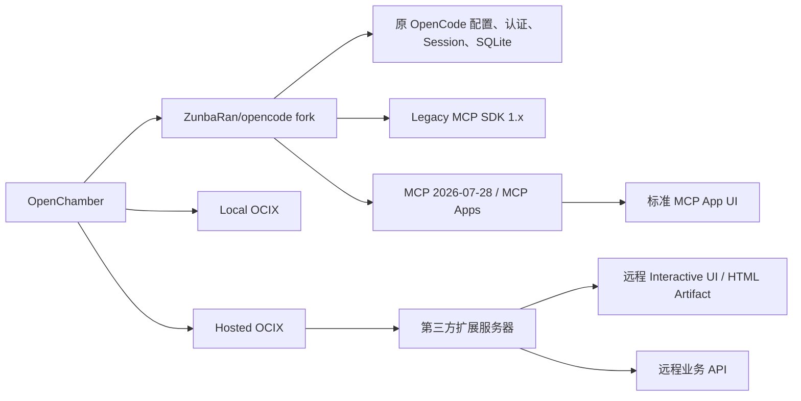

# OpenChamber × OpenCode Fork × MCP Apps × OCIX 总体实施计划

> **用途**：交给其他 Agent 做架构评审、风险评审和实施拆解。
>
> **更新时间**：2026-07-29
>
> **范围**：双仓库治理、OpenCode MCP client/server 能力、OpenChamber Web/Electron host、Local/Hosted OCIX、CLI/SDK 打包、测试与兼容性。
>
> **核心结论**：MCP Apps 与 OCIX 是两套并行产品。MCP Apps 由 OpenCode fork 提供标准协议数据链路、OpenChamber 提供沙箱 Host；OCIX 继续提供 OpenChamber 原生应用、App Board、联动、签名、Business Gateway，并新增 Hosted OCIX 薄包交付。两者允许能力重叠，但不互相包装或转换。

## 0. 已确定的产品边界与实施基线



实施基线：

- OpenCode fork：`ZunbaRan/opencode`，长期分支 `openchamber-apps`，上游同步目标 `anomalyco/opencode:dev`。
- 上游同步只使用 merge commit；已发布分支不 rebase。
- fork CLI 二进制名、配置目录、数据目录和数据库身份仍为 `opencode`。
- fork 版本格式为 `<upstream>-oc.<revision>`；CLI 和 `@zunbaran/opencode-sdk` 使用同一版本。
- OpenChamber 只从 `packages/electron/opencode-cli.lock.json` 指定的 fork Release 获取内置 CLI，并验证平台、版本、发行仓库和 SHA256。
- 内置 CLI 不独立升级；只随 OpenChamber Release 更新。外部 CLI 仅作为高级开发/诊断覆盖，缺少能力时降级为普通聊天和原始 tool output。
- MCP Apps 按标准 AppBridge 渲染，不转化成 OCIX；Hosted OCIX 通过 OCIX Host Bridge 渲染，不实现为 MCP Apps。
- 不增加 fork 专属数据库表。MCP App 数据只写入现有 ToolPart metadata。
- 不引入新的 `OPENCODE_CONFIG_DIR`；OCIX tools、skills 和 OpenChamber 附加配置继续写入解析后的标准 OpenCode 全局配置目录。

当前实现状态（以代码和 CI 结果为准）：

- OpenCode fork 已实现 distribution capability、Legacy/2026 双适配器、MCP App registry/resource cache/app-only tool、严格会话绑定 API、ToolPart metadata、生成式 fork SDK、同步/CI/Release workflow。
- OpenChamber 已实现 capability handshake、官方 CLI 更新禁用、锁文件驱动的 CLI 准备流程、独立 MCP App renderer/AppBridge、Local OCIX 所有权加固、Hosted OCIX 薄包/签名 manifest/最后可用缓存/Host Bridge 和来源区分。
- 正式可发布状态仍以 fork Release 六平台产物、真实锁文件、历史 profile、真实 MCP Server、真实 Hosted OCIX 和桌面包验收全部通过为门禁。

## 1. 背景与目标

OpenChamber 是 OpenCode CLI/server 的 GUI。当前 OpenChamber 已经拥有 Agent 对话、Session、tool call、SSE、Permission 和自有 Interactive UI runtime，但还没有标准 MCP Apps host。

目标是让下面这条链路成立：

```text
MCP Server
  └─ tools/list 返回 _meta.ui.resourceUri = ui://...
       ↓
OpenCode CLI/server
  ├─ 发现并保存 MCP App metadata
  ├─ 执行普通 tool call
  ├─ 将 resourceUri / structuredContent 传给 GUI
  ├─ 读取 ui:// resource
  └─ 代理 iframe 发起的 app-only / 普通 tool call
       ↓ OpenCode HTTP API
OpenChamber Web/Electron
  ├─ 识别 MCP App tool part
  ├─ 加载沙箱 iframe
  ├─ 建立 AppBridge / postMessage 通信
  ├─ 传入 toolInput / toolResult
  └─ 将 iframe 请求转回 OpenCode
```

非目标：重新实现一个 LLM Agent、替换 OpenCode Session、用 AI SDK `useChat` 重写主消息流，或把 OpenChamber 现有 Interactive UI 强行改成 MCP Apps。

## 2. OpenCode 相关 Issue / PR 清单

以下状态按 2026-07-29 检查结果记录，后续评审应重新确认 GitHub 状态。

### 2.1 直接相关项

| 项目 | 当前状态 | 与本项目的关系 | 结论 |
|---|---|---|---|
| [Issue #10884](https://github.com/anomalyco/opencode/issues/10884) — Add Support for MCP Apps in the desktop app | Open | 官方 OpenCode 仓库中的 MCP Apps 功能请求，明确目标是 hosting/rendering MCP Apps | 作为需求来源和范围依据 |
| [PR #15926](https://github.com/anomalyco/opencode/pull/15926) — add MCP Apps support for rich iframe UIs | Open，尚未合并 | 当前最直接的参考实现，覆盖 MCP metadata、resource、tool-call proxy、iframe renderer 和测试 | 优先评审其 backend 部分，并作为定制 CLI 的起点 |

Issue #10884 虽然标题写的是 Desktop，但它属于 OpenCode 单仓库；实际完整实现同时需要 `packages/opencode` 的 server/MCP 代码和 `packages/ui` / `packages/app` 的 host UI。OpenChamber 可以替代后半部分，但不能忽略前半部分。

PR #15926 的描述和最新提交之间存在路由变更：早期描述使用 `/mcp-app`，后续提交将路由调整为 `/mcp/app`、`/mcp/app/resource`、`/mcp/app/tool-call`。实施时必须以锁定的 commit 实际代码和生成的 OpenAPI/SDK 为准，不能只照抄 PR 描述。

PR 当前已请求 OpenCode code owners review，但仍显示为 Open。它可以作为实现参考，不应被当作已经发布的稳定 OpenCode 版本。

### 2.2 相关但不是 MCP Apps 前置依赖

| 项目 | 当前状态 | 关系 | 是否纳入实施依赖 |
|---|---|---|---|
| [Issue #6330](https://github.com/anomalyco/opencode/issues/6330) — Generic UI Intent Channel | Open | 讨论 server/client 之间的声明式 UI intent、跨 TUI/Desktop/Web 渲染和插件驱动 UX | 否；作为架构对比材料 |
| [Issue #11616](https://github.com/anomalyco/opencode/issues/11616) — Web Interface Client Interaction Architecture | Closed | 记录 OpenCode 本地 server、Web UI、REST/SSE 和 proxy 的边界 | 否；作为 API/proxy 设计参考 |
| [Issue #5958](https://github.com/anomalyco/opencode/issues/5958) / [Issue #5563](https://github.com/anomalyco/opencode/issues/5563) | 历史 AskQuestion 相关工作 | 说明 TUI-only UI 功能如果没有 Web/Desktop renderer 会造成客户端问题 | 否；用于提醒多客户端兼容性 |

Issue #6330 与 MCP Apps 解决的是两种不同问题：#6330 设计的是 OpenCode 自己的声明式 intent channel；MCP Apps 是 MCP 标准扩展，允许 MCP server 提供 HTML UI。不要把 #6330 当作 #10884/#15926 的实现前置条件，也不要同时引入两套 UI 协议来解决同一条链路。

### 2.3 外部标准与 SDK

- [MCP Apps 官方概览](https://modelcontextprotocol.io/extensions/apps/overview)：`ui://` resource、`_meta.ui`、沙箱 iframe、双向 JSON-RPC 和安全模型。
- [MCP Apps 官方 ext-apps 仓库](https://github.com/modelcontextprotocol/ext-apps)：提供 App、server helper 和 `app-bridge`；仓库不提供完整生产 host，host 需要自行集成。
- [MCP Extension Support Matrix](https://modelcontextprotocol.io/extensions/client-matrix)：MCP extension 必须由 client/server 显式支持；旧协议通过 `initialize` 协商，新版 `2026-07-28` 则结合每请求 `_meta` 与 `server/discover`。当前列表包含 VS Code GitHub Copilot，但不代表 OpenCode 已经发布支持。

## 3. OpenCode CLI/server 必须补齐的能力

这里的“CLI”实际包含 OpenCode CLI 启动的本地 server 和其中的 MCP client。终端 TUI 本身不适合渲染 iframe，但 CLI/server 仍然需要提供协议和数据链路。

### 3.1 MCP Apps capability negotiation

需要按 MCP 协议版本实现 MCP Apps extension `io.modelcontextprotocol/ui` 的能力声明及兼容策略：

- 旧版 MCP client 在 `initialize` 时声明支持 MCP Apps；
- `2026-07-28` client 在每个请求的 `_meta` 中携带 protocol version、client identity 和 capabilities，并通过 `server/discover` 获取 server 能力；
- server 不声明或不支持该扩展时，继续按普通 MCP tool 工作；
- GUI host 不支持时，tool 结果仍有文本/结构化 fallback；
- 不因为某个 MCP server 使用未知 `_meta.ui` 字段而导致 MCP 连接失败。

**评审重点**：PR #15926 的当前 commit 是否真的包含 initialize capability，而不是只处理 tool metadata 和渲染。需要以 `packages/opencode/src/mcp` 与 MCP initialize 流程的实际代码为准。

### 3.2 Tool metadata extraction 与 registry

从 `tools/list` 的 tool definition 中提取并保存：

- `_meta.ui.resourceUri`；
- `_meta.ui.visibility`，尤其是 `['app']`；
- `_meta.ui.csp`；
- `_meta.ui.permissions`；
- `_meta.ui.prefersBorder`、`_meta.ui.domain` 等标准字段；
- OpenCode 需要的 MCP server identity、session/directory context。

需要有按 MCP server 隔离的 registry，避免两个 server 使用相同 tool name 时互相覆盖。

### 3.3 App-only tool visibility

当 tool metadata 指定 `visibility: ['app']` 时：

- tool 仍然必须可以由 iframe 通过 host 调用；
- tool 不应进入 LLM 的普通 tool list；
- 普通文本对话不能绕过 host 的权限校验直接调用；
- server 重连、tool list 更新和 session 恢复时 registry 必须保持一致。

这是 MCP Apps 能正常运行的核心 CLI 行为，不能只在前端隐藏按钮。

### 3.4 Tool result metadata 透传

普通 MCP tool result 到 OpenCode message part 时，至少需要保留：

- `structuredContent`；
- `resourceUri`；
- MCP server identity；
- app metadata，如 `maxHeight`、CSP、permissions；
- 原有文本、图片和 error content。

OpenChamber 不能依赖把 JSON 拼到 output 字符串里来判断 MCP Apps。标准字段应作为结构化 metadata 到达 GUI。

### 3.5 UI resource fetch / cache

需要提供 server-side resource 读取能力：

- 根据 `ui://` URI 找到对应 MCP server；
- 通过正确的 MCP session/auth 读取 resource；
- 校验 resource MIME/type 和大小；
- 缓存策略明确，至少避免同一 message 重复拉取；
- MCP server 重启或 resource 内容变化时不会返回错误缓存；
- resource fetch 失败时返回可诊断错误，不阻塞主 session。

PR #15926 的参考路由为：

```text
GET  /mcp/app
GET  /mcp/app/resource
POST /mcp/app/tool-call
```

但该 PR 的历史提交曾使用 `/mcp-app`，因此应以最终锁定 commit 为准，并在 OpenChamber 内部统一一个稳定的代理路径。

### 3.6 App tool-call proxy

iframe 内部发起 `tools/call` 时，CLI/server 需要：

- 解析 app 请求中的 server/tool/arguments；
- 校验该 tool 是否属于当前 app/resource/session；
- 复用 OpenCode 已有 MCP auth、permission 和 directory context；
- 将结果以 MCP Apps 约定返回给 iframe；
- 处理错误、取消、超时和 server disconnect；
- 禁止 iframe 构造任意 MCP server 地址进行 SSRF。

### 3.7 API / OpenAPI / SDK

新增 route 后需要同步：

- OpenCode server route schema；
- OpenAPI 文档；
- `@opencode-ai/sdk` 生成代码；
- route handler 测试；
- 供外部 GUI 使用的请求/响应类型。

不要仅修改 SDK 类型而不让 CLI server 真正实现 route，也不要让 OpenChamber 直接依赖未发布的 SDK 版本。

### 3.8 CLI/server 测试与 demo

OpenCode backend 至少需要覆盖：

- `extractAppMeta()` 的合法、缺失和非法 metadata；
- tool registry 的 server 隔离；
- app-only visibility filtering；
- structuredContent 和 resourceUri 透传；
- resource fetch/cache；
- app tool-call proxy；
- MCP server 断开、超时、错误和重连；
- 没有 host UI 时的普通文本 fallback；
- 一个可自动启动的 MCP Apps demo server。

PR #15926 声称包含这些方向的单元测试和 demo，但 OpenChamber 采用其 backend 前必须重新跑测试并补齐与 OpenChamber proxy 的集成测试。

## 4. OpenChamber 需要完成的 host 工作

### 4.1 CLI 版本与打包

当前 OpenChamber：

- 根 `package.json` 固定 `@opencode-ai/sdk` 为 `1.18.4`；
- Electron 使用 `packages/electron/scripts/prepare-opencode-cli.mjs` 下载官方 OpenCode release；
- Electron package 将 CLI 放进 `resources/opencode-cli`。

因此不能只在 React 里加 renderer 就完成产品功能。需要先决定：

**方案 A：定制 OpenCode CLI 二进制，推荐用于开发阶段**

- fork OpenCode；
- cherry-pick/移植 PR #15926 的 backend 部分；
- 为自定义二进制定义版本/commit 标识；
- Electron 支持从本地路径、内部 artifact URL 或自有 release 下载；
- 生成或维护对应 SDK/API wrapper。

**方案 B：等待 OpenCode upstream 合并并发布**

- OpenChamber 只跟随官方 release；
- 通过 capability/route 探测决定是否启用 MCP Apps；
- 未支持版本继续使用文本 fallback。

**方案 C：OpenChamber 自己实现 MCP adapter，不推荐作为第一选择**

- OpenChamber server 自己管理 MCP initialize、server process、auth、tools/list、resources/read、tools/call；
- 这会复制 OpenCode 的 MCP lifecycle 和权限逻辑；
- 容易出现“Agent 看到的 tool”和“GUI 可调用的 tool”不一致。

开发阶段使用方案 A，产品发布阶段保留方案 B 的 feature detection，是当前建议。

### 4.2 OpenChamber proxy/API

当前 OpenChamber 的通用 OpenCode proxy 使用 `/api` 前缀并把它 rewrite 到上游根路径，见：

- `packages/web/server/lib/opencode/proxy.js`：通用 `/api` proxy、请求 body、auth header 和 response header forwarding；
- `packages/web/server/lib/realtime-proxy.js`：只处理 SSE/WS 白名单。

建议 OpenChamber 对 GUI 暴露：

```text
/api/mcp/app
/api/mcp/app/resource
/api/mcp/app/tool-call
```

再由通用 proxy 转发到上游 OpenCode 的 `/mcp/app...`。不要把 MCP Apps HTTP route 塞进 realtime SSE/WS proxy。

必须补充集成测试验证：

- GET resource 的 query/body/headers；
- POST tool-call 的 JSON body；
- OpenCode auth 和 `x-opencode-directory`；
- 4xx/5xx 错误体不会被吞掉；
- resource HTML 的 Content-Type、CSP 和缓存头正确处理；
- OpenCode 重启期间 request 能正确失败或等待；
- `/mcp-app` 与 `/mcp/app` 不会被错误地同时假设为稳定 API。

### 4.3 ToolPart 接入

现有入口已经在 `packages/ui/src/components/chat/message/parts/ToolPart.tsx` 读取 `state.metadata`、`input`、`output`，并支持自有 `InteractiveUIView` / `HTMLArtifactView`。

建议增加独立模块，而不是继续扩大 `ToolPart.tsx`：

```text
packages/ui/src/components/chat/mcp-apps/
├── types.ts
├── metadata.ts
├── McpAppToolView.tsx
├── McpAppHost.tsx
├── mcpAppTransport.ts
└── security.ts
```

渲染选择顺序：

```text
tool part
  ├─ 有合法 MCP Apps metadata/resourceUri → McpAppToolView
  ├─ 有 OpenChamber Interactive UI envelope → InteractiveUIView
  ├─ 有 HTML Artifact envelope → HTMLArtifactView
  └─ 其他 → 现有通用 Tool UI
```

标准 MCP Apps 判断必须读取结构化 metadata，不应依赖 `output` 文本解析。

### 4.4 MCP Apps host

使用官方 `@modelcontextprotocol/ext-apps` 的 `app-bridge`，或实现同等的 AppBridge 协议：

- 以 sandboxed iframe / `srcdoc` 渲染 resource HTML；
- 正确处理 `ui/initialize` handshake；
- 建立 `PostMessageTransport`；
- 传入 `toolInput`、`toolResult` 和 `structuredContent`；
- 处理 `tools/call`、`sendMessage`、`openLink`、size change 等 host capability；
- 自动高度受 `maxHeight` 限制；
- iframe 异常时显示错误卡和原始 tool 结果 fallback；
- 不允许 iframe 访问 parent DOM、Cookie、localStorage 或 Electron preload 能力。

MCP Apps 官方安全模型要求 host 控制 iframe 沙箱、CSP、permissions 和可调用能力；这部分不能直接复用普通 HTML artifact 的信任假设。

### 4.5 与现有 Interactive UI 的边界

OpenChamber 当前的 Interactive UI 是自有协议，优点是可信 React renderer、平台主题和现有 Runtime API 已经集成；MCP Apps 是第三方 MCP server 提供 HTML，通过标准 bridge 与 host 通信。

两者应并存：

| 能力 | OpenChamber Interactive UI | MCP Apps |
|---|---|---|
| UI 来源 | OpenChamber 内置组件 | MCP server 提供 `ui://` HTML |
| 执行模型 | trusted/validated React renderer | sandbox iframe |
| tool 调用 | OpenChamber Runtime API/现有 tool 链路 | AppBridge → host → MCP/OpenCode |
| 主题 | 直接使用 OpenChamber theme | 通过 host style/theme context 注入 |
| fallback | 通用 Tool UI | 通用 Tool UI + resource 错误 |
| 安全重点 | schema validation、组件白名单 | iframe sandbox、CSP、postMessage、权限代理 |

## 5. 分阶段开发计划

### Phase 0 — 锁定参考实现与协议契约

**目标**：避免直接基于一个会变化的 PR 分支开发。

任务：

1. 锁定 PR #15926 的具体 commit，记录 route、schema、SDK 生成结果。
2. 确认该 commit 是否包含 `io.modelcontextprotocol/ui` capability negotiation。
3. 确认当前 OpenCode `message part` 的 metadata shape。
4. 用官方 ext-apps demo server 做最小端到端测试。
5. 决定内部代理路径统一使用 `/api/mcp/app`，还是保留兼容别名。
6. 记录 OpenChamber 当前 CLI 下载、启动、健康检查和 SDK 版本耦合点。

**输出**：协议契约文档、锁定 commit、最小 demo、兼容矩阵。

**Gate 0**：如果 PR backend 不完整，先补齐 OpenCode fork；不要先写 UI renderer 再猜 metadata shape。

### Phase 1 — OpenCode CLI/server backend

**目标**：让 OpenCode 在不依赖 Desktop UI 的情况下，完整提供 MCP Apps 数据链路。

任务：

1. capability negotiation；
2. metadata extraction 和 per-server registry；
3. app-only visibility filtering；
4. structuredContent/resourceUri/tool metadata 透传；
5. resource fetch/cache；
6. app tool-call proxy；
7. auth、permission、directory、session 绑定；
8. OpenAPI/SDK 更新；
9. backend 单元测试和 demo。

**验收**：用一个 MCP Apps server，CLI 能发现 app tool，普通 tool call 成功，`ui://` resource 可读，iframe tool-call 能经过 server API 返回结果；没有 GUI 时不会让 session 卡死。

### Phase 2 — OpenChamber CLI 适配、proxy 和 SDK

**目标**：让 OpenChamber 能稳定连接“带 MCP Apps backend 的 OpenCode”。

任务：

1. 支持定制 CLI artifact 或本地 CLI 路径；
2. 将 CLI 版本从单纯 semver 校验扩展为 release/commit 可识别；
3. 对 `/api/mcp/app*` 增加代理和集成测试；
4. 确认 SSE message part 的未知 metadata 不被清理；
5. 若官方 SDK 未包含新 route，先使用小型 raw HTTP wrapper；
6. 将 route/capability 探测封装成 `McpAppsCapability`；
7. 未支持 CLI 时明确进入 fallback，而不是显示空白面板。

**验收**：同一套 OpenChamber Web API 可以连接支持和不支持 MCP Apps 的 OpenCode，后者的普通聊天和普通 MCP tools 行为不变。

### Phase 3 — OpenChamber MCP Apps host

**目标**：在 Web、Electron 和需要时 VS Code runtime 中渲染标准 MCP Apps。

任务：

1. 增加 `@modelcontextprotocol/ext-apps` 的 host 侧依赖；
2. 解析标准 tool metadata；
3. 实现 `McpAppToolView` 和 `McpAppHost`；
4. 加载 resource HTML 到 sandbox iframe；
5. 实现 AppBridge handshake 和 `PostMessageTransport`；
6. 传递 `toolInput`、`toolResult`、`structuredContent`；
7. 实现 size change、maxHeight、loading、error、retry、fallback；
8. 处理 app-only tools 和 host capability policy；
9. 将实现与现有 Interactive UI / HTML Artifact renderer 解耦。

**验收**：官方 demo、地图/图表类 demo和一个 app-only tool 能在聊天消息中显示并交互；刷新、历史重放、session 恢复、tool 失败和 server 重启均有可见结果。

### Phase 4 — 安全与兼容性验证

**必须验证**：

- iframe 无法读取 parent DOM、Cookie、localStorage；
- iframe 无法调用未授权的工具或任意 URL；
- CSP、permissions、openLink、sendMessage 均由 host policy 控制；
- resource URL 不会造成 SSRF 或跨 session/server 访问；
- AppBridge message 校验 source、origin、session/resource identity；
- HTML、JS、图片过大时有大小限制；
- bridge 断开、tool-call 超时和 MCP server 退出时不会卡住主聊天；
- 未知 MCP Apps metadata 不会破坏普通 tool rendering；
- Web 与 Electron 的 iframe 行为一致；
- TUI/纯 CLI 仍可使用文本或结构化 fallback。

### Phase 5 — 发布与 upstream 对齐

任务：

1. 维护 OpenCode fork 的最小 patch 集；
2. 定期 rebase upstream/dev；
3. upstream PR 合并后切换到官方 release，移除定制 patch；
4. 根据 route/capability 进行版本探测；
5. 在 Electron release pipeline 中验证各平台 bundled CLI；
6. 发布说明中明确 MCP Apps 支持矩阵和 fallback 行为。

## 6. 建议的代码落点

### OpenCode fork/server

优先对照 PR #15926 的这些位置，实际路径以锁定 commit 为准：

```text
packages/opencode/src/mcp/index.ts
packages/opencode/src/server/routes/mcp-app.ts
packages/opencode/src/session/prompt.ts
packages/opencode/src/session/message-v2.ts
packages/opencode/src/mcp/*initialize* / MCP client setup
```

需要重点检查而不是盲目复制：

- MCP initialize capability 是否完整；
- Effect architecture 合并后的 MCP service 生命周期；
- `resourceUri` 是否按 server 隔离；
- app-only tool 是否真的从 LLM tool list 中过滤；
- route 是否已经从 `/mcp-app` 改为 `/mcp/app`；
- generated SDK 是否与 server schema 同步。

### OpenChamber

```text
package.json
packages/electron/scripts/prepare-opencode-cli.mjs
packages/electron/package.json
packages/web/server/lib/opencode/proxy.js
packages/web/server/lib/realtime-proxy.js  # 不应承载普通 MCP App HTTP route
packages/ui/src/components/chat/message/parts/ToolPart.tsx
packages/ui/src/components/chat/mcp-apps/*  # 建议新增
```

已有自有 Interactive UI 的文档和实现可以继续保留：

- `docs/AI_SDK_INTERACTIVE_UI_AND_MCP_APPS.md`
- `examples/interactive-ui/README.md`
- `packages/ui/src/components/interactive-ui/`

本文的 MCP Apps host 不应改写现有 Interactive UI 协议。

## 7. 测试矩阵

| 层级 | 测试内容 | 必须覆盖 |
|---|---|---|
| MCP parser | `_meta.ui` 提取、schema、server 隔离 | 合法/非法/缺失/未知字段 |
| MCP registry | app tool、app-only tool、重连 | 增删改、server 重启、重复 tool name |
| OpenCode route | list/resource/tool-call | 200、400、401、403、404、500、超时 |
| Message contract | metadata 透传 | structuredContent、resourceUri、CSP、maxHeight |
| OpenChamber proxy | path rewrite、auth、body、directory | `/api/mcp/app` → `/mcp/app` |
| Host bridge | initialize、tool result、tool call | handshake race、重连、postMessage 错误 |
| iframe security | sandbox/CSP/policy | parent 访问、任意 URL、未授权 tool |
| UI fallback | 普通 tool、坏 app、旧消息 | 不支持版本、资源失败、渲染异常 |
| Product E2E | Web/Electron + demo MCP server | 首次调用、历史恢复、重启、发布包 |

## 8. 风险与决策点

### R1：PR #15926 未合并且可能继续漂移

应锁定 commit 做 POC，并将 backend patch 与 OpenChamber host patch 分开。不要把 PR 的前端实现整体复制到 OpenChamber，因为 OpenCode UI 技术栈和 OpenChamber 现有 renderer 结构不同。

### R2：route 名称变更

`/mcp-app` 与 `/mcp/app` 在 PR 历史中都出现过。OpenChamber 内部可以提供稳定的 `/api/mcp/app`，上游路径由 adapter 根据 capability/version 选择，但最终应尽量只支持一条正式路径。

### R3：SDK 与 CLI 版本耦合

OpenChamber 当前固定 `@opencode-ai/sdk` 版本并下载相同版本官方 CLI。定制 CLI 的 commit 可能没有对应官方 semver release，因此必须支持 custom artifact 或 raw HTTP wrapper。

### R4：MCP Apps 与 OpenChamber HTML Artifact 混淆

两者都可能使用 iframe，但信任模型不同。MCP Apps 是第三方 MCP server 提供的 UI，必须使用 AppBridge、sandbox、CSP 和 host policy；不能因为现有 HTML Artifact 能运行，就直接把 MCP resource 当可信 HTML。

### R5：权限与 app-only tool

只在前端隐藏 app-only tool 不够。CLI/server 必须在工具发现和 tool-call proxy 两侧都校验 visibility、server、session 和 permission。

### R6：CLI/TUI fallback

MCP Apps 的 UI 只适用于 GUI host。CLI/TUI 仍需获得文本或结构化结果；任何 host 不支持的场景都不能让 Agent session 等待一个永远不会出现的 UI。

## 9. 给评审 Agent 的检查清单

请评审 Agent 重点回答：

1. PR #15926 当前 commit 是否完整实现 MCP Apps 的 initialize capability negotiation？
2. PR 的 backend 是否足够让外部 GUI（而不是 OpenCode 自己的 UI）使用？
3. `/mcp/app` 的 route、请求参数和返回 schema 是否应由 OpenChamber 直接复用？
4. OpenChamber 是否应该维护 fork，还是等待 upstream release？迁移成本是什么？
5. OpenChamber 的 generic `/api` proxy 是否会正确转发 resource GET 和 tool-call POST？需要哪些集成测试？
6. `@opencode-ai/sdk` 是否应从 fork 重新生成，还是先使用 raw HTTP wrapper？
7. AppBridge 的安全边界是否覆盖 origin/source/session/resource/server/tool 校验？
8. app-only tools、普通 MCP tools 和 OpenChamber 自有 Interactive UI 是否会出现重复执行或错误路由？
9. 历史消息重放和 session 恢复时，resource 是否仍可定位到正确 MCP server？
10. 哪些能力应推迟到第一版之后，例如 `sendMessage`、`openLink`、CSP permissions、流式 input？

评审结果最好输出：

- blocking issues；
- 必须在 Phase 0 解决的契约问题；
- 可以延后的非阻塞能力；
- 推荐的最小 patch 集；
- 是否允许开始 Phase 1 backend 开发。

## 10. 推荐的第一版范围

第一版建议只承诺：

- MCP Apps capability detection；
- tool metadata 与 `resourceUri` 透传；
- resource fetch；
- sandbox iframe；
- AppBridge initialize；
- tool result / structuredContent；
- iframe 发起的 `tools/call`；
- app-only tool visibility；
- maxHeight；
- 文本 fallback；
- Web/Electron E2E 和安全测试。

`sendMessage`、复杂 host permissions、流式 tool input、跨 session app state、安装型 MCP App 管理等能力可以在第一版稳定后再评估。

**最终建议**：先从 OpenCode PR #15926 提取并验证 CLI/server backend，再在 OpenChamber 中新增独立的 `mcp-apps` host 模块。不要等待 OpenCode Desktop UI，也不要通过重新实现一套 MCP client 来绕过 OpenCode，除非评审明确认为 OpenCode backend 的维护成本不可接受。

## 11. MCP 2026-07-28 新规范对本计划的影响

> 本节根据 [官方公告](https://blog.modelcontextprotocol.io/posts/2026-07-28/)、[2026-07-28 规范全文](https://modelcontextprotocol.io/specification/2026-07-28) 和 [Key Changes](https://modelcontextprotocol.io/specification/2026-07-28/changelog) 追加。

### 11.1 新规范核心变化

2026-07-28 规范在 2026-07-28 发布。官方公告将本次版本的核心描述为：无状态协议核心、Multi Round-Trip Requests（MRTR）、基于 Header 的路由、可缓存的 list 结果、授权强化、正式扩展框架以及同步更新的 Tier 1 SDK。

| 变化点 | 规范变化 | 对 OpenCode/OpenChamber 的影响 |
|---|---|---|
| 无状态核心 | 对 `2026-07-28` 协议，移除 `initialize` / `initialized` 握手和 `Mcp-Session-Id`；每个请求携带协议版本、client identity 和 capabilities | CLI/server 需要支持无状态请求；不能把旧 session 逻辑直接当成新规范实现 |
| `server/discover` | server 必须实现 discovery RPC，client 可以先调用它了解版本、能力和身份 | OpenCode 需要增加版本探测和兼容性选择逻辑 |
| Multi Round-Trip Requests | 工具可以返回 `resultType: "input_required"` 和 `inputRequests`；client 收集答案后用 `inputResponses` 重试原请求 | app tool-call、用户确认和 elicitation 不能只按一次 request/response 设计 |
| Header 路由 | Streamable HTTP 使用 `Mcp-Method` 和 `Mcp-Name` | OpenCode 与 OpenChamber proxy 必须保留并正确转发这些 Header |
| 缓存提示 | `tools/list`、`prompts/list`、`resources/list`、`resources/read` 结果可以带 `ttlMs` 与 `cacheScope` | MCP App tool registry/resource cache 需要遵守服务端缓存提示 |
| 正式扩展框架 | Tasks 移出实验性核心成为 `io.modelcontextprotocol/tasks` 扩展；MCP Apps 也属于正式扩展体系 | MCP Apps、Tasks 和核心协议要分别做版本/能力判断，不能把扩展字段硬编码进核心 schema |
| 授权强化 | 增加 issuer 校验、凭证与 issuer 绑定，并从 Dynamic Client Registration 逐步转向 Client ID Metadata Documents | OpenCode 的 OAuth/MCP auth 与 GUI proxy 需要增加 issuer 校验和兼容旧授权流程的测试 |
| 弃用政策 | 正式弃用后至少保留 12 个月；Roots、Sampling、Logging 和旧 HTTP+SSE transport 被标记为 deprecated | 可以设计渐进迁移，但不能继续把旧 transport 当作长期唯一实现 |
| SDK | TypeScript、Python、Go、C# Tier 1 SDK 已同步到新规范，Rust 为 beta | OpenChamber 当前 pinned SDK 不能默认视为兼容，需要升级或在 OpenCode fork 中重新生成 SDK |

新规范中“移除握手和 session”是针对 `2026-07-28` 协议版本的 breaking change，不等于 OpenCode 可以立即删除所有旧版兼容代码。面向现有 MCP server 的产品实现应该采用双栈或按协议版本选择：

```text
旧 MCP server/client
  └─ 保留旧 initialize / initialized / Mcp-Session-Id 行为

2026-07-28 MCP
  └─ server/discover + 每请求 metadata + 无协议级 session
```

### 11.2 对 OpenCode PR #15926 的重新评估

PR #15926 的实现工作早于 2026-07-28 规范发布，不能再直接视为完整的最新 MCP Apps 实现。它仍然是最有价值的 UI 和 OpenCode 数据流参考，但 Phase 0 必须增加以下审计：

1. PR 所依赖的 MCP SDK 版本是否理解 `2026-07-28`；
2. MCP client 是否仍然只通过旧 `initialize` 获取能力；
3. `resourceUri`、`structuredContent` 和 `_meta.ui` 是否能在新旧协议结果中统一抽取；
4. app-only tool 是否兼容新规范的 per-request capabilities；
5. `/mcp/app` resource/tool-call route 是否把 MCP 版本差异正确封装掉；
6. app tool-call 返回 `input_required` 时，OpenCode 是否能把 MRTR 过程暴露给 GUI；
7. SDK 生成的请求是否包含 `Mcp-Method`、`Mcp-Name` 和正确的 `_meta`；
8. old HTTP+SSE、Streamable HTTP 旧版和新 stateless HTTP 的兼容矩阵是否有测试。

因此，本计划中“从 PR #15926 提取 backend”应改成：

> 以 PR #15926 为 MCP Apps host/data-flow 基线，重新基于 MCP 2026-07-28 SDK 和协议要求审计、移植并补齐 OpenCode CLI/server backend。

### 11.3 对 OpenCode CLI/server 开发计划的新增任务

Phase 0 必须新增：

- 读取并锁定 OpenCode 当前 MCP SDK、MCP transport 和 protocol version 支持；
- 建立旧版 MCP 与 `2026-07-28` 的 capability/transport matrix；
- 用 `server/discover` 做版本探测，并保留旧 server 的兼容 fallback；
- 确认 OpenCode 的 session、MCP server process 和 request-scoped state 如何映射到新无状态协议；
- 确认 MCP Apps 的 `io.modelcontextprotocol/ui` 扩展声明和新核心协议的能力声明是两层不同对象。

Phase 1 必须新增：

- 无状态 request metadata 构造器；
- `server/discover` client/server 测试；
- `resultType` 的完整处理，旧 server 缺失时按 `complete` 兼容；
- MRTR 的 `input_required` → host 展示 → `inputResponses` 重试链路；
- list/resource cache hint 的 registry/cache 实现；
- `Mcp-Method` / `Mcp-Name` 生成和透传；
- OAuth issuer、client credentials binding 和旧 DCR 流程的兼容测试。

### 11.4 对 OpenChamber proxy 与 host 的新增影响

OpenChamber 的 generic `/api` proxy 目前已经具备转发请求、body 和部分 auth header 的基础能力，但需要针对新规范验证：

- 不删除 `Mcp-Method`、`Mcp-Name`、`MCP-Protocol-Version` 和 `_meta`；
- 不把新的 request/response stream 误判为旧 SSE realtime channel；
- 当 response 为 `input_required` 时，将中间结果传给 host，而不是当成最终 tool error；
- host 可以展示确认/补充信息，并将 `inputResponses` 传回 OpenCode；
- `ttlMs`、`cacheScope` 不在 proxy 层被丢弃；
- 新旧 MCP auth 流程的 issuer 信息不被 GUI proxy 改写或隐藏；
- resource cache key 至少包含 protocol/version、MCP server identity、resource URI 和必要的 scope。

MCP Apps iframe 的 AppBridge 仍然是独立的 `ui/initialize` 通道；新规范移除的是核心 MCP transport 的 `initialize` / `initialized`，不能把两者混为同一个握手。实现时应分别测试：

```text
核心 MCP transport
  └─ 新版：无协议级 initialize；旧版：保留兼容握手

MCP Apps iframe bridge
  └─ ui/initialize + postMessage/AppBridge
```

### 11.5 更新后的第一版边界

由于新规范刚发布，第一版建议把协议兼容分为两档：

**MVP**

- 支持一个锁定版本的 OpenCode fork；
- 支持 MCP 2026-07-28 + 一个已验证的旧版 MCP fallback；
- 支持 MCP Apps resource、tool result、structuredContent、AppBridge 和 `tools/call`；
- 支持 app-only tool visibility；
- 支持 MRTR 的最小 confirmation/input flow；
- 旧客户端或旧 server 无法提供 UI 时使用文本 fallback。

**后续版本**

- 完整 Tasks extension；
- `subscriptions/listen` 和资源/工具变化订阅；
- 更复杂的 CSP/permissions 管理；
- 多 server、多 session 的 resource preloading；
- 流式 tool input 和跨请求显式 state handle；
- 从 custom OpenCode fork 迁移到 upstream release。

### 11.6 新增评审问题

将以下问题加入评审 Agent 的 blocking review：

1. OpenCode 当前 MCP SDK 是否已经支持 `2026-07-28`，还是仍绑定旧版 `initialize` 模型？
2. PR #15926 是否需要重做 backend，而不只是把 UI renderer 移植到 OpenChamber？
3. OpenCode 是否应在第一版同时支持旧 session MCP 与新 stateless MCP？
4. `server/discover` 应由 OpenCode 启动时调用、每次 server reconnect 调用，还是按 capability cache 调用？
5. MRTR 的 `input_required` 应由 OpenCode Agent loop 处理，还是暴露给 OpenChamber host 处理？
6. OpenChamber 的 proxy 是否会无损透传新 Header、`_meta`、cache hints 和 input responses？
7. MCP Apps 的 `ui/initialize` 与 MCP core 的 protocol discovery 如何在代码中保持清晰分层？
8. 在 MCP 2026-07-28 发布后的兼容窗口内，是否暂时将 MCP Apps 功能标记为 experimental，直到双栈测试完成？
