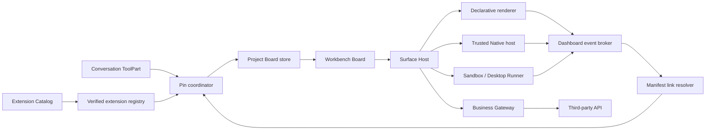

# OCIX 扩展工作台（Extension Workbench）设计

> 状态：**设计冻结；macOS arm64 首发范围已通过统一验收**  
> 版本：Draft 3  
> 更新：2026-07-25  
> 配套验收：[OCIX 扩展工作台测试计划](./OCIX_EXTENSION_WORKBENCH_TEST_PLAN.md)

## 0. 当前实现快照

本文同时承担目标设计和实现审计基线。2026-07-25 的代码状态如下：

| 批次 | 当前状态 | 已有证据 | 尚未关闭的门禁 |
|---|---|---|---|
| W1 Manifest / Catalog | 已实现 | 新旧 OCIX normalize、validator、统一 Surface descriptor 单元测试 | 完整恶意 icon/schema corpus |
| W2 Board / Pin | 已实现 | 项目隔离、revision、原子 JSON、去重、四类 Pin 路径测试 | 崩溃注入与大规模项目 soak |
| W3 Board UI | 已实现 | Right Sidebar Catalog、12 列布局、两列默认、drag/resize、真实 Host 手动启动；54 个视觉组合 / 62 张 Golden 通过 | 键盘 drag/resize 与大规模布局 soak |
| W4 Focus / Popout | macOS 通过 | Focus/Escape/恢复；Declarative Popout 占位与恢复；HTML Runner 同一 `WebContentsView` 迁移；packaged Runner 裁剪、遮挡和 display-mode lifecycle 通过 | Windows/Linux 实机证据 |
| W5 Events / Links | 已实现 | typed payload、同 OCIX mapping、去重/限流/TTL/hop/cycle；真实 Sales 列表 → HTML 详情 | 多级链和恶意 Origin 的完整安全套件 |
| W6 生命周期 | 已实现 | compatible major range、Gateway block、受限声明式迁移、原子替换、卸载影响计数与定向清理；隔离 Host 中 install/upgrade/disable/enable/rollback/uninstall/reinstall 通过 | packaged 设置页逐按钮自动化仍可扩充 |
| W7 脚手架 / Skill | 已实现 | 模板同时生成 Declarative、Native、HTML、dashboard/link；validator 和脚手架测试通过 | 第三方盲测样本扩充 |
| W8 统一验收 | macOS 通过 | type-check / production build；30 个文件 179 项 Workbench 单测；Qwen 17/17；visual/a11y/security/performance；packaged desktop；统一报告 `ok=true, complete=true` | Capacitor、Windows、Linux 仍列为 unverified |

统一报告位于 `.tmp/interactive-ui-unified-acceptance/report.json`。这里的 `complete=true` 只表示设计冻结的 macOS arm64 首发范围完成；Capacitor、Windows 和 Linux 仍是 `unverifiedPlatforms`，不应被解读为已经获得跨平台实机证据。

## 1. 背景

OpenChamber 已经支持以下 2×2 能力：

| 生成角色 / 表现形式 | Interactive UI | HTML Artifact |
|---|---|---|
| Agent Generated | Agent 按安全组件协议临时组合页面；不调用业务 API | Agent 生成隔离 HTML/CSS/受限脚本；不调用业务 API |
| Third-party Extension | 签名 OCIX 的 Declarative / Trusted Native 页面；通过 Business Gateway 调用 API | 签名 OCIX 的 sandboxed HTML；通过 Business Bridge → Gateway 调用 API |

目前这些 Surface 主要由 Agent 在对话中触发并显示。新版本要把它们从“一次性对话结果”扩展为可持续使用的个人工作台：

- 用户可从右侧边栏浏览已安装扩展及其 Surface；
- 可以手动打开具有完整默认入参的 Surface；
- 可以把对话中已经生成或已经完成参数推断的 Surface 固定到工作台；
- Tile 可以排序、缩放、聚焦和弹出为系统窗口；
- 同一 OCIX 内的 Surface 可以通过声明式事件形成列表 → 详情 → 子列表等联动；
- 工作台关闭、应用重启或项目切换后，布局仍按明确规则恢复。

该能力统一称为 **Extension Workbench（扩展工作台）**。Workbench 是 Surface 的组织与编排层，不是新的第五种渲染形式。

## 2. 设计目标

### 2.1 产品目标

1. 在 Right Sidebar 增加“扩展”入口，并将其展开为约占主窗口宽度 45%–65% 的工作区。
2. 左侧显示按 OCIX 分组的 Catalog，右侧显示 12 列磁贴式 Board。
3. 默认一行两个 Tile；开发者可声明合理的初始、最小和最大尺寸。
4. 支持四类 Surface 固定到 Board，同时保持 2×2 安全边界。
5. 支持同一 OCIX 内由开发者声明的多级联动。
6. 保持现有 `openchamber://extension/v1` 包向后兼容；旧 OCIX 无需重新打包即可继续安装和运行。
7. Board 数据属于本地 OpenChamber 项目状态，不写入用户仓库。
8. macOS 作为首个完整验收平台；协议、存储和 Web UI 实现不得依赖 macOS 专有机制。

### 2.2 开发者目标

扩展开发者只需要：

1. 在现有 `views[]` / `artifacts[]` Surface 上补充可选 `dashboard` 声明；
2. 声明输入 schema、默认参数、布局和刷新策略；
3. 声明 Surface 可以发出和接收的事件；
4. 在扩展根级声明事件到目标 Surface 的映射；
5. 使用 Host 提供的受控事件 API，不直接操作其他 Tile、窗口或凭据。

### 2.3 非目标

首版明确不包含：

- 跨 OCIX 联动；
- Agent Generated Surface 自动参与联动；
- 用户手工画连线或编写字段映射；
- 多命名 Board 的管理 UI（数据模型预留）；
- 团队共享、多人实时协作或云同步 Board；
- 把 Board 配置提交进项目仓库；
- Third-party Installed Surface 的业务响应离线缓存；
- 开发者 JavaScript 事件映射或迁移脚本；
- 公共 Marketplace；
- Windows 安装包实机证据作为 macOS 首发的阻断条件。

## 3. 核心术语

| 术语 | 定义 |
|---|---|
| Extension / OCIX | 一个已安装、签名验证通过的扩展包 |
| Surface | `views[]` 或 `artifacts[]` 中一个可渲染入口 |
| Catalog | Workbench 左侧的扩展与 Surface 列表 |
| Board | Workbench 右侧持久化磁贴区域 |
| Tile | Board 中一个 Surface 的逻辑实例 |
| Context | 创建或恢复 Surface 所需的结构化入参 |
| Interaction group | 一次根交互产生的关联 Tile 集合 |
| Link | OCIX 声明的 Source event → Target Surface 规则 |
| Focus | 应用内覆盖式放大，保留当前逻辑实例 |
| Popout | 独立系统窗口；Board 原位置显示占位符 |

## 4. 信息架构与交互

### 4.1 Right Sidebar

Right Sidebar 增加“扩展”标签。选择后：

```text
┌──────────────── Extension Workbench ────────────────┐
│ Catalog（可折叠） │ Board（12-column grid）          │
│                   │                                  │
│ CRM               │ ┌──────────┐ ┌──────────┐       │
│  客户列表          │ │ 客户列表 │ │ 销售概览 │       │
│  客户详情（需参数）│ └──────────┘ └──────────┘       │
│  订单列表          │ ┌───────────────────────┐       │
│                   │ │ HTML Artifact          │       │
│ BI                │ │ 内部双向滚动            │       │
│  经营看板          │ └───────────────────────┘       │
└──────────────────────────────────────────────────────┘
```

- Workbench 展开宽度允许用户调整，目标范围为主窗口的 45%–65%。
- Catalog 可折叠；折叠后 Board 使用完整 Workbench 宽度。
- Catalog 一级标题使用扩展的 `shortName`，缺失时回退到完整 `name`。
- 二级列表混合显示 Interactive UI 与 HTML Artifact，并显示形式、可手动启动状态和简短说明。
- 没有满足必填入参的 Surface 显示为 disabled，并说明“需要上下文参数”；它仍可由 Agent 或另一 Surface 的 Link 打开。

### 4.2 Board 与 Tile

- Board 为 12 列网格。
- Surface 未声明布局时，默认 `6 × 4`，即宽屏下一行两个。
- 长页面不因内容自动无限增高；Tile 保持布局尺寸，内容区域独立支持上下、左右滚动。
- Tile 标题栏承担拖动；内容区保留点击、文本选择、图表交互和滚动。
- Tile 边缘或明确 resize handle 用于缩放。
- Tile 控件至少包括：刷新（适用时）、Focus、Popout（支持时）、更多菜单。
- 更多菜单提供从 Board 移除；聊天中的 Pin 按钮第二次点击只聚焦已有 Tile，不承担取消固定。
- 关联 Tile 使用同一颜色边框和 interaction group 标签；仅在选中某个 Tile 时绘制关系线，避免常驻视觉噪音。

### 4.3 初始放置

1. 手动启动或 Pin 的 Tile 放到当前视口附近的最近空位。
2. Link 产生的目标 Tile 优先放在 Source 旁边。
3. Source 旁边无足够空间时，放到下方最近空位。
4. 同一 Tile 的 Context 已存在时聚焦已有 Tile，不重复创建。
5. Context 不同则允许同一 Surface 存在多个实例。

### 4.4 Focus 与 Popout

#### Focus

- 在应用内使用高层 Overlay 放大。
- 保持原逻辑实例，不应重新请求或丢失临时交互状态。
- Overlay 层级必须高于 HTML Artifact Runner、对话内容和普通弹窗容器。
- 退出后 Tile 回到原位置和尺寸，原按钮全部恢复。

#### Popout

- 打开独立系统窗口，首版同一 OpenChamber 主窗口最多三个 Popout。
- Board 原位置显示“已在浮窗打开”占位符。
- 关闭 Popout 后，内容恢复到原 Tile。
- HTML Artifact 可以迁移同一个 Desktop Runner / `WebContentsView`。
- Declarative Surface 以同一逻辑 Tile 的 Host-owned Context、query state 和受控 UI state 在新窗口重挂载。
- Trusted Native 必须接入 Host-owned Tile state 合同；无法保证状态一致的 Native Surface 必须声明不支持 Popout。
- Popout 不是新的 Surface 实例，不能绕过 Scripts Runner 全局与窗口资源上限。

## 5. OCIX Manifest 向后兼容扩展

### 5.1 兼容原则

- 顶层 `$schema` 继续使用 `openchamber://extension/v1`。
- 新字段全部可选。
- 不含新字段的旧包按现有对话 Surface 行为运行；Catalog 可显示，但未声明默认入参时不得推断其可手动启动。
- `views[]` 与 `artifacts[]` 使用同一个可选 `dashboard` 合同。
- 安装 staging、CLI validator 和 Runtime normalize 必须使用相同规则。

### 5.2 示例

以下只展示新增字段；已有 `entry`、`tools`、`routing`、`capabilities`、`displayModes` 等合同保持不变：

```json
{
  "$schema": "openchamber://extension/v1",
  "id": "com.acme.crm",
  "name": "Acme Enterprise CRM",
  "shortName": "CRM",
  "icon": "assets/crm.svg",
  "version": "2.0.0",
  "views": [
    {
      "id": "com.acme.crm.customers",
      "title": "客户列表",
      "dashboard": {
        "description": "浏览当前销售区域的客户",
        "inputSchema": {
          "type": "object",
          "properties": {
            "region": { "type": "string", "enum": ["all", "apac", "emea"] },
            "host": {
              "type": "object",
              "properties": {
                "projectId": { "type": "string" }
              }
            }
          },
          "required": ["region"]
        },
        "defaultContext": { "region": "all" },
        "hostContext": [
          { "source": "project.id", "to": "host.projectId" }
        ],
        "layout": {
          "columns": 6,
          "rows": 5,
          "minColumns": 4,
          "maxColumns": 12,
          "minRows": 3,
          "maxRows": 12,
          "overflow": "auto"
        },
        "instances": "byContext",
        "refresh": {
          "mode": "onFocus",
          "minimumIntervalSeconds": 30
        },
        "events": {
          "emits": [
            {
              "id": "customer.selected",
              "payloadSchema": {
                "type": "object",
                "properties": {
                  "customerId": { "type": "string" }
                },
                "required": ["customerId"]
              }
            }
          ],
          "accepts": []
        },
        "migrations": [
          {
            "fromVersion": "^1.0.0",
            "operations": [
              { "op": "rename", "from": "territory", "to": "region" },
              { "op": "setDefault", "path": "host.projectId", "value": "legacy-project" }
            ]
          }
        ]
      }
    }
  ],
  "artifacts": [
    {
      "id": "com.acme.crm.customer-detail",
      "title": "客户详情",
      "dashboard": {
        "description": "查看指定客户的详情",
        "inputSchema": {
          "type": "object",
          "properties": {
            "customerId": { "type": "string", "minLength": 1 }
          },
          "required": ["customerId"]
        },
        "layout": {
          "columns": 6,
          "rows": 6,
          "minColumns": 4,
          "maxColumns": 12,
          "minRows": 4,
          "maxRows": 14,
          "overflow": "auto"
        },
        "instances": "byContext",
        "refresh": { "mode": "manual" },
        "events": {
          "emits": [
            {
              "id": "orders.requested",
              "payloadSchema": {
                "type": "object",
                "properties": {
                  "customerId": { "type": "string" }
                },
                "required": ["customerId"]
              }
            }
          ],
          "accepts": ["customer.selected"]
        }
      }
    }
  ],
  "links": [
    {
      "id": "customer-list-to-detail",
      "from": "com.acme.crm.customers",
      "event": "customer.selected",
      "to": "com.acme.crm.customer-detail",
      "map": {
        "customerId": "$event.payload.customerId"
      },
      "relationship": "customer",
      "placement": "adjacent"
    }
  ]
}
```

### 5.3 输入 Schema 子集

`inputSchema` 是受限 JSON Schema，不是通用代码执行入口。首版允许：

- `type`: `object`、`array`、`string`、`number`、`integer`、`boolean`；
- `properties`、`items`、`required`；
- `enum`；
- 字符串长度、数值范围、数组长度等静态边界；
- 经白名单支持的 `format`。

首版禁止：

- `$ref`、远程 schema 和动态加载；
- 自定义 keyword；
- 正则或递归结构造成的高复杂度校验；
- 表达式、模板执行、JavaScript；
- schema 中携带 Secret、Token 或默认业务凭据。

### 5.4 Context 合并与手动启动

手动启动按固定顺序构造 Context：

```text
defaultContext
  → manifest allowlist 声明的 Host Context
  → 未来的用户输入参数
  → inputSchema 校验
```

Host Context 首版候选来源：

- `project.id`
- `project.path`
- `session.id`
- `theme`
- `locale`
- `timezone`

扩展必须逐项声明来源和目标路径。Host 不自动加入未声明字段，也绝不猜测 `customerId`、`orderId` 等业务 ID。合并后仍缺少 `required` 字段时，Catalog 禁止手动启动。

### 5.5 图标

- `icon` 只能引用签名包内的 SVG 或 PNG；
- 禁止远程 URL、data URL、脚本 SVG 和外部字体/图片；
- 安装时校验 MIME、实际文件类型、尺寸、像素和字节上限；
- 无图标时使用 Host 生成的稳定占位图标。

### 5.6 Refresh

`refresh.mode` 允许：

- `manual`：只由用户点击或 Host 明确请求；
- `onFocus`：Tile 重新变为可见或获得焦点时刷新；
- `interval`：按 bounded interval 刷新。

所有模式都受 `minimumIntervalSeconds`、可见性和 Host 的资源策略约束。隐藏 Workbench、后台 Popout 或不可见 Tile 不持续高频刷新。

### 5.7 声明式升级迁移

`dashboard.migrations[]` 只处理已保存 Tile 的非敏感 Context，不迁移业务响应、Runner 状态、凭据或确认请求。每条规则包含旧兼容范围和最多 32 个静态操作：

```ts
type DashboardMigration = {
  fromVersion: string
  operations: Array<
    | { op: 'rename'; from: SafePath; to: SafePath }
    | { op: 'move'; from: SafePath; to: SafePath }
    | { op: 'setDefault'; path: SafePath; value: JsonLiteral }
  >
}
```

固定语义：

- `rename` 只允许同一个对象内改字段名；跨对象路径必须使用 `move`；
- `setDefault` 只在目标路径缺失时写入，不覆盖用户已有值；
- `to` / `path` 必须存在于新版本 `inputSchema`；
- 同一个 `fromVersion` 只能有一条规则，每个 Surface 最多 16 条；
- 字段缺失、目标值冲突、结果不满足新 Schema 时整次迁移失败；
- Host 先在内存中完成迁移并重新校验，再以 Board revision + 原子写替换原 Tile；
- `tileId`、布局位置、关系、来源和创建时间保留，尺寸只在新版本声明的 min/max 内夹取；
- Manifest 中任何 `script`、函数、表达式或未知操作都会在打包/安装阶段被拒绝。

没有匹配规则时保留原 Tile 和 Context，显示可诊断 placeholder。用户可以等待开发者提供迁移，或移除旧 Tile 后按新版本重新打开；Host 不静默删除。

## 6. Surface 发现与统一描述符

安装注册表把 `views[]` 和 `artifacts[]` 归一化为只读 Catalog 描述符：

```ts
type WorkbenchSurfaceDescriptor = {
  extensionId: string
  extensionVersion: string
  extensionName: string
  extensionShortName: string
  extensionIcon?: InstalledAssetRef
  surfaceId: string
  surfaceKind: 'view' | 'artifact'
  form: 'interactive-ui' | 'html-artifact'
  source: 'third-party-extension'
  title: string
  description?: string
  manualLaunch: {
    enabled: boolean
    reason?: 'missing-required-context' | 'unsupported-runtime' | 'disabled'
  }
  dashboard?: NormalizedDashboardContract
}
```

Catalog 只读取 enabled、签名验证通过且当前版本完整的扩展。disabled、文件完整性失败或已卸载的扩展不能继续产生可运行描述符。

## 7. Board 持久化合同

### 7.1 存储位置

Board 保存到跨平台 OpenChamber data root 下：

```text
<OpenChamber data root>/extension-workbench/boards/<stable-project-id>.json
```

- 不使用仓库相对路径；
- 不写入 `.openchamber`、`.opencode` 或用户业务源码；
- `stable-project-id` 由 OpenChamber 项目身份生成，不直接使用未经清理的绝对路径作为文件名；
- 写入采用临时文件 + 原子替换，保留 `revision` 以拒绝陈旧更新。

### 7.2 数据模型

```json
{
  "$schema": "openchamber://extension-board/v1",
  "schemaVersion": 1,
  "projectId": "project_01...",
  "activeBoardId": "default",
  "boards": [
    {
      "id": "default",
      "name": "Default",
      "revision": 18,
      "tiles": [
        {
          "tileId": "tile_01...",
          "source": {
            "kind": "third-party-extension",
            "extensionId": "com.acme.crm",
            "surfaceId": "com.acme.crm.customer-detail",
            "compatibleVersion": "^2.0.0"
          },
          "form": "html-artifact",
          "context": { "customerId": "cust_123" },
          "contextDigest": "sha256:...",
          "layout": { "column": 6, "row": 0, "columns": 6, "rows": 6 },
          "displayMode": "tile",
          "relationship": {
            "groupId": "group_01...",
            "kind": "customer",
            "parentTileId": "tile_00..."
          },
          "origin": {
            "sessionId": "session_...",
            "messageId": "message_...",
            "toolCallId": "tool_..."
          },
          "createdAt": "2026-07-25T00:00:00.000Z",
          "updatedAt": "2026-07-25T00:00:00.000Z"
        }
      ]
    }
  ]
}
```

数据模型预留多个命名 Board，但首版 UI 只操作 `default`。

### 7.3 可以和不可以持久化的内容

允许：

- Tile ID 与来源类型；
- extension ID、surface ID、兼容版本范围；
- 经 schema 校验、尺寸限制和敏感字段策略处理的 Context；
- 布局、显示模式、关系组；
- 对话来源引用；
- Agent Generated Surface 的安全快照引用；
- 时间戳和迁移状态。

禁止：

- Access Key、Token、Cookie、Authorization header；
- Secret Store 内容；
- Installed Surface 的完整 API 响应或业务页面截图；
- HTML Artifact 的 local/session storage；
- 待确认写操作、确认 challenge 或一次性凭证；
- Runner 进程、窗口或 WebContents 的原生句柄。

Installed Tile 重启后使用 Context 重新查询。界面只可保存“上次更新时间”等 Host 元数据，不保存业务响应。Agent Generated 内容允许保存经过现有 sanitizer 的安全快照。

## 8. Tile 身份、Pin 与实例规则

### 8.1 Canonical Context

Host 在 schema 校验后：

1. 递归按 key 排序；
2. 统一可规范化的数值和空值；
3. 移除 schema 外字段；
4. 对规范 JSON 计算 `contextDigest`。

Tile 去重键为：

```text
extensionId + surfaceId + compatibleVersion + contextDigest
```

相同键再次手动启动、Link 打开或 Pin 时，聚焦现有 Tile。Context 不同则创建新 Tile。

### 8.2 四类 Pin 语义

| Surface | Pin 后行为 |
|---|---|
| Agent Generated Interactive UI | 保存已清理 View snapshot，Board 中为独立 snapshot |
| Agent Generated HTML Artifact | 保存安全 Artifact snapshot/ref，继续受 sandbox 与 Scripts policy 限制 |
| Third-party Interactive UI | 使用对话中 Agent 已推断并通过 Tool 验证的真实 `context`，创建独立 live Tile |
| Third-party HTML Artifact | 使用对话中已验证的真实 `context`，创建独立 live sandbox Tile |

“独立”表示聊天中的原 Surface 保留，Board 得到新的逻辑实例；不是把聊天 DOM 移走。Pin 不重新要求 Agent 推断参数。

聊天 Host 控制栏增加 Pin：

- 尚未 Pin：创建或聚焦 Board Tile；
- 已有相同去重键：只聚焦，不取消；
- 移除操作只在 Tile 菜单中出现。

## 9. 声明式联动

### 9.1 安全模型

Surface 不直接定位、创建或控制其他 Tile。它只能向 Host 发出已声明的 typed event：

```text
Source Surface
  → Host API emit(eventId, payload)
  → 校验 extension / surface / event / payload
  → 查找同一 OCIX 的 Link
  → 声明式字段映射
  → Target inputSchema 校验
  → 去重或创建 Target Tile
  → 更新 relationship group
```

### 9.2 Link 合同

```ts
type DashboardLink = {
  id: string
  from: SurfaceId
  event: EventId
  to: SurfaceId
  map: Record<TargetContextPath, MappingExpression>
  relationship: string
  placement: 'adjacent' | 'below'
}
```

首版 Mapping Expression 只允许读取：

- `$event.payload.<path>`
- `$source.context.<path>`
- `$host.<allowlisted-path>`
- JSON 字面量

不允许条件表达式、函数、网络请求、脚本、动态目标 Surface 或跨扩展目标。

### 9.3 发出事件的 API

#### Declarative

Declarative action 新增受控 `emit`：

```json
{
  "type": "emit",
  "event": "customer.selected",
  "payload": {
    "customerId": { "$path": "row.id" }
  }
}
```

Renderer 只从当前已清理数据模型解析 `$path`，再交给 Host 校验。

#### Trusted Native

```ts
await props.host.dashboard.emit('customer.selected', {
  customerId: selected.id,
})
```

Native bundle 只能发出当前 Surface manifest 已声明的事件。

#### Installed HTML Artifact

```js
await window.openchamber.dashboard.emit('customer.selected', {
  customerId: selectedId,
})
```

消息继续经过 sandbox channel、sequence、origin、大小和 extension/surface 绑定校验。Artifact 不能指定 Target。

### 9.4 循环与风暴控制

每次根事件创建：

- `traceId`
- `hop`
- `visitedLinkIds`
- `dedupeKey`
- `expiresAt`

Host 必须：

- 拒绝重复 Link；
- 限制最大 hop；
- 对同一 Source/Event/Context 做短窗口去重；
- 限制 payload 深度、节点数和 64 KiB 消息上限；
- 对单扩展和单 Tile 限流；
- 把拒绝原因写入脱敏诊断，不把 payload 全量写日志。

多级 Link（客户列表 → 客户详情 → 订单列表 → 订单详情）允许，但每一步都重新执行 schema 和权限检查。

### 9.5 关系生命周期

- 根交互创建一个 interaction group 和稳定颜色；
- 后续层级沿用 group 颜色，通过标签说明 `客户 → 订单 → 详情` 层级；
- 删除 Source Tile 时，Target 保留，但移除失效 parent 关系和关联视觉；
- 删除 Target 不影响 Source；
- Agent Generated Tile 首版不自动接入 Link，事件合同只预留未来手工编排能力。

## 10. Business Gateway 与写操作

Workbench 不改变现有第三方鉴权模型：

- Credential 仍在 OpenChamber server-side Secret Store；
- Surface 只声明 action ID 和业务入参；
- Gateway 注入 Key/Token 并调用第三方 API；
- Key 对应权限、RBAC/ABAC 和业务授权由第三方系统负责；
- HTML Artifact 仍不能直接访问网络。

联动只负责“打开目标 Surface 并传递 Context”，不自动授予业务 action。

- Read/query 沿用现有自动执行策略；
- write/destructive action 继续要求 Host 确认；
- Link event 不能携带、复用或伪造确认 challenge；
- 刷新、Focus、Popout 和恢复不得重放写操作。

## 11. 拖拽、缩放与可访问性

### 11.1 拖拽实现约束

- 使用仓库已有 `@dnd-kit`，不新增拖拽依赖；
- 12 列二维换行布局使用 `rectSortingStrategy`，不能使用 horizontal-only strategy；
- 预览位移使用 `CSS.Translate.toString`，避免缩放导致 Tile 内容变形；
- Mouse activation distance 为 8px；
- Touch activation delay 为 200ms、tolerance 为 6px；
- 只有标题栏/drag handle 使用 `touch-action: none`；
- 内容区必须继续支持触摸滚动和控件交互；
- 排序与持久化只在 drag end 提交；
- 使用稳定 `tileId`，不能以数组下标作为身份。

为避免大 Tile 在二维网格中实时重排抖动，首版采用明确 drop position 预览，在 drop 时一次性提交布局。

### 11.2 缩放

- resize 期间只更新本地 preview；
- pointer release 后把对齐到网格的结果一次性提交；
- 始终夹在 manifest `min/max` 与 Board 12 列边界内；
- 内容不得突破 Tile clipping boundary；
- resize 与 iframe/Runner 内容交互必须通过显式 handle 分离。

### 11.3 键盘与辅助技术

- Catalog、Tile 控件、drag handle、resize handle 均可键盘聚焦；
- 提供键盘移动和尺寸调整；
- 状态变化通过 live region 简洁播报；
- 关系不能只靠颜色，必须同时提供 group 标签或图标；
- disabled Surface 必须暴露原因；
- 支持 reduced motion；
- 所有新增文案进入 locale 系统；
- light/dark、高对比和窄宽都必须可用。

## 12. Runner 生命周期与资源

现有 Scripts HTML Artifact 限制继续成立：

- 全局最多 8 个活跃 Scripts Runner；
- 单窗口最多 4 个；
- 默认 lease 15 分钟；
- memory 上限 256 MiB；
- CPU 90% 连续 5 次触发强制停止；
- 单消息上限 64 KiB。

Workbench 增加以下行为：

1. 关闭或隐藏 Workbench 时，Scripts Tile 进入 soft suspend/throttle；保持逻辑实例，但停止非必要刷新和动画。
2. 恢复可见时优先恢复最近使用的 Tile。
3. 超出资源上限时执行 LRU hard eviction，Tile 变为可恢复 placeholder。
4. 用户重新打开该 Tile 时用 Context 重启。
5. hard eviction 可能丢失页面内未提交的瞬时状态，这是首版明确限制，界面必须说明，不能伪装为无损暂停。
6. Focus 不创建第二个 Runner。
7. Popout 迁移现有 Runner，并计入原有全局/窗口配额。

## 13. 扩展升级、禁用与卸载

### 13.1 升级

- Surface ID、input schema 和 dashboard contract 兼容时自动恢复 Tile；
- 新版本不兼容时显示“需要迁移或重新打开”；
- 首版只执行 5.7 定义的 `rename`、`move` 和 `setDefault`；
- 禁止运行扩展提供的迁移 JavaScript；
- 迁移由 `POST /api/interactive-ui/workbench/boards/:projectId/tiles/:tileId/migrate` 发起；
- Runtime 选择与旧 `compatibleVersion` 匹配的规则并重新执行新 Schema；
- Store 校验 revision、Tile ownership 和 Surface form 后原子替换；
- 迁移失败保留可诊断 placeholder，不静默丢弃 Board，也不允许 Gateway 请求。

### 13.2 禁用

- disabled 扩展的 Tile 变为不可运行 placeholder；
- 保留布局和非敏感 Context，以便重新启用后恢复；
- 不继续刷新、调用 Gateway 或占用 Runner。

### 13.3 卸载

- Host 先通过只读 impact API 统计所有本地项目中的目标扩展 Tile；
- impact 未加载成功前，确认按钮保持禁用；
- 卸载确认框显示将删除的 Tile 数量和受影响项目数；
- 用户确认后删除该扩展的全部 Tile 与关系；
- 不删除其他扩展和 Agent Generated Tile；
- 延续现有 Agent Tool/Skill、Secret 和连接清理合同。

## 14. 分层架构



建议实现模块边界：

1. **Manifest normalization**：解析 dashboard、events、links、icon；
2. **Catalog service**：把 verified extension registry 投影为统一 Surface 列表；
3. **Board store**：项目级持久化、revision、迁移、原子写；
4. **Tile coordinator**：Pin、去重、布局、Focus、Popout；
5. **Event broker**：schema、映射、loop guard、relationship；
6. **Workbench UI**：Catalog、Grid、Tile chrome、空态和错误态；
7. **Surface adapters**：Declarative、Trusted Native、Artifact 的统一生命周期；
8. **Desktop window adapter**：Popout 与 Runner 迁移。

跨层不得共享未经验证的 manifest 原始对象、Credential 或业务响应。

## 15. 运行时支持矩阵

| 能力 | macOS Desktop 首版 | Windows/Linux 目标 | Web |
|---|---|---|---|
| Catalog / Board / Pin | 支持并完整验收 | 协议与 UI 跨平台，待实机证据 | 支持 |
| Declarative Focus | 支持 | 目标支持 | 支持 |
| Declarative Popout | 支持 | 目标支持 | 浏览器窗口能力受限 |
| Static HTML Artifact | 支持 | 目标支持 | 支持 |
| Scripts HTML Artifact | Managed Desktop Runner | 相同架构，待打包证据 | experimental / default-off |
| Runner 原生迁移 Popout | 支持 | 目标支持 | 不等价 |
| Third-party Gateway API | 支持 | 目标支持 | 取决于部署与安全配置 |

不能因为实现使用 TypeScript、React、JSON 和 HTTP 就把未跑过的 Windows/Linux 包写成“已通过”。文档和发布报告必须区分“架构跨平台”与“平台已有证据”。

## 16. 实施批次

| 批次 | 范围 | 完成定义 |
|---|---|---|
| W1 | Manifest/dashboard normalize、validator、Catalog descriptor | 旧 OCIX 兼容，新字段正反例测试通过 |
| W2 | Board store、项目身份、Tile reducer、Pin | 四类 Pin、重启恢复和项目隔离通过 |
| W3 | Workbench Catalog + 12 列 Board + drag/resize | 默认两列、滚动、键盘、持久化通过 |
| W4 | Focus、Popout、Runner 生命周期 | 无溢出/遮挡；placeholder 与恢复通过 |
| W5 | Event broker、mapping、relationship | 同 OCIX 多级联动、循环防护通过 |
| W6 | Upgrade/disable/uninstall/migration | 生命周期和数据清理通过 |
| W7 | OCIX 脚手架、开发 Skill、开发手册 | 第三方 Agent 可生成可验证示例包 |
| W8 | Real Host、Qwen、macOS packaged acceptance | 测试文档全部首发门禁有当前构建证据 |

实现期间每个批次都要更新状态，但不得在 W8 前把整体能力写成“已完成”。

## 17. 发布门槛

首版只有同时满足以下条件才可称为完成：

1. 旧签名 OCIX 继续安装、发现和在对话中运行；
2. 混合 OCIX 的 Interactive UI 与 HTML Artifact 都出现在同一 Catalog；
3. 手动启动只对完整 Context 开放；
4. 四类 Surface Pin 行为符合本设计；
5. 默认一行两个 Tile，拖动、缩放、内部双向滚动互不冲突；
6. Focus、Popout、Overlay 和系统弹窗层级无回归；
7. 同一 OCIX 的列表 → 详情 → 子列表链路使用真实 Context；
8. 读操作自动、写操作确认，Credential 和响应不落 Board；
9. 关闭 Workbench、重启应用、切换项目、禁用、升级和卸载行为确定；
10. Scripts Runner 配额、LRU、恢复和失败态有真实 Desktop 证据；
11. macOS 当前构建完整通过配套测试计划；
12. 未验收平台明确标注为 unverified。
