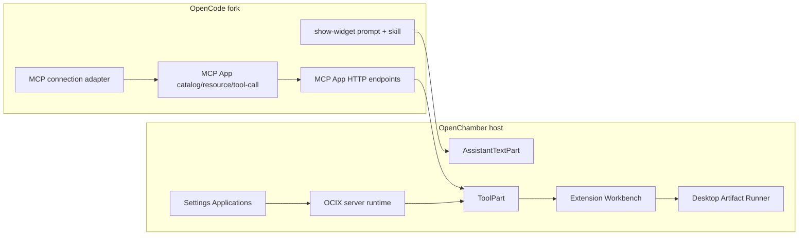

# OpenChamber 上游 UI 回归与 Fork 功能完整保留计划

> 状态：Proposed
>
> 日期：2026-08-07
>
> 适用仓库：`openchamber/`、`opencode/`、`tldraw-mcp-app/`
>
> 核心决策：保留全部二开能力，放弃与功能合同无关的通用 UI 分叉；以后只以官方稳定 Release 的不可变 tag 作为同步基线。

## 0. 结论与执行摘要

本计划不是删除 OCIX、MCP Apps 2026、Generative Widget 或 Settings 能力，也不是把现有 fork 退回上游。目标是把当前 fork 收敛为：

```text
官方稳定 Release 的原生 OpenChamber UI
  + OpenCode fork 的 MCP Apps 2026 / Generative Widget 能力
  + OpenChamber 的 MCP App Host
  + 完整 OCIX 平台
  + show-widget Host
  + 这些能力必需的 Settings / Workbench / Desktop Runner UI
```

实施方式采用“从目标上游稳定 Release 前移功能纵切片”，而不是在当前混合历史上逐条 revert：

1. 冻结当前 fork，保留可回退基线和完整验收证据。
2. 分别锁定 OpenChamber、OpenCode 官方稳定 Release tag。
3. 以新的 OpenChamber Release tag 为干净 UI 基线。
4. 以前移模块所有权的方式恢复功能代码，再在少数宿主接缝上重新接线。
5. 通用客户端 UI 默认采用上游实现；只有功能合同要求的 UI 留在 fork。
6. 逐层通过单元、集成、真实浏览器、Remote 服务和打包客户端验收。

这是一项中等偏大的结构收敛任务，但不是重写。当前 OCIX 和 show-widget 已经形成相对独立的深模块；主要风险集中在少数大型宿主文件和跨运行时接缝。

预计单人投入：**10–18 人日**。若目标 Release 对 `ToolPart`、Settings、右侧栏或 Electron 主进程进行了大规模重写，按 **15–25 人日**预留。

---

## 1. 冻结范围

### 1.1 必须完整保留的能力

#### A. MCP Apps 2026

- OpenCode 对 MCP 2026-07-28 era 的能力协商和兼容适配。
- `io.modelcontextprotocol/ui` capability 协商。
- `ui://` Tool metadata 提取、资源读取、MIME/CSP/permissions 校验、8 MiB 资源上限和 SHA-256。
- App 可见 Tool 的资源绑定和调用权限。
- OpenCode HTTP 接口：App 目录、绑定资源读取、绑定 App-only Tool 调用。
- OpenChamber `McpAppRenderer`、AppBridge、初始化/销毁时序、model context 更新、fullscreen、二进制保存和导出。
- MCP App Pin 到 Workbench、历史回放、revision 状态和 tldraw 自包含验收。
- Legacy MCP 与 MCP 2026 server 的双栈兼容。

#### B. 完整 OCIX

- Agent Generated Declarative Interactive UI。
- Installed Declarative。
- Trusted Native 和 Host Native UI Kit。
- Agent Generated HTML Artifact。
- Third-party Installed HTML Artifact 与 Business Bridge。
- `.ocix` 签名、publisher trust、安装、更新、回滚和 marketplace。
- Connector Secret Store、Business Gateway、确认式写操作和 revision 冲突。
- Direct Remote signed Manifest URL + Access Key 模式。
- Remote 资源 lazy load、hash/MIME 校验、TTL cache、health/update/re-consent。
- Agent Runtime 的 Tool/Skill 安装、冲突保护和 OpenCode reload。
- Extension Workbench、Pin、Focus、Popout、布局持久化和同扩展 Link。
- OCIX Style v2、8 套预设、Declarative/Native/Artifact 统一 token 合同。
- Routing catalog、Routing Inspector 和错误/陈旧状态。

#### C. Generative Widget（`show-widget`）

- OpenCode 内置 wire-format prompt。
- OpenCode 内置按需 `generative-widget-guidelines` skill。
- assistant text 中的流式 fence 检测和持久回放。
- streaming/final sanitizer、CSP、sandbox receiver 和高度缓存。
- theme 同步、错误隔离、CDN allowlist 和 `connect-src 'none'`。
- `window.__widgetSendMessage` 窄桥、长度和频率限制。
- Electron 打包时对 prompt/skill 的 staged 与 packaged 双重自检。

#### D. 必要 Settings 与管理界面

- Applications 页面入口和 Settings 搜索。
- OCIX Style preset。
- Installed extensions。
- Business connections。
- Remote apps。
- Routing Inspector。
- Trusted publishers。
- Marketplaces。
- 所有权限 review、访问密钥、更新/回滚、卸载和 destructive confirmation 流程。

### 1.2 明确不属于“非必要 UI”的界面

以下内容虽然是 UI，但承担功能或安全合同，不能以“恢复上游外观”为理由删除：

- `McpAppRenderer` 的 AppBridge 生命周期、fullscreen、Edit/export 和失败状态。
- tldraw 的可用高度、宽高比和历史 revision 控件。
- OCIX `.ocix-scope`、Style v2 tokens、状态颜色和预设。
- Settings 中的 publisher fingerprint、permission summary、Access Key 和 write confirmation。
- Workbench Catalog、Pin、Focus、Popout、拖拽/缩放和 required-context 禁用态。
- Artifact Runner 的 Stop、lease、故障和 Popout 控件。
- show-widget 的 loading、malformed、error、show-code 和 follow-up 能力。

### 1.3 默认删除或交还上游的 UI

- 与上述功能无关的 Chat、Session、Git、Files、Provider、Agent 等页面的视觉重做。
- 通用 app shell、侧边栏、顶部栏、工具行和 Settings 导航的 fork-only 视觉设计。
- 与功能合同无关的按钮、卡片、圆角、边框、间距、阴影、字体和品牌纹理。
- fork-only Logo、主题或装饰性动画，除非另有明确产品决策。
- show-widget 外壳中的点阵背景等纯品牌装饰；保留安全容器和交互控件。
- 上游已经提供同等或更强行为的通用功能。
- 为旧 UI 形态保留的兼容层。仓库规则不以维护废弃 UI 路径为目标。

---

## 2. 当前代码事实与依赖图

### 2.1 当前规模

按 2026-08-07 当前工作区源文件统计：

| 模块 | 文件数 | 总行数 | 说明 |
|---|---:|---:|---|
| `packages/ui/src/components/interactive-ui`、`lib/interactive-ui`、`sections/interactive-ui` | 64 | 约 23,756 | 含组件、合同和测试 |
| `packages/web/server/lib/interactive-ui` | 39 | 约 30,668 | 含 runtime、manager、store、routes 和测试 |
| `components/chat/generative-widget`、`lib/generative-widget` | 17 | 约 2,989 | 含 renderer、sanitizer、parser、bridge 和测试 |

这些数字说明 OCIX 已是完整平台模块，不适合通过删除零散 JSX 来“简化”。正确做法是保留模块实现，只缩小它与上游 UI 的接口。

### 2.2 当前端到端关系



### 2.3 OpenCode MCP Apps 2026 模块

| 所有权 | 当前文件 | 当前职责 | 迁移策略 |
|---|---|---|---|
| MCP App schema/resource | `opencode/packages/opencode/src/mcp/app.ts` | `ui://` metadata、visibility、preferred hints、resource metadata、8 MiB 限制、hash | 完整保留；按目标 Release 的 MCP 类型适配 |
| 2026/legacy adapter | `opencode/packages/opencode/src/mcp/connection-adapter.ts` | modern SDK 到 legacy client surface 的单点适配；era/capability 记录 | 完整保留；不得把 era 分支重新扩散到调用者 |
| Catalog/lifecycle | `opencode/packages/opencode/src/mcp/catalog.ts`、`mcp/index.ts` | App 目录、resource cache mode、App-only Tool allowlist 和绑定 | 完整保留；重新落在目标 Release 的 MCP service 接口上 |
| HTTP contract | `server/routes/instance/httpapi/groups/mcp.ts` | `/mcp/app`、`/mcp/app/resource`、`/mcp/app/tool-call` | 完整保留；继续使用 typed HttpApi |
| HTTP enforcement | `server/routes/instance/httpapi/handlers/mcp.ts` | 校验 session/message/part/toolKey/server/resourceUri 的精确绑定 | 完整保留；安全逻辑不能下放 UI |
| Capabilities | global capability route + installation version | fork/upstream 双版本与 `mcpApps`、`mcpAppToolCall` | 完整保留；仍作为客户端分发握手 |

关键安全事实：`handlers/mcp.ts` 不是按 App 提供的任意参数调用。它重新读取完成的 ToolPart，并同时匹配 session、message、part、tool key、server 和 `resourceUri`。迁移时任何只保留“按钮可点”而弱化该绑定的实现都不合格。

### 2.4 OpenChamber MCP App Host

| 当前文件 | 接口/行为 | 处理方式 |
|---|---|---|
| `packages/ui/src/lib/opencode/client.ts` | `getMcpAppResource()`、`callMcpAppTool()`、fork capability 文档 | 从上游版本重放窄 wrapper；保留 request fidelity 和 runtime switching |
| `packages/ui/src/lib/interactive-ui/mcpApp.ts` | Tool metadata binding、runtime state、safe diagnostics、model-context 限制 | 完整保留 |
| `packages/ui/src/components/interactive-ui/McpAppRenderer.tsx` | AppBridge、broker iframe、teardown ordering、fullscreen、App-only calls | 完整保留 |
| `packages/ui/src/components/chat/message/parts/ToolPart.tsx` | 解析 metadata，并懒加载 `McpAppRenderer` | 先恢复上游文件，再重加最小分发接缝 |
| `packages/ui/src/components/interactive-ui/workbench/ExtensionWorkbench.tsx` | MCP App snapshot Pin、fullscreen/focus、历史实例 | 完整保留；外部 tab 注册单独重接 |
| `packages/electron/main.mjs` / preload | 二进制保存与 request-bound cancellation | 从目标 Release 文件重放最小 IPC 分支 |

`ToolPart.tsx` 当前同时承担上游普通 Tool UI 和 fork 的多种渲染轨，是首要冲突点。计划不保留整个 fork 版 `ToolPart` 的视觉改动，而是从上游版本开始，只恢复以下行为：

1. OCIX/Artifact/MCP App envelope 或 metadata 的解析。
2. 精确 renderer 选择和 lazy import。
3. 原始 Tool 输出 fallback。
4. Pin 和 routing observation。
5. persistable MCP envelope 回写。

工具行字体、边框、展开动画、普通 Tool 描述布局等一律采用上游版本。

### 2.5 OCIX 平台模块

#### Shared UI

- `packages/ui/src/components/interactive-ui/**`
- `packages/ui/src/lib/interactive-ui/**`
- `packages/ui/src/components/sections/interactive-ui/**`
- `packages/ui/src/stores/useExtensionWorkbenchStore.ts`
- `packages/ui/src/styles/ocix-theme.css`
- `packages/ui/src/styles/ocix-presets.css`

#### Server/runtime

- `packages/web/server/lib/interactive-ui/runtime.js`
- `manager.js`
- `package-format.js`
- `connection-store.js`
- `artifact-store.js`
- `workbench-store.js`
- `remote-ocix.js`
- `remote-resource-cache.js`
- `hosted-ocix.js`
- `routes.js`
- `builtin-runtime.js`
- `builtin/agent-runtime/**`

#### 当前生产接线

`packages/web/server/lib/opencode/feature-routes-runtime.js` 已经是合适的生产接缝：

- 创建 Extension Manager、Connection Store、Artifact Store、Workbench Store。
- 初始化内置 Agent Runtime。
- 为 Remote R2/R3 绑定资源解析、生命周期和 update policy。
- 创建 `InteractiveUIRuntime`。
- 注册显式 OpenChamber routes。

`packages/web/server/lib/opencode/core-routes.js` 对外声明 `interactive-ui.ocix.v1` capability。显式 OCIX routes 必须继续注册在通用 OpenCode `/api/*` proxy 之前。

迁移时不把这些逻辑塞进 Electron；Desktop 继续在进程内复用 Web server runtime。

### 2.6 Generative Widget 模块

#### OpenCode

| 文件 | 当前行为 |
|---|---|
| `session/prompt/generative-widget.txt` | always-on wire format 与安全边界 |
| `session/system.ts` | 将 prompt 加入 system parts |
| `skill/generative-widget-guidelines.ts` | 内置完整设计指南 |
| `skill/index.ts` | 注册 `<built-in>` skill，允许用户同名 skill 覆盖 |

#### OpenChamber

| 文件 | 当前行为 | 宿主改动 |
|---|---|---|
| `lib/generative-widget/**` | parser、sanitizer、CSS bridge、send bridge、height cache | 无 |
| `components/chat/generative-widget/**` | streaming/persisted renderer 和错误边界 | 无 |
| `AssistantTextPart.tsx` | `textContainsShowWidget()` 命中后转给 renderer | 一个优先级分支 |
| `ChatInput.tsx` | 注册 `setGenerativeWidgetSendHandler()` 并通过现有 `sendMessage` 发送 follow-up | 一个 effect |

当前 `AssistantTextPart.tsx` 在普通 Markdown/Generated JSON 之前判断 `show-widget`；这个顺序属于 wire-format 合同，必须保留。`ChatInput.tsx` 的桥接必须继续读取当前 session/provider/model/agent/variant，不能在 iframe 中直接调用业务 API。

可删除的是 `WidgetRenderer` 外围的纯品牌装饰；不能删除 sanitizer、receiver、CSP、sandbox、resize、theme、link 和 send-message 处理。

### 2.7 Settings 接缝

当前 Applications 页面接入点集中且可重放：

| 文件 | 接入内容 |
|---|---|
| `packages/ui/src/lib/settings/metadata.ts` | `interactive-ui.extensions` slug、group、availability |
| `packages/ui/src/components/views/SettingsView.tsx` | page order、icon、title 和 `<ExtensionManagerPage />` 分支 |
| `packages/ui/src/lib/settings/search.ts` | style、installed、connections、remote、inspector、publishers、marketplaces 索引 |
| `packages/ui/src/apps/MobileApp.tsx` | mobile Settings page allowlist |
| `packages/ui/src/lib/i18n/messages/*.settings.ts` | 所有可见和可访问文案 |

目标不是保留当前整个 Settings shell。目标是让 `ExtensionManagerPage` 使用目标 Release 已有的 `SettingsPageLayout`、`SettingsSection`、`SettingsFieldRow`、`SettingsInfoHint`、Button、Icon 和 dropdown trigger 原语。

若目标 Release 的 Settings 结构已改变，优先适配 Applications 页面；不得为了复用当前页面而恢复一整套旧 Settings 导航。

### 2.8 Workbench 接缝

当前 Workbench 在两种上游宿主形态中注册：

- `RightSidebarTabs.tsx`：增加 `extensions` tab，并渲染 `<ExtensionWorkbench />`。
- `ContextPanel.tsx`：在新式 Context Rail 中注册 extensions mode。

持久状态分布在：

- `useUIStore.ts`：`rightSidebarTab`、Workbench 宽度、`ocixStylePreset`。
- `useExtensionWorkbenchStore.ts`：board、tile、focus、link 等状态。
- server `workbench-store.js`：项目级 authoritative persistence。

迁移时应优先使用目标 Release 已有的 tab/rail 扩展方式。如果上游已经提供通用 Applications/Artifacts panel 插槽，直接使用；否则只重放一个 tab/mode，不保留旧 ContextPanel 的其他 fork UI。

### 2.9 Desktop Artifact Runner

`ArtifactExecutionSurface.tsx` 通过 `invokeDesktop('desktop_artifact_runner_*')` 控制主进程中的 `WebContentsView`。主进程在 `main.mjs` 中创建 `artifactRunnerManager`，并处理 start/update/post/popout/restore/stop/status。

以下是功能与安全合同，不属于可删 UI：

- URL path allowlist。
- 独立 non-persistent partition。
- sandbox/contextIsolation/nodeIntegration gates。
- permission/navigation/window/webview deny。
- lease、CPU、memory、global/per-window concurrency 限制。
- 主窗口 navigation/close 时强制回收。
- clipping intersection 和 layout acknowledgement。

迁移必须从目标 Release 的 `main.mjs` 和 `preload.mjs` 开始，按 command 分支前移 Artifact Runner；禁止用当前整份 Electron 主进程覆盖上游。

---

## 3. 目标模块与接口

### 3.1 所有权原则

| 类别 | 所有权 | 合并原则 |
|---|---|---|
| 通用客户端 UI | 上游 OpenChamber | 每次 Release 直接采用上游实现 |
| OCIX renderer/runtime | fork feature module | 完整保留并单独测试 |
| MCP Apps 2026 runtime/host | fork feature module | 完整保留并做跨仓库合同测试 |
| Generative Widget | fork feature module | 完整保留，宿主只有两个窄接缝 |
| Settings Applications 页面 | fork feature module | 用上游 Settings 原语重渲染 |
| Electron privileged runtime | 上游 shell + fork command adapter | 只前移必要 IPC/manager |
| 通用主题/排版/图标 | 上游 | OCIX 仅在 `.ocix-scope` 内拥有独立 token |

### 3.2 目标宿主改动预算

迁移完成后，以下文件允许存在 fork 接缝，但不得携带无关 UI 重做：

1. `AssistantTextPart.tsx`：一个 show-widget 分支。
2. `ChatInput.tsx`：一个 send-message bridge effect。
3. `ToolPart.tsx`：OCIX/Artifact/MCP App 的解析与渲染分支。
4. `SettingsView.tsx`：一个 Applications page 注册。
5. `metadata.ts` / `search.ts` / locale dictionaries：Applications 元数据。
6. `RightSidebarTabs.tsx` 或目标 Release 对应宿主：一个 Workbench tab。
7. `ContextPanel.tsx` 或目标 Release 对应宿主：一个 Workbench mode。
8. `useUIStore.ts`：最小持久字段和 sanitizer。
9. `feature-routes-runtime.js` / `core-routes.js`：OCIX route factory 与 capability。
10. `opencode/client.ts`：MCP App 的 SDK gap wrapper 和 capability handshake。
11. Electron `main.mjs` / preload：Artifact Runner 与 MCP 二进制保存的窄 IPC 分支。
12. `index.css`：两份 scoped OCIX stylesheet import；Settings search highlight 仅在目标 Settings search 仍需要时保留。

### 3.3 深模块要求

功能复杂度应留在 feature-owned module 内，宿主只学习小接口：

```text
AssistantTextPart
  └── textContainsShowWidget + RenderAssistantTextWithWidgets

ToolPart
  ├── parseInteractiveResultEnvelope + InteractiveUIView
  ├── parse*ArtifactResultEnvelope + HTMLArtifactView
  └── parseMcpAppBinding + McpAppRenderer

SettingsView
  └── ExtensionManagerPage

Sidebar/ContextPanel
  └── ExtensionWorkbench
```

不在本轮为了“看起来更模块化”引入通用 plugin registry。只有当目标 Release 同时提供两个以上真实 adapter，或 `ToolPart` 的接入无法保持小接口时，才提取新的宿主 seam。若提取后 props 与生命周期知识几乎等于原实现，则该模块是浅模块，应取消。

---

## 4. UI 去留判定标准

### 4.1 四分类

每个 fork 修改必须进入且只能进入以下一类：

| 类别 | 判定 | 动作 |
|---|---|---|
| F — Feature contract | 删除会破坏能力、安全、状态、权限、生命周期或协议 | 完整保留 |
| A — Host adapter | 上游宿主调用 fork module 的最小接线 | 在目标 Release 上手工重放 |
| U — Upstream-owned UI | 通用 UI，且与二开协议无关 | 采用目标 Release 版本 |
| D — Duplicate/obsolete | 上游已有同等能力，或仅服务废弃 UI | 删除，不加兼容层 |

### 4.2 判定问题

依次回答：

1. 删除后协议结果、权限、持久状态、错误模式或用户可完成的操作是否改变？是则为 F。
2. 它是否只负责把上游宿主接到 feature module？是则为 A。
3. 它是否只改变颜色、圆角、间距、排版、通用布局或品牌表现？是则为 U。
4. 上游是否已经提供同等行为并通过本计划测试？是则为 D。
5. 无法证明属于 F/A 的修改默认不进入新 fork。

### 4.3 当前已知示例

| 当前修改 | 分类 | 理由 |
|---|---|---|
| `.ocix-scope` 与 `ocix-theme.css` | F | 扩展视觉与 Artifact token 合同 |
| `WidgetRenderer` 点阵背景 | U | 不影响 wire format 或 sandbox |
| `ToolPart` 的普通工具行 typography | U | 与 MCP/OCIX 分发无关 |
| `ToolPart` 的 envelope parser 与 lazy renderer | A/F | 功能入口 |
| Settings 固定 nav 宽度、通用 section 外观 | U | 采用上游 Settings |
| `ExtensionManagerPage` 权限 review 与 Access Key 清理 | F | 信任和凭据合同 |
| `OpenChamberLogo.tsx` 的 fork 品牌图形 | U | 不参与能力 |
| `rightSidebarTab: 'extensions'` | A/F | Workbench 可达性和持久状态 |
| tldraw `maxHeight`、fullscreen、revision selector | F | MCP App 可用性和历史状态 |
| Artifact Runner clipping | F | 原生 View 正确性和安全 |

---

## 5. 上游基线策略

### 5.1 Release 选择

执行开始时分别锁定：

- `OPENCHAMBER_UPSTREAM_TAG=<official stable tag>`
- `OPENCODE_UPSTREAM_TAG=<official stable tag>`

约束：

- 只使用 GitHub Releases 中发布的官方稳定 tag。
- 不使用 `main`、`dev`、`beta` 或其他移动分支。
- tag、commit、版本号和选择日期写入执行报告。
- 若用户明确指定 commit/tag/ref，才允许例外。
- OpenChamber 与 OpenCode 不要求版本号相同，但必须通过 fork capability handshake 和 SDK package 合同。

官方来源：

- <https://github.com/openchamber/openchamber/releases>
- <https://github.com/anomalyco/opencode/releases>

### 5.2 为什么不用当前分支大规模 revert

- 功能与 UI 改动已经在 `ToolPart`、Settings、ContextPanel、Electron main 等大型文件交叉。
- revert 容易把安全修复、状态恢复、AppBridge ordering 一起撤销。
- revert 后的文件仍携带旧上游结构，下一次 Release 会继续冲突。
- 从 Release tag 前移 feature-owned modules，可把“什么属于 fork”重新固化为可审计清单。

### 5.3 保留当前 fork 的方式

- 当前分支保持可构建、可回退，不做 destructive rewrite。
- 新建独立 integration worktree/branch。
- OpenChamber 和 OpenCode 使用各自 worktree，禁止从一个仓库直接修改另一个。
- 所有前移按阶段独立 commit，便于 bisect 和回滚。

---

## 6. 分阶段实施计划

### Phase 0 — 冻结现状与目标 Release

目标：在任何代码迁移前建立可比较基线。

任务：

1. 记录两个 fork 当前 commit、fork version、upstream version 和 SDK package version。
2. 锁定两个目标稳定 tag。
3. 导出当前 feature contract inventory。
4. 运行并归档当前通过的核心测试。
5. 记录当前持久数据位置：extension manager、connections、artifacts、workbench、UI store。
6. 记录当前 packaged CLI 的 prompt/skill self-check 结果。
7. 为普通 UI 页面和四条功能轨保存少量截图，作为行为参考，而不是继续维护旧 UI Golden。

交付物：

- `TARGET_RELEASE_BASELINE.md`
- feature file allowlist
- baseline test report
- rollback refs

Gate：目标 tag 不明确或当前基线无法构建时，不进入 Phase 1。

### Phase 1 — 建立上游原生 UI 基线

目标：得到未引入任何 fork UI 的可运行 OpenChamber。

任务：

1. 从目标 OpenChamber stable tag 创建 integration branch。
2. 安装依赖并运行上游自身 type-check、lint、Web build 和 Electron bundled UI smoke。
3. 不复制当前 `SettingsView`、`ToolPart`、`ContextPanel`、主题或全局 CSS。
4. 记录目标 Release 的 Settings、ToolPart、右侧栏、runtime route 和 Electron shell 扩展点。

Gate：上游基线自身测试失败时先记录或修复基线环境，不把失败归因于 fork。

### Phase 2 — 前移 OpenCode fork 合同

目标：先恢复 OpenChamber UI 依赖的后端能力。

子阶段：

#### 2A. MCP Apps 2026

- 前移 `mcp/app.ts` schema/resource 边界。
- 在目标 MCP service 上恢复 `connection-adapter.ts`。
- 恢复 App catalog、resource cache mode 和 app-only Tool binding。
- 恢复 typed HTTP group/handlers。
- 恢复 fork capabilities 和双版本 provenance。
- 保留 legacy server fallback；不恢复已经废弃的内部代码路径。

#### 2B. Generative Widget prompt/skill

- 恢复 `generative-widget.txt` 注入。
- 恢复 built-in skill。
- 恢复 prompt/skill 内容哈希或精确自检。

#### 2C. SDK 与发行

- 运行 `openchamber-compat.ts`。
- 构建 fork CLI。
- 构建/发布或本地准备匹配的 `@zunbaran/opencode-sdk`。
- 生成 provenance，记录 upstream/fork commits。

Gate：OpenCode 的 MCP focused tests、typecheck、compat 和 prompt/skill self-check 全部通过。

### Phase 3 — 前移 OCIX server/runtime

目标：在 UI 之前恢复 authoritative runtime。

顺序：

1. package format、signature、manager 和 trust store。
2. connection store 和 Business Gateway。
3. artifact store 与 document/materialization routes。
4. workbench store。
5. built-in Agent Runtime。
6. Direct Remote manifest/resource cache/lifecycle。
7. route registration 和 runtime capability。

要求：

- 所有显式 OpenChamber routes 在 generic proxy 之前注册。
- credential 仍只存在 server-side store。
- manager 初始化冲突继续 fail closed，并保留 unmanaged OpenCode files。
- Remote inspect 不读取资源；实际 surface load 才 lazy fetch 已签名索引资源。
- 原有持久格式不变时禁止创建无意义 migration。

Gate：server focused tests、extension CLI tests、Remote route tests 和 security tests 通过。

### Phase 4 — 前移 OCIX Shared UI 核心

目标：恢复 renderer，而不恢复通用客户端视觉分叉。

任务：

1. 前移 `components/interactive-ui/**` 和 `lib/interactive-ui/**`。
2. 保留 `ocix-theme.css`、`ocix-presets.css`，只在 `.ocix-scope` 生效。
3. 将 feature 组件使用的 Button/Icon/dialog/select 适配为目标 Release 共享原语。
4. 恢复 `runtimeFetch`、runtime URL 和 Desktop IPC 的正确接口。
5. 在目标 `ToolPart` 上重加 OCIX/Artifact parser 和 renderer 分支。
6. 普通 Tool UI 完全使用目标 Release 表现。

Gate：Declarative、Native、Artifact、binding、result schema、client 和 Tool fallback focused tests 通过。

### Phase 5 — 前移 MCP App Host

目标：恢复 MCP Apps 2026 端到端链路。

任务：

1. 前移 `mcpApp.ts` 和 `McpAppRenderer.tsx`。
2. 在目标 `opencode/client.ts` 恢复 resource/tool-call wrapper。
3. 在目标 `ToolPart` 恢复 metadata binding 分支。
4. 恢复 AppBridge host methods、display mode 和 teardown ordering。
5. 恢复 Workbench Pin snapshot。
6. 恢复 Electron 二进制保存、取消和 atomic publish。
7. 用 `tldraw-mcp-app` 重新验证高度、fullscreen、Edit、revision、持久化和导出。

Gate：MCP App unit tests、OpenCode binding tests、tldraw self-contained browser acceptance 通过。

### Phase 6 — 前移 Generative Widget

目标：恢复 show-widget，但不恢复纯品牌装饰。

任务：

1. 前移 `lib/generative-widget/**` 和 `components/chat/generative-widget/**`。
2. 在目标 `AssistantTextPart` 加一个优先级分支。
3. 在目标 `ChatInput` 加 bridge effect。
4. 使用目标 Release Markdown renderer、Button/Icon 和主题 token。
5. 删除点阵背景、fork-only card chrome 等纯装饰；保留 sandbox iframe 和 toolbar 功能。
6. 将任何硬编码可见字符串迁入所有 locale dictionaries。

Gate：parser、sanitizer、guidelines、WidgetRenderer、streaming remount 和 send-message tests 通过；打包 CLI self-check 通过。

### Phase 7 — 重建 Applications Settings 页面

目标：只保留功能页面，不恢复旧 Settings shell。

任务：

1. 采用目标 Release `SettingsPageLayout` 和 section/control primitives。
2. 前移 `ExtensionManagerPage`、`StylePresetSection`、`RoutingInspectorSection`。
3. 在目标 metadata/page registry 注册 `interactive-ui.extensions`。
4. 重新添加 Search registry 与精确 `settingsItem` anchor。
5. 合并所有 locale 的完整翻译，禁止英文占位。
6. 明确 Web/Desktop/Mobile/VS Code availability。
7. 凭据输入继续使用 password field，inspect/connect 状态继续 requestId-bound。
8. 成功、失败、取消、dialog close/escape 都清空 key state。

Gate：Settings search、remote review、extension manager 和 credential non-retention tests 通过；窄宽度容器人工检查通过。

### Phase 8 — 重建 Workbench 与 Desktop Runner 接缝

目标：恢复功能面板，不恢复旧右侧栏的其他视觉设计。

任务：

1. 在目标 Release 的 panel/tab/rail 中注册一个 Applications/Extensions 入口。
2. 前移 `useExtensionWorkbenchStore` 和 server persistence。
3. 只在 `useUIStore` 增加必要字段、persist partialize 和 sanitizer。
4. 恢复 Pin、Focus、Popout、drag/resize、Link 和 uninstall cleanup。
5. 将 Artifact Runner manager/IPC 分支前移到目标 Electron shell。
6. 测试 HMR、bundled UI 和 packaged Desktop。

Gate：Workbench focused tests、browser acceptance、Artifact Runner tests 和 packaged clipping test 通过。

### Phase 9 — 删除剩余非必要 UI 分叉

目标：证明 feature 之外的 UI 已回到目标 Release。

任务：

1. 对所有非 feature-owned UI 文件执行差异审计。
2. 普通 Settings、Chat、Tool row、Sidebar、Context、Theme、Logo 默认采用上游。
3. 删除 feature 未引用的 fork CSS、icons、themes 和 helpers。
4. 运行 dead-code，人工检查报告。
5. 建立“允许存在差异的宿主文件”清单；清单外的通用 UI 差异必须有单独理由。

Gate：非功能页面 smoke 与目标 Release 一致；无 fork-only 全局样式泄漏。

### Phase 10 — 全量验收、打包与切换主线

目标：以最终 HEAD 重新生成所有证据。

任务：

1. 全 workspace type-check、lint、build。
2. OpenCode compat、typecheck、MCP tests 和 CLI build。
3. OCIX unified acceptance。
4. tldraw MCP App acceptance。
5. Generative Widget model E2E。
6. 三个 Direct Remote reference services 的手工验收。
7. Electron packaged build 和 packaged CLI self-check。
8. 重新生成视觉 Golden；不得复制旧 fork Golden 冒充结果。
9. 更新统一验收报告、开发指引和发布 evidence。

Gate：所有 release-blocking matrix 通过后才允许合入 fork 主分支。

---

## 7. 文件级迁移清单

### 7.1 直接以前移为主的 feature-owned 目录

```text
openchamber/packages/ui/src/components/interactive-ui/**
openchamber/packages/ui/src/lib/interactive-ui/**
openchamber/packages/ui/src/components/sections/interactive-ui/**
openchamber/packages/ui/src/components/chat/generative-widget/**
openchamber/packages/ui/src/lib/generative-widget/**
openchamber/packages/ui/src/stores/useExtensionWorkbenchStore.ts
openchamber/packages/ui/src/styles/ocix-theme.css
openchamber/packages/ui/src/styles/ocix-presets.css
openchamber/packages/web/server/lib/interactive-ui/**
openchamber/packages/electron/artifact-runner.mjs
openchamber/packages/electron/artifact-runner-preload.cjs
```

说明：`McpAppRenderer.tsx` 和 `mcpApp.ts` 当前位于 `interactive-ui` 目录，但协议上仍与 OCIX 分离。本轮不为路径整洁而搬迁它们，避免把 UI 收敛任务扩展成无收益重构。

### 7.2 必须从目标上游版本开始，再重加接缝的文件

```text
openchamber/packages/ui/src/components/chat/message/parts/AssistantTextPart.tsx
openchamber/packages/ui/src/components/chat/message/parts/ToolPart.tsx
openchamber/packages/ui/src/components/chat/ChatInput.tsx
openchamber/packages/ui/src/components/views/SettingsView.tsx
openchamber/packages/ui/src/lib/settings/metadata.ts
openchamber/packages/ui/src/lib/settings/search.ts
openchamber/packages/ui/src/components/layout/RightSidebarTabs.tsx
openchamber/packages/ui/src/components/layout/ContextPanel.tsx
openchamber/packages/ui/src/stores/useUIStore.ts
openchamber/packages/ui/src/lib/opencode/client.ts
openchamber/packages/ui/src/apps/MobileApp.tsx
openchamber/packages/ui/src/index.css
openchamber/packages/web/server/lib/opencode/feature-routes-runtime.js
openchamber/packages/web/server/lib/opencode/core-routes.js
openchamber/packages/electron/main.mjs
openchamber/packages/electron/preload.mjs
openchamber/packages/electron/package.json
```

这些文件禁止从当前 fork 整体覆盖目标 Release。

### 7.3 默认采用上游，按证据再决定是否保留差异

```text
openchamber/packages/ui/src/components/sections/shared/**
openchamber/packages/ui/src/styles/design-system.css
openchamber/packages/ui/src/styles/typography.css
openchamber/packages/ui/src/lib/theme/**
openchamber/packages/ui/src/components/ui/OpenChamberLogo.tsx
普通 Chat / Session / Git / Files / Provider / Agent 页面
普通 Tool row 的样式与展开交互
通用 Settings navigation/chrome
```

若 Applications 页面依赖上游没有的 Settings primitive，应先判断该 primitive 是否至少有两个真实调用者。只有形成真实共享 seam 时才扩展 shared settings module；否则在 feature 页面直接使用现有原语组合。

### 7.4 OpenCode feature-owned 文件

```text
opencode/packages/opencode/src/mcp/app.ts
opencode/packages/opencode/src/mcp/connection-adapter.ts
opencode/packages/opencode/src/mcp/catalog.ts
opencode/packages/opencode/src/mcp/index.ts          # 仅前移 fork MCP App 分支
opencode/packages/opencode/src/server/routes/instance/httpapi/groups/mcp.ts
opencode/packages/opencode/src/server/routes/instance/httpapi/handlers/mcp.ts
opencode/packages/opencode/src/session/prompt/generative-widget.txt
opencode/packages/opencode/src/session/system.ts     # 仅前移 prompt 注入
opencode/packages/opencode/src/skill/generative-widget-guidelines.ts
opencode/packages/opencode/src/skill/index.ts        # 仅前移 built-in skill 注册
opencode/packages/core/src/installation/version.ts
opencode/script/openchamber-compat.ts
opencode/script/openchamber-provenance.ts
opencode/script/openchamber-sdk-package.ts
```

`mcp/index.ts`、`session/system.ts` 和 `skill/index.ts` 都是上游活跃文件，必须从目标 OpenCode tag 开始重放窄分支，不整体覆盖。

---

## 8. 持久数据与兼容策略

### 8.1 必须保留的数据

- Extension versions、trust records 和 install metadata。
- Connector credential store；密钥不能进入浏览器或日志。
- Remote app shell、manifest hash、publisher slot、resource cache provenance。
- Artifact content/reference store。
- Workbench project boards、tiles、layout、context 和 link state。
- `ocixStylePreset`。
- `rightSidebarTab: 'extensions'` 或目标 Release 的等价 panel identity。
- MCP App persistable envelope 和历史 ToolPart metadata。

### 8.2 迁移规则

- 字段和格式未改变时，直接继续读取，不创建版本噪音。
- 若目标 Release 已占用同名 persisted key，先改 fork key 并提供一次性明确迁移。
- 新 UI 不得把 fetch failure 当作 authoritative empty，避免清空有效持久数据。
- failed write、update、rollback 或 uninstall 必须保持原有原子性和可恢复行为。
- 不为已废弃 UI 布局提供双渲染兼容层；只迁移仍有真实用户数据的状态。

### 8.3 跨仓库版本合同

OpenChamber 不根据版本字符串猜能力，而继续读取 OpenCode fork capability document：

```text
forkVersion / forkCommit
upstreamVersion / upstreamCommit
apiVersion
features.mcpLegacy
features.mcp20260728
features.mcpApps
features.mcpAppToolCall
```

托管 fork 暴露完整能力；外部 legacy CLI 继续得到明确缩减能力和 UI 诊断，而不是静默空白。

---

## 9. 测试与验收矩阵

### 9.1 OpenCode

最低门禁：

```bash
cd opencode
bun run lint
bun run typecheck
bun run script/openchamber-compat.ts

cd packages/opencode
bun test test/mcp/app.test.ts
bun test test/mcp/connection-adapter.test.ts
bun test test/mcp/lifecycle.test.ts
bun test test/mcp/session-tools.test.ts
```

并执行：

- MCP 2026 fixture server。
- legacy server。
- server capability omitted / negotiated / malformed。
- App resource size、MIME、hash、CSP、permissions。
- exact ToolPart binding。
- App-only Tool allowlist。
- Generative Widget prompt/skill exact self-check。

### 9.2 OpenChamber Shared UI / Server

```bash
cd openchamber
bun run type-check:ui
bun run lint:ui
bun run type-check:web
bun run lint:web
bun run dead-code
```

Focused tests 至少覆盖：

- result/artifact/installed-artifact schemas。
- bindings 和 generated layout sanitizer。
- Declarative/Native UI Kit。
- MCP App state、bridge lifecycle、display mode 和 tool-call。
- show-widget parser、sanitizer、streaming/finalize、height cache。
- extension manager、signature、trust、install/update/rollback。
- Connection Store 与 401/403/409。
- Remote inspect、resource cache、TTL、health/update/re-consent。
- Workbench layout、events、migrations、Pin 和 cleanup。
- runtime auth、route ordering 和 explicit unsupported runtimes。

### 9.3 端到端脚本

```bash
bun run test:interactive-ui-functional
bun run test:interactive-ui-security
bun run test:interactive-ui-model-routing
bun run test:interactive-ui-conversation-browser
bun run test:interactive-ui-unified
bun run test:interop-acceptance
bun run test:tldraw-mcp-app-browser:self-contained
```

### 9.4 tldraw MCP App fixture

```bash
cd tldraw-mcp-app
npm run build
npm test
npm run accept
```

人工验证：

- 首次 create view。
- 默认尺寸不拥挤。
- fullscreen / inline 往返保持同一 App 状态。
- Edit 生效。
- historical revision 只读、restore 生成新 revision。
- checkpoint/save/export。
- App-only Tool 调用被精确绑定。
- packaged Desktop 中自包含资源无外部依赖。

### 9.5 Direct Remote reference services

使用 workspace 根的：

- Aurora Operations — Declarative。
- Ember Commerce — Trusted Native。
- Indigo Studio — HTML Artifact。

执行 [Remote 用户验收文档](../../extension/USER_ACCEPTANCE_TEST.md)，覆盖 full/read-only/invalid key、401/403/409、offline/recovery、lazy resource、缓存、update 和品牌 token。

### 9.6 Desktop

```bash
bun run type-check:electron
bun run lint:electron
bun run test:interactive-ui-artifact-runner
bun run electron:dev:bundled
bun run electron:build
bun run test:interactive-ui-desktop-packaged
```

打包后必须：

- 验证最终 App/installer 中的 OpenCode fork commit。
- staged 和 packaged 两次验证 Generative Widget prompt/skill。
- 验证 MCP App binary export cancellation/atomic publish。
- 验证 Scripts Artifact 独立 Runner、Stop、lease 和 clipping。

### 9.7 运行时矩阵

| 能力 | Web | Electron | VS Code | Hosted/Capacitor mobile |
|---|---|---|---|---|
| show-widget | 支持 | 支持 | 支持 UI 时验证 | 支持 UI 时验证 |
| MCP Apps | 依赖 fork/API | 完整目标 | 明确验证或 unsupported | 明确验证或 unsupported |
| OCIX Declarative | 支持 | 支持 | 依据现有 runtime 合同 | 支持 |
| Trusted Native | 支持受信代码 | 支持 | 不得误称 parity | 按合同 |
| Generated static Artifact | 支持 | 支持 | 明确 unsupported 时显示状态 | 支持 |
| Scripts Artifact | experimental browser | 独立 Runner | unsupported | unsupported |
| Business Gateway | 支持 | 支持 | 当前 explicit unsupported | 按现有合同 |

### 9.8 UI 回归验收

新增一个小型“上游 UI 对齐”矩阵：

- Settings General/Appearance/Chat。
- 普通 Markdown 对话。
- 普通 Tool 执行与失败。
- Git/Files/Context panel。
- Provider/Agent/MCP 设置页。
- Light/Dark 和至少一个长文本 locale。

判定：这些非 feature 页面不应因 fork feature 引入新的全局 CSS、布局或品牌差异。功能页面单独按 OCIX/MCP/widget 合同验收。

---

## 10. 提交顺序

建议保持以下可 bisect 提交序列：

1. `docs: freeze upstream UI realignment baseline`
2. `chore: establish OpenChamber stable release base`
3. `feat(opencode): restore MCP Apps 2026 contracts`
4. `feat(opencode): restore generative widget prompt and skill`
5. `feat(ocix): restore server runtime and distribution`
6. `feat(ocix): restore shared renderers and scoped styles`
7. `feat(mcp-apps): restore OpenChamber host and AppBridge`
8. `feat(widget): restore show-widget host integration`
9. `feat(settings): restore Applications management surface`
10. `feat(workbench): restore extension board and persistence`
11. `feat(electron): restore artifact runner and packaged fork checks`
12. `refactor(ui): remove non-feature fork presentation changes`
13. `test: refresh focused, visual and packaged acceptance evidence`
14. `docs: publish final migration and release report`

OpenCode 和 OpenChamber 提交保持在各自仓库，不制作跨仓库原子 commit。发布报告通过明确 commit/hash 和 SDK/CLI lock 把它们关联起来。

---

## 11. 风险与缓解

| 风险 | 影响 | 缓解 |
|---|---|---|
| `ToolPart.tsx` 上游变化大 | OCIX/MCP 分发冲突 | 从上游文件开始，按四个行为点重放；普通 Tool UI 不前移 |
| Settings 架构变化 | Applications 页面不兼容 | 使用目标 Release primitives；不恢复旧 shell |
| ContextPanel/Sidebar 重构 | Workbench 无入口 | 优先使用新 panel slot；只加一个真实 adapter |
| Electron `main.mjs` 冲突 | Runner/导出或 updater 回归 | 按 IPC command 前移，运行 bundled + packaged 测试 |
| MCP SDK/typed routes 变化 | OpenCode 编译或协议错误 | 保持 connection adapter 单点；先恢复 OpenCode 再 UI |
| 全局 CSS 泄漏 | 上游页面仍被 fork 视觉影响 | feature CSS 必须 scoped；非 feature 页面视觉 smoke |
| persisted store key 冲突 | 用户状态丢失 | Phase 0 inventory；只为真实冲突写一次性迁移 |
| Remote key 泄漏 | 安全事故 | requestId-bound flow、server-only store、日志扫描和失败路径测试 |
| packaged CLI 不是 fork | show-widget/MCP 能力消失 | staged/packaged 双重 provenance 与 self-check |
| 旧 Golden 掩盖变化 | 错误通过 | 在最终 HEAD 重新生成，不复制旧截图 |
| 上游已经实现相同功能 | 维护重复代码 | capability-by-capability 对比；上游满足 fork tests 时删除重复实现 |

---

## 12. 资源估算

| 阶段 | 人日 |
|---|---:|
| 基线、能力矩阵、Release 锁定 | 1–2 |
| OpenCode MCP Apps + widget prompt/skill | 2–4 |
| OCIX server/runtime | 2–4 |
| OCIX UI + MCP App Host | 2–4 |
| show-widget + Settings | 1–3 |
| Workbench + Electron Runner | 2–4 |
| 全量验收、打包、文档 | 2–4 |

任务存在重叠，因此总计不是简单相加。正常目标为 **10–18 人日**；大型上游架构漂移按 **15–25 人日**。

不建议用“冲突文件数量”估工，因为 `ToolPart.tsx`、`ContextPanel.tsx`、`main.mjs` 单文件就可能包含大量无关上游演进。应按功能 Gate 和接缝复杂度估算。

---

## 13. Definition of Done

只有同时满足以下条件，才算完成 UI 收敛：

1. OpenChamber 和 OpenCode 都基于已记录的官方稳定 Release tag。
2. MCP Apps 2026、完整 OCIX、show-widget 和必要 Settings 功能全部保留。
3. tldraw MCP App 在开发和 packaged Desktop 中通过。
4. 三类 Direct Remote reference service 通过用户验收矩阵。
5. packaged OpenCode CLI 的 fork provenance、prompt 和 skill 验证通过。
6. 非 feature 页面采用目标上游 UI，没有 fork feature 的全局样式泄漏。
7. feature CSS 全部在 `.ocix-scope` 或 sandbox document 内；show-widget 外壳使用语义 token。
8. 安全校验仍由 OpenCode/runtime/Electron owning module 强制，而不是只靠 UI 隐藏。
9. persisted extension、connection、artifact、workbench 和 UI state 能正常读取或有明确一次性迁移。
10. Web、Electron、VS Code、Hosted/Capacitor 的支持或 unsupported 行为均明确。
11. 全量 type-check、lint、focused tests、unified acceptance、visual 和 packaged checks 已对最终 HEAD 执行。
12. 旧通用 UI 代码、死导出、无调用样式和无依据兼容层已删除。
13. 允许存在的 fork host diff 有一份短清单；清单外差异都有明确功能合同或被移除。

---

## 14. 关联文档

- [MCP 2026 Client Host 开发指南](./MCP_2026_CLIENT_HOST_DEVELOPMENT_GUIDE.md)
- [MCP 2026 App 开发经验](./MCP_2026_APP_DEVELOPMENT_LESSONS.md)
- [Generative Widget 移植计划](./GENERATIVE_WIDGET_CODEPILOT_PORT_PLAN.md)
- [Generative Widget 测试交接](./GENERATIVE_WIDGET_TEST_HANDOFF.md)
- [Interactive UI Extension 架构](./INTERACTIVE_UI_EXTENSION_ARCHITECTURE.md)
- [OCIX Extension Workbench 设计](./OCIX_EXTENSION_WORKBENCH_DESIGN.md)
- [OCIX Style Contract](./OCIX_STYLE_CONTRACT.md)
- [OCIX Remote Mode 详细计划](./OCIX_REMOTE_MODE_DETAILED_PLAN.md)
- [OCIX Direct Remote 开发者指南](./OCIX_REMOTE_SERVICE_DEVELOPER_GUIDE.md)
- [统一验收报告](./INTERACTIVE_UI_UNIFIED_ACCEPTANCE_REPORT.md)
- [OpenChamber × OpenCode × MCP Apps × OCIX 测试计划](./OPENCHAMBER_OPENCODE_MCP_OCIX_TEST_PLAN.md)

---

## 15. 执行时的第一张清单

开始开发前逐项确认：

- [ ] 当前两个 fork 已冻结且可回退。
- [ ] OpenChamber stable tag 已锁定。
- [ ] OpenCode stable tag 已锁定。
- [ ] 两个 tag 的 upstream commit 已记录。
- [ ] 当前 fork 的功能测试基线已归档。
- [ ] feature-owned file allowlist 已生成。
- [ ] host-adapter file allowlist 已生成。
- [ ] 通用 UI 默认采用上游的规则已确认。
- [ ] MCP Apps 2026 不从 OCIX 合同中混用。
- [ ] show-widget 不获得 OCIX/Business Gateway 权限。
- [ ] Settings 采用目标 Release 原语，不恢复旧 shell。
- [ ] Remote key、publisher key、package signing key 三类身份不混淆。
- [ ] Electron Runner 仍是独立受限 renderer。
- [ ] 计划中的每个 Phase 有独立 worktree/commit owner 和 Gate。
